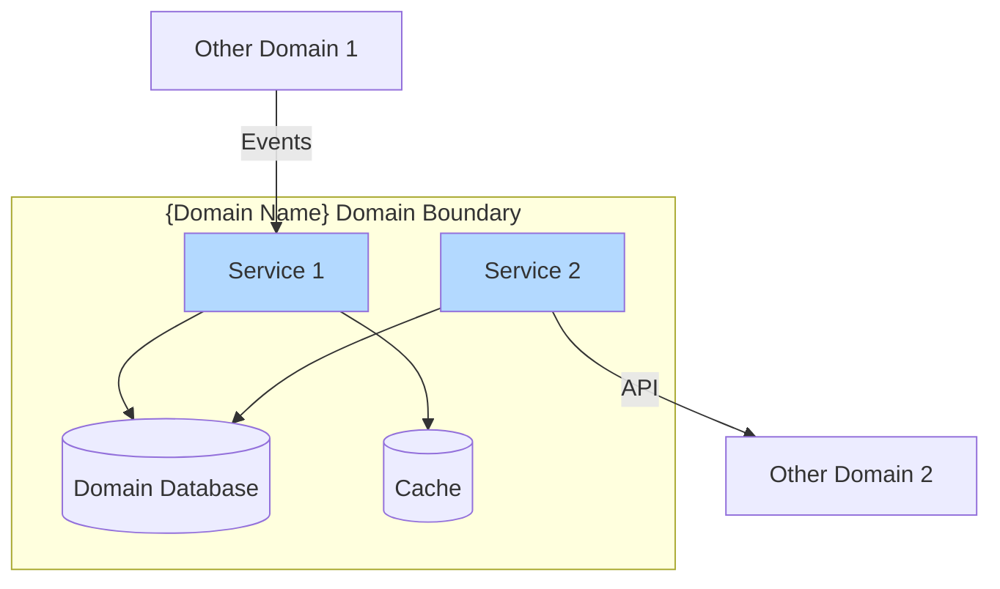
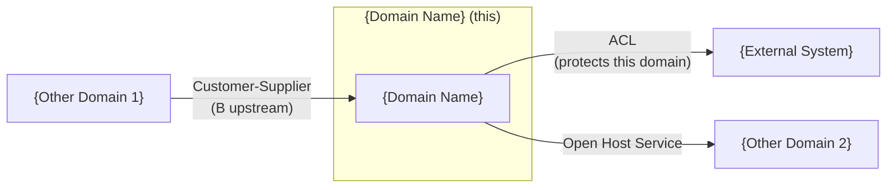
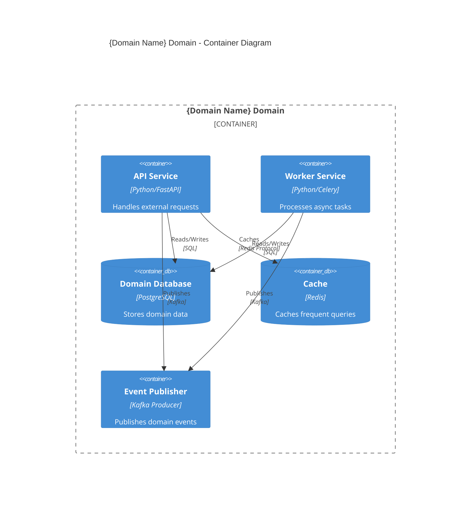
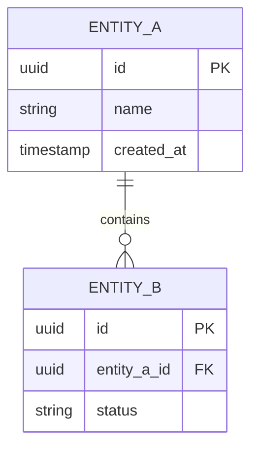
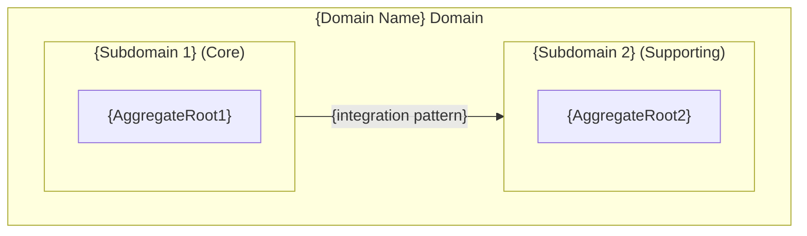

# {Domain Name} Domain Architecture

> **Document Type**: Domain Architecture Document (Level 2 - Container)
> **Parent**: [System Architecture](../../ARCHITECTURE.md)
> **Last Updated**: {YYYY-MM-DD}
> **Domain Owner**: {Team Name}
> **Subdomain Type**: Core Domain | Supporting Subdomain | Generic Subdomain
> **Rationale**: {One sentence: why this domain is classified as Core / Supporting / Generic}

## Vision Traceability

This domain implements the following capabilities and concepts from the [Vision Document]({path/to/VISION.md}):

| Vision Element | Section | How This Domain Implements It |
|----------------|---------|-------------------------------|
| {Capability or concept from vision} | {Section 4, 5, or 6} | {Brief explanation} |
| {Another element} | {Section} | {Explanation} |

> **AI Instruction**: Every domain must trace back to at least one vision capability or concept. If a domain has no vision traceability, question whether it should exist.

## Document Scope

This document describes the architecture of the **{Domain Name}** bounded context. For system-wide context and principles, see the [root architecture document](../../ARCHITECTURE.md).

### What This Document Covers

- Internal structure of the {Domain Name} domain
- Services and components within this domain
- Data models owned by this domain
- APIs exposed by this domain
- Integration points with other domains

### What This Document Does NOT Cover

- Implementation details of other domains
- Infrastructure configuration (see [Infrastructure](../../platform/infrastructure/ARCHITECTURE.md))
- System-wide security policies (see [Security](../../cross-cutting/security/ARCHITECTURE.md))

## Domain Overview

### Business Capability

{Describe the business capability this domain provides. What business problem does it solve? What would happen if this domain didn't exist?}

### Domain Boundaries



### Ubiquitous Language

Key terms used within this domain. All code, documentation, and communication should use these terms consistently.

| Term | Definition | Notes |
|------|------------|-------|
| {Term 1} | {Precise definition} | {Usage notes} |
| {Term 2} | {Precise definition} | {Usage notes} |
| {Term 3} | {Precise definition} | {Usage notes} |

## Subdomain Classification & Context Map Position

### Subdomain Classification

**Type**: {Core Domain | Supporting Subdomain | Generic Subdomain}

{Explain the classification in 2–4 sentences. For Core: describe the competitive advantage and why this domain is irreplaceable. For Supporting: describe why it is built in-house rather than purchased. For Generic: list the off-the-shelf solutions considered and the one chosen.}

**Design investment implications**:

| Subdomain Type | Applies? | Design Approach |
|----------------|----------|-----------------|
| Core Domain | {Yes / No} | Rich model — Aggregates with invariants, Value Objects, Domain Events, Domain Services. No CRUD shortcuts. Ubiquitous language enforced in all code. |
| Supporting Subdomain | {Yes / No} | Pragmatic model — CRUD repositories acceptable, simpler entities. Domain boundaries still enforced per ARCH-003. |
| Generic Subdomain | {Yes / No} | Thin adapter (PAT-005) over off-the-shelf solution. ACL required (ARCH-012) to prevent external vocabulary leaking into the domain. |

### Context Map Position

How this bounded context relates to the other bounded contexts in the system. Every cross-domain integration must use one of the approved DDD patterns (see ARCH-012).



**Context Map Table**:

| Other Context | Pattern | Direction | Description |
|---------------|---------|-----------|-------------|
| {Domain / System 1} | Customer-Supplier \| ACL \| Conformist \| Partnership \| Shared Kernel \| Open Host Service \| Published Language | This is upstream \| This is downstream \| Bidirectional | {Why this pattern; what is exchanged; what protections are in place} |
| {Domain / System 2} | {Pattern} | {Direction} | {Description} |

> **ACL requirement**: If this is a Core Domain consuming data from a Generic Subdomain or external system, an Anti-Corruption Layer is mandatory (ARCH-012). Document the ACL adapter name and location here.

---

## Component Architecture

### Container Diagram



### Service Catalog

#### {Service 1 Name}

| Attribute | Value |
|-----------|-------|
| **Responsibility** | {Single sentence describing what this service does} |
| **Technology** | {Language, framework, runtime} |
| **Repository** | {Link to code repository} |
| **Deployment** | {How and where it runs} |
| **Scaling** | {Horizontal/Vertical, triggers, limits} |

**Exposed APIs**:
- `POST /api/v1/{resource}` - {Description}
- `GET /api/v1/{resource}/{id}` - {Description}

**Consumed APIs**:
- `{Other Domain} - {Endpoint}` - {Purpose}

**Events Published**:
- `{domain}.{entity}.{action}` - {When published, what it contains}

**Events Consumed**:
- `{other_domain}.{entity}.{action}` - {How handled}

#### {Service 2 Name}

{Repeat structure}

## Data Architecture

### Data Ownership

This domain is the **single source of truth** for the following data:

| Entity | Description | Sensitivity |
|--------|-------------|-------------|
| {Entity 1} | {What it represents} | {Public/Internal/Confidential} |
| {Entity 2} | {What it represents} | {Public/Internal/Confidential} |

### Entity Relationship Diagram



### Data Lifecycle

| Entity | Creation | Updates | Deletion | Retention |
|--------|----------|---------|----------|-----------|
| {Entity 1} | {Trigger} | {Allowed fields} | {Soft/Hard} | {Period} |

### Data Shared with Other Domains

| Data | Consuming Domain | Mechanism | Freshness |
|------|------------------|-----------|-----------|
| {Data element} | {Domain} | {API/Event/Replica} | {Real-time/Eventually} |

## API Design

### Public API (External Consumers)

Base URL: `https://api.example.com/v1/{domain}`

Authentication: {OAuth2/API Key/JWT}

Rate Limits: {Limits per tier}

Full API specification: [OpenAPI Spec](./api/openapi.yaml)

### Internal API (Other Domains)

Base URL: `http://{service}.internal/{domain}`

Authentication: {mTLS/Service Token}

Full API specification: [OpenAPI Spec](./api/internal-openapi.yaml)

### API Versioning Strategy

This domain follows {URL/Header} versioning. See [ADR-XXX](../../decisions/ADR-XXX.md) for rationale.

**Current versions**:
- v1: Active (default)
- v2: Beta

**Deprecated versions**:
- None

## Event Contracts

### Events Published

#### {domain}.{entity}.created

Published when a new {entity} is created.

```json
{
  "event_id": "uuid",
  "event_type": "{domain}.{entity}.created",
  "timestamp": "ISO8601",
  "data": {
    "id": "uuid",
    "field1": "value",
    "field2": "value"
  },
  "metadata": {
    "correlation_id": "uuid",
    "causation_id": "uuid"
  }
}
```

**Consumers**: {List of known consumers}

#### {domain}.{entity}.updated

{Repeat structure}

### Events Consumed

#### {other_domain}.{entity}.{action}

**Source**: {Domain Name}

**Handler**: {Service that processes this}

**Behavior**: {What happens when received}

**Failure Handling**: {Retry policy, dead letter queue}

## Integration Points

### Upstream Dependencies

Services this domain depends on to function.

| Dependency | Type | Criticality | Fallback |
|------------|------|-------------|----------|
| {Service/Domain} | Sync API | Critical | {Circuit breaker behavior} |
| {Service/Domain} | Async Event | Non-critical | {Eventual consistency} |

### Downstream Dependents

Services that depend on this domain.

| Dependent | Integration Type | SLA Commitment |
|-----------|------------------|----------------|
| {Service/Domain} | {API/Event} | {Availability, latency} |

### External Integrations

Third-party services this domain integrates with.

| Provider | Purpose | Criticality | Documentation |
|----------|---------|-------------|---------------|
| {Provider} | {What for} | {Critical/Non-critical} | [→ Integration Guide](./integrations/{provider}.md) |

## Operational Characteristics

### Performance Requirements

| Operation | Target (p50) | Target (p99) | Current |
|-----------|--------------|--------------|---------|
| {Operation 1} | {ms} | {ms} | {ms} |
| {Operation 2} | {ms} | {ms} | {ms} |

### Scalability

| Dimension | Current Capacity | Maximum | Scaling Trigger |
|-----------|------------------|---------|-----------------|
| Requests/sec | {value} | {value} | CPU > 70% |
| Concurrent users | {value} | {value} | Memory > 80% |
| Data volume | {value} | {value} | Storage > 70% |

### Availability

| Metric | Target | Current |
|--------|--------|---------|
| Uptime |  |
| RTO | {time} | {time} |
| RPO | {time} | {time} |

## Security Considerations

### Data Classification

All data in this domain is classified as: **{Classification Level}**

See [Security Architecture](../../cross-cutting/security/ARCHITECTURE.md) for handling requirements.

### Access Control

| Role | Permissions |
|------|-------------|
| {Role 1} | {What they can do} |
| {Role 2} | {What they can do} |

### Compliance Requirements

This domain is subject to: {GDPR, PCI-DSS, HIPAA, etc.}

Specific controls: {Brief description or link to compliance doc}

## Domain-Specific Decisions

Architectural decisions specific to this domain. For system-wide decisions, see [ADR Index](../../decisions/README.md).

| ADR | Date | Summary |
|-----|------|---------|
| [ADR-{Domain}-001](./decisions/ADR-001.md) | {Date} | {Title} |
| [ADR-{Domain}-002](./decisions/ADR-002.md) | {Date} | {Title} |

## Internal Subdomain Decomposition

> **When to complete this section**: complete this section only when this domain is large or complex enough to contain distinct sub-areas with different vocabularies, different rates of change, or different teams. For simple domains (fewer than 8 entities, single team, uniform language), write "Not applicable — domain is small enough to be treated as a single unit" and skip this section.

When a domain contains multiple distinct sub-areas, each area is documented as an **internal subdomain** using the template at `.cursor/templates/architecture/domains/subdomains/_SUBDOMAIN-TEMPLATE.md`. Internal subdomain documents are placed in `domains/{domain-name}/subdomains/`.

```
domains/{domain-name}/
├── ARCHITECTURE.md              ← This document
└── subdomains/
    ├── {subdomain-1}.md         ← Uses _SUBDOMAIN-TEMPLATE.md
    └── {subdomain-2}.md
```

### Subdomain Map

| Subdomain | Type | Boundary Model | Responsibility | Document |
|-----------|------|----------------|---------------|----------|
| {Subdomain 1 Name} | Core \| Supporting \| Generic | Bounded Context \| Internal Module | {One sentence} | [→ Architecture](./subdomains/{subdomain-1}.md) |
| {Subdomain 2 Name} | Core \| Supporting \| Generic | Bounded Context \| Internal Module | {One sentence} | [→ Architecture](./subdomains/{subdomain-2}.md) |

### Subdomain Boundaries Diagram



> **Rule**: Subdomains within the same domain may share a data store (schema), but must not directly access each other's aggregate tables. Cross-subdomain data flows through defined service interfaces or domain events.

---

## Technical Debt

Known issues and planned improvements within this domain.

| Item | Impact | Effort | Priority | Ticket |
|------|--------|--------|----------|--------|
| {Description} | {H/M/L} | {H/M/L} | {1-5} | {Link} |

## Runbooks

| Scenario | Runbook |
|----------|---------|
| Service unresponsive | [→ Runbook](./runbooks/service-down.md) |
| Database connection issues | [→ Runbook](./runbooks/db-issues.md) |
| High latency | [→ Runbook](./runbooks/high-latency.md) |

## Contact

| Role | Person | Contact |
|------|--------|---------|
| Domain Owner | {Name} | {Email/Slack} |
| Tech Lead | {Name} | {Email/Slack} |
| On-call | {Rotation} | {PagerDuty/Slack} |
