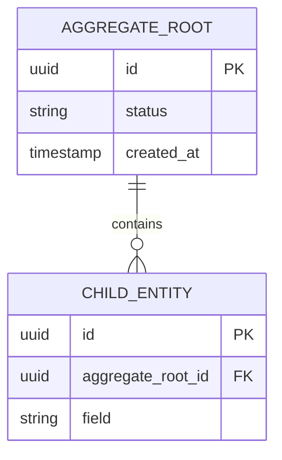

# {Subdomain Name} — Subdomain Architecture

> **Document Type**: Subdomain Architecture Document (Level 3 - Component)
> **Parent Domain**: [{Domain Name}](../ARCHITECTURE.md)
> **Root Architecture**: [System Architecture](../../../ARCHITECTURE.md)
> **Last Updated**: {YYYY-MM-DD}
> **Subdomain Owner**: {Team Name}

## Metadata

| Field | Value |
|-------|-------|
| **Subdomain Type** | Core Domain \| Supporting Subdomain \| Generic Subdomain |
| **Parent Domain** | {Domain Name} |
| **Boundary Model** | Bounded Context (separate) \| Internal Module (within parent domain) |
| **Implementation Status** | Not Started \| In Progress \| Complete |

> **Boundary Model guidance**:
> - Use **Bounded Context (separate)** when this subdomain has its own ubiquitous language that diverges from the parent domain, owns distinct data, or is large enough to justify independent deployment.
> - Use **Internal Module (within parent domain)** when this subdomain shares the parent's language and data store, and is better expressed as a cohesive module rather than a separate service.

---

## Business Scope

### What This Subdomain Solves

{Describe the specific business problem this subdomain addresses *within* the parent domain. What would be missing if this subdomain didn't exist? Be concrete — use business language, not technical language.}

### Why It Is a Separate Subdomain

{Explain why this area is modeled as a subdomain rather than simply as a feature of the parent domain. Examples: different rate of change, different team ownership, distinct ubiquitous language, different consistency requirements.}

### Subdomain Classification Rationale

**Type**: {Core Domain | Supporting Subdomain | Generic Subdomain}

{Explain the classification. For Core: what is the competitive advantage here? For Supporting: why build in-house rather than off-the-shelf? For Generic: what off-the-shelf options were evaluated?}

**Design investment required**:

| Classification | Design Approach Applied |
|----------------|------------------------|
| Core Domain | Rich domain model — Aggregates, Value Objects, Domain Events, Domain Services. Ubiquitous language is strictly enforced. No CRUD shortcuts. |
| Supporting Subdomain | Pragmatic model — simpler entities, CRUD repositories acceptable. Domain boundaries still respected. |
| Generic Subdomain | Thin adapter over off-the-shelf solution. Isolate the external model behind an ACL to prevent vocabulary leakage into the parent domain. |

---

## Ubiquitous Language

Terms specific to this subdomain. These terms may differ from or extend the parent domain's ubiquitous language. When a term is used here with a different meaning than in the parent domain, note the divergence explicitly.

| Term | Definition | Diverges from Parent? | Notes |
|------|------------|-----------------------|-------|
| {Term 1} | {Precise definition within this subdomain} | Yes / No | {If yes: how does it differ?} |
| {Term 2} | {Definition} | Yes / No | {Notes} |
| {Term 3} | {Definition} | Yes / No | {Notes} |

> **AI Instruction**: Ubiquitous language is the contract between domain experts and developers. Every class name, method name, and variable name in this subdomain's code should use the terms defined here.

---

## Aggregate Roots

Aggregates are clusters of entities and value objects treated as a single unit for data changes. Each aggregate has one root — the only object external code may hold a reference to.

### {Aggregate Root 1 Name}

**Responsibility**: {One sentence describing what this aggregate enforces}

**Invariants** (business rules this aggregate always upholds):
- {Invariant 1 — e.g., "An Order cannot be confirmed if it has no items"}
- {Invariant 2}

**Entities within this aggregate**:
- `{EntityName}` — {brief description}
- `{EntityName}` — {brief description}

**Value Objects within this aggregate**:
- `{ValueObjectName}` — {brief description, e.g., "Money: amount + currency, immutable"}
- `{ValueObjectName}` — {brief description}

**Domain Events emitted**:
- `{SubdomainName}.{AggregateName}.{action}` — {when emitted, what it signals}

### {Aggregate Root 2 Name}

{Repeat the structure above for each additional aggregate root.}

---

## Domain Services

Domain Services contain domain logic that does not naturally belong to any single aggregate.

| Service | Responsibility | Operates On |
|---------|---------------|-------------|
| {ServiceName} | {What business rule or calculation it encapsulates} | {Which aggregates or value objects it coordinates} |
| {ServiceName} | {Responsibility} | {Operates on} |

---

## Integration with Sibling Subdomains

How this subdomain interacts with other subdomains within the same parent domain.

| Sibling Subdomain | Integration Direction | Mechanism | Data / Events Exchanged |
|-------------------|-----------------------|-----------|------------------------|
| {Sibling 1} | This → Sibling \| Sibling → This \| Bidirectional | API call \| Domain Event \| Shared read model | {What is exchanged} |
| {Sibling 2} | {Direction} | {Mechanism} | {What} |

> **Rule**: Sibling subdomains within the same parent domain may share the domain's data store but must not directly access each other's aggregate tables. All cross-subdomain data flows through defined interfaces.

---

## Integration with Other Domains

How this subdomain integrates with bounded contexts outside the parent domain.

| External Domain | Context Map Pattern | Direction | Purpose |
|-----------------|---------------------|-----------|---------|
| {Domain Name} | ACL \| Customer-Supplier \| Conformist \| Partnership \| Open Host | Inbound \| Outbound | {Why this integration exists} |

> For full Context Map details, see the [parent domain's Context Map section](../ARCHITECTURE.md#subdomain-classification--context-map-position).

---

## Data Architecture

### Owned Data

This subdomain is the **single source of truth** for the following data:

| Entity | Description | Sensitivity | Storage |
|--------|-------------|-------------|---------|
| {Entity 1} | {What it represents} | Public \| Internal \| Confidential | {Table/collection in parent domain's store} |
| {Entity 2} | {What it represents} | {Sensitivity} | {Storage} |

### Data Lifecycle

| Entity | Creation Trigger | Update Rules | Deletion Policy | Retention |
|--------|------------------|--------------|-----------------|-----------|
| {Entity 1} | {What event or command creates it} | {Who can update, what fields} | Soft delete \| Hard delete | {Duration} |

---

## Implementation Notes

{For Core Domains: describe key design patterns used (Specification Pattern, Domain Events, Sagas, etc.).}
{For Supporting Subdomains: describe any simplifications made and their rationale.}
{For Generic Subdomains: document the off-the-shelf solution chosen, version, and adapter design.}

### Technology Choices

| Decision | Choice | Rationale |
|----------|--------|-----------|
| {Aspect — e.g., "Persistence"} | {What was chosen} | {Why} |
| {Aspect — e.g., "Event format"} | {What was chosen} | {Why} |

### Technical Debt

| Item | Impact | Effort | Priority | Ticket |
|------|--------|--------|----------|--------|
| {Description} | H / M / L | H / M / L | {1–5} | {Link} |

---

## Traceability

| Vision Element | Section | How This Subdomain Implements It |
|----------------|---------|----------------------------------|
| {Capability or concept} | {Section reference} | {Brief explanation} |

> Every subdomain must trace back to at least one vision capability. If this subdomain has no vision traceability, question whether it should exist.
