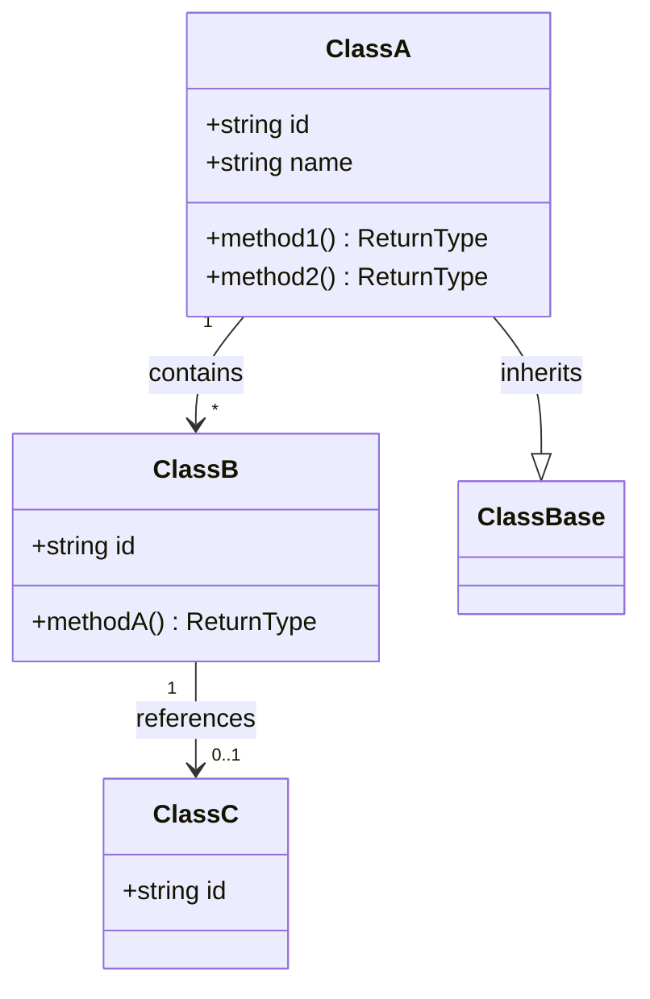

# Class Diagram Template

**Type**: Structural | **View**: Logical  
**Purpose**: Outline structural building blocks: classes, attributes, methods, and relationships (object-oriented design).

## When to Use

- Documenting domain or API model structure
- Showing associations, inheritance, or composition between types
- ADRs or design docs for new aggregates or modules

## Diagram

One diagram per bounded context or package. Show only classes and relationships relevant to the document.

## Relationship Syntax (Mermaid Class)

- `-->` association (with optional multiplicity and label)
- `--|>` inheritance
- `*--` composition (strong ownership)
- `o--` aggregation (weak ownership)

## Placeholders

| Placeholder | Replace With |
|-------------|---------------|
| ClassA/B/C   | Class names (e.g. Order, OrderItem, Payment) |
| ClassBase   | Base class or interface name |
| id, name, method1... | Key attributes and methods |
| contains, references, inherits | Relationship labels |

## Caption (add below diagram in your doc)

> This class diagram shows the {scope} domain/API structure. {One sentence on the main takeaway.}
