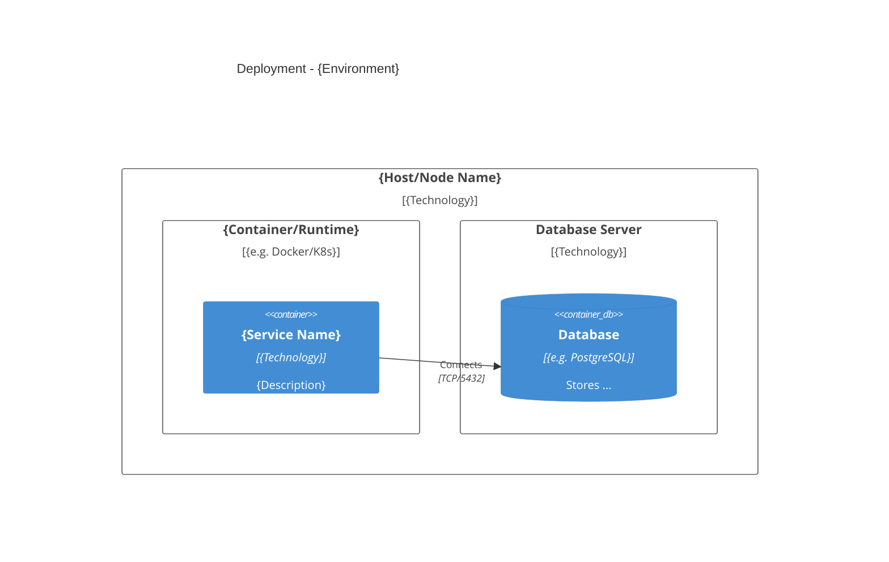

# Deployment Diagram Template

**Type**: Structural | **View**: Physical  
**Purpose**: Show the physical hardware/nodes where software components are installed and how they connect.

## When to Use

- Documenting deployment topology (e.g. production, staging)
- Showing which artifacts run on which nodes (VMs, containers, clusters)
- Communicating infrastructure and runtime environment to ops/infra

## Diagram

Use one diagram per environment or deployment unit. Label nodes and key communication protocols.

```mermaid
flowchart TB
    subgraph "{Environment Name} - {Region or Zone}"
        subgraph Node1["{Node 1 Name}"]
            A[{Artifact / Service A}]
            B[{Artifact / Service B}]
        end
        subgraph Node2["{Node 2 Name}"]
            C[{Artifact / Service C}]
        end
        subgraph Node3["{Node 3 Name}"]
            D[(Database)]
        end
    end

    A -->|"protocol/port"| C
    B -->|"protocol/port"| C
    C -->|"e.g. TCP/5432"| D
```

## Alternative: C4 Deployment (if using C4)



## Placeholders

| Placeholder       | Replace With |
|-------------------|--------------|
| {Environment Name}| e.g. Production, Staging, Dev |
| {Region or Zone}  | e.g. us-east-1, AZ-A |
| {Node 1/2/3 Name} | e.g. App Server, API Gateway, DB Server |
| {Artifact / Service A/B/C} | e.g. Order API, Auth Service, Worker |
| protocol/port     | e.g. HTTPS/443, gRPC/50051, TCP/5432 |

## Caption (add below diagram in your doc)

> This deployment diagram shows how {scope} is deployed in {environment}. {One sentence on the main takeaway.}
