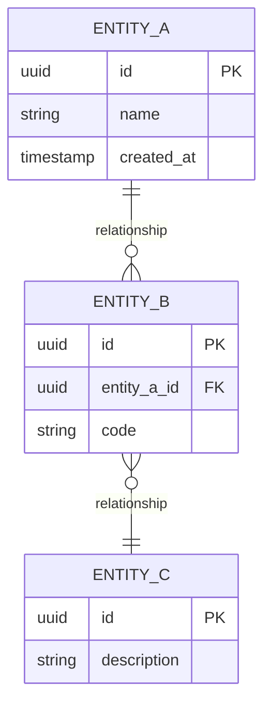

# Entity Relationship Diagram (ERD) Template

**Type**: Structural  
**Purpose**: Describe data models and relationships within a database or bounded context.

## When to Use

- Documenting domain or database schema
- ADRs or design docs that introduce or change data model
- Explaining entity relationships and cardinality to developers

**Descriptive**: Use **concrete** entity and attribute names from the schema (e.g. `workspace`, `content_characterization`, `pipeline_run`); label relationships with real semantics (e.g. "contains", "produces").

## Diagram

Scope to one bounded context or one schema per diagram. Show key attributes and cardinality (1:1, 1:N, N:M).

## Relationship Syntax (Mermaid ER)

- `||--||` one-to-one
- `||--o{` one-to-many (one A, zero-or-many B)
- `}o--o{` many-to-many
- `||--o|` one-to-zero-or-one

## Placeholders

| Placeholder   | Replace With |
|---------------|---------------|
| ENTITY_A/B/C  | Entity/table names (e.g. User, Order, OrderItem) |
| relationship  | Verb or phrase (e.g. "contains", "belongs to") |
| id, name, ... | Key attributes; use PK/FK for primary/foreign keys |

## Caption (add below diagram in your doc)

> This ERD describes the {scope} data model. {One sentence on the main takeaway.}
