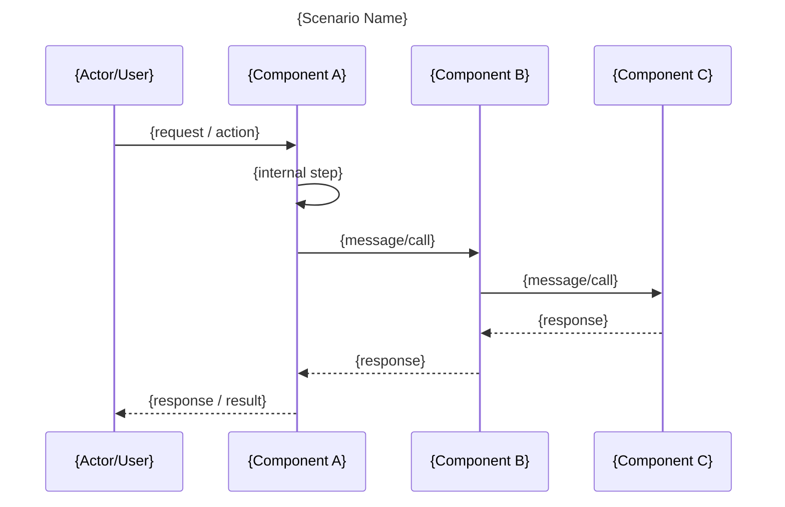
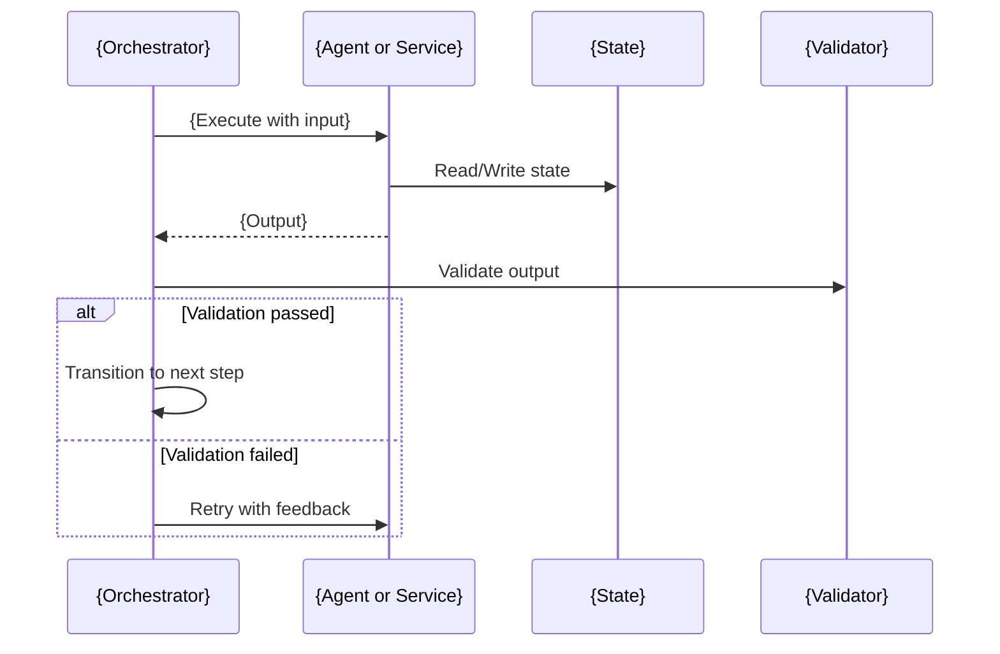

# Sequence Diagram Template

**Type**: Behavioral | **View**: Process  
**Purpose**: Map the order of interactions between system components over time (e.g. user flows, API calls). Use **concrete participant names** and **concrete message/artifact names** so the diagram is descriptive and useful (see rules DIAG-019–DIAG-022).

## When to Use

- Documenting a single scenario or flow (e.g. "login", "place order", "payment failure")
- Showing message order between actors, APIs, and services
- Analyzing user or system flows for design or troubleshooting
- **Orchestration flows** (e.g. Pipeline → Agent → State → Validator; retry branch)

## Descriptive Checklist

Before finalizing, ensure:
- [ ] **Concrete participants**: Real component/role names (e.g. Pipeline, ideation_agent, State, Validator), not "Component A".
- [ ] **Concrete messages**: Real operations or artifacts (e.g. "Execute Phase N Agent (input)", "Phase output", "Validate output", "Retry with feedback").
- [ ] **Return/response** where it clarifies (e.g. "Phase output", "ValidationResult").
- [ ] **Alt/else** for validation pass vs fail or retry when the flow has branches.

---

## Diagram

One scenario per diagram. Put the primary actor or trigger on the left. Use **concrete** present-tense labels for messages.

## Optional: Alternatives and Loops

Use when the flow has **validation**, **retry**, or **error** branches. Name the condition and the alternative clearly.

---

## Placeholders

| Placeholder    | Replace With |
|----------------|--------------|
| {Scenario Name}| e.g. Order Placement, Pipeline Phase Execution, User Login |
| {Actor/User}   | e.g. User, CLI, Admin |
| {Component A/B/C} | **Concrete** names (e.g. Pipeline, narrative_agent, State, Validator) |
| {request / action}, {message/call}, {response} | **Concrete** descriptions (e.g. "Execute Phase N Agent (input)", "Phase output", "Validate output") |

## Caption (add below diagram)

> This sequence diagram describes the {scenario name} flow. {One sentence on the main takeaway, e.g. "Shows how the pipeline validates phase output and retries on failure."}
