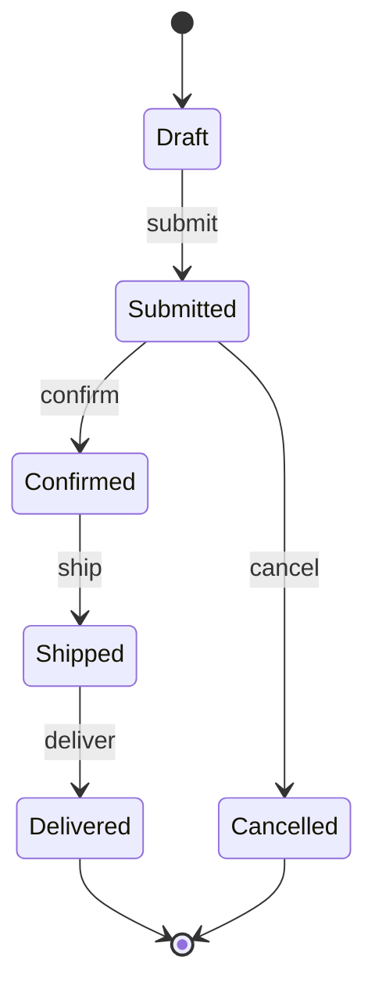

# State Machine Diagram Template

**Type**: Behavioral  
**Purpose**: Model the life cycle of an object or system, showing states and transitions.

## When to Use

- Documenting entity or aggregate life cycle (e.g. Order, Payment, Subscription)
- Showing valid state transitions and events
- Clarifying workflow states for developers and product

**Descriptive**: Use **concrete** state and event names from the domain (e.g. Draft, Submitted, content_characterization_pending); label transitions with real events or conditions.

## Diagram

One diagram per entity/aggregate. Define initial and terminal states. Use events or triggers on transitions.

```mermaid
stateDiagram-v2
    [*] --> {InitialState}
    {InitialState} --> {State2} : {event / trigger}
    {State2} --> {State3} : {event}
    {State2} --> {State4} : {event}
    {State3} --> {FinalState} : {event}
    {State4} --> {FinalState} : {event}
    {FinalState} --> [*]
```

## Example (Order lifecycle)



## Placeholders

| Placeholder     | Replace With |
|-----------------|--------------|
| {InitialState}  | e.g. Draft, New, Pending |
| {State2/3/4}    | State names (nouns or noun phrases) |
| {FinalState}    | e.g. Delivered, Completed, Cancelled |
| {event / trigger} | Verb or event (e.g. submit, confirm, timeout) |

## Caption (add below diagram in your doc)

> This state machine describes the {entity name} life cycle. {One sentence on the main takeaway.}
