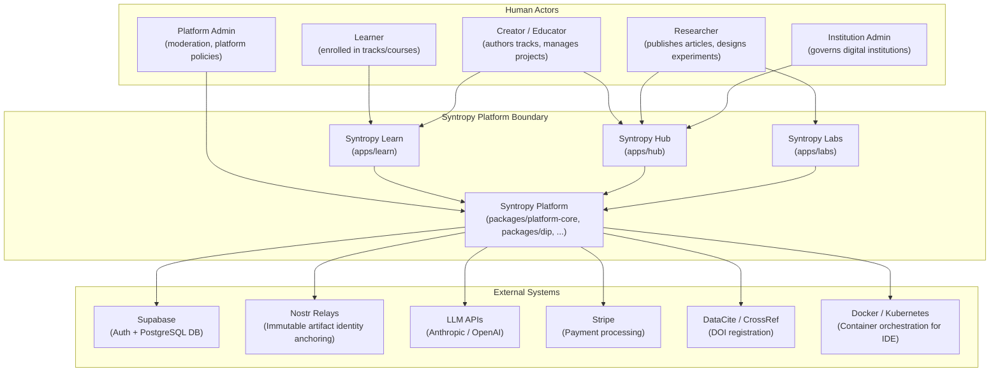
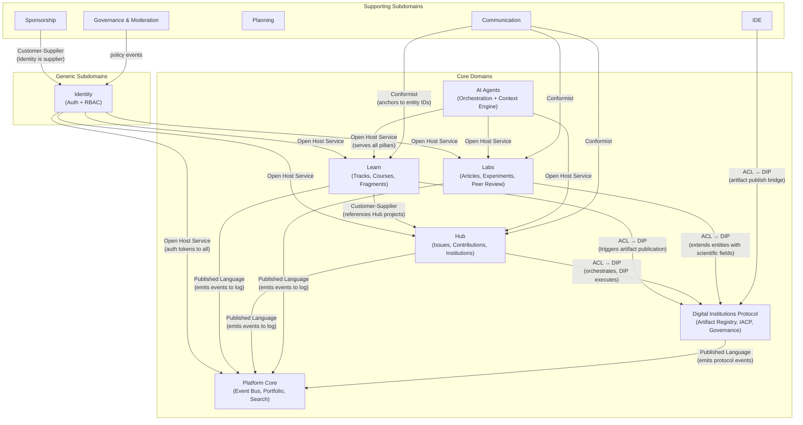
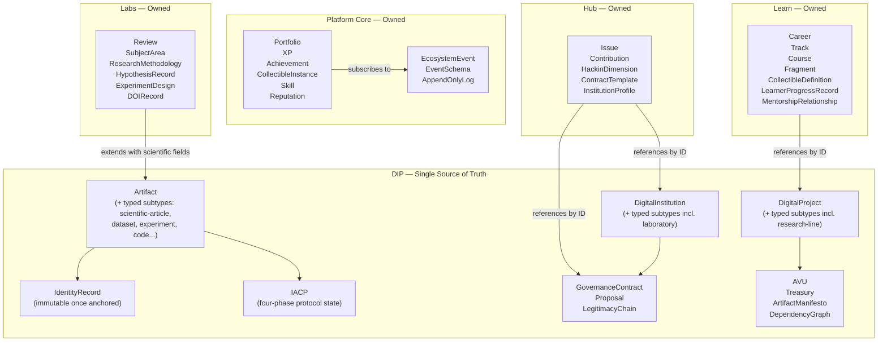
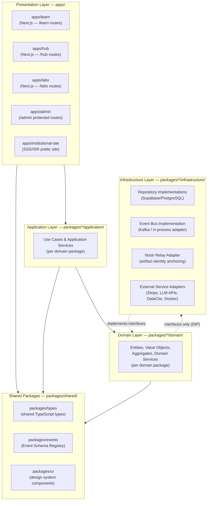

# Syntropy Ecosystem — System Architecture

> **Document Type**: Root Architecture Document (Level 1 - Context)
> **Last Updated**: 2026-03-12
> **Version**: 1.0.0

## Generation Metadata

| Field | Value |
|-------|-------|
| **Source** | [Vision Document](../vision/VISION.md) |
| **Generated** | 2026-03-12 |
| **Framework** | Vision-to-System Framework (see `.cursor/FRAMEWORK.md`) |
| **Architecture Brief** | [docs/context/architecture-brief.md](../context/architecture-brief.md) |

---

## System Purpose

The Syntropy Ecosystem is a unified platform where learning, building, and researching are a single continuous journey rather than three disconnected activities. It addresses the fundamental fragmentation of knowledge work: creators who learn in isolation, researchers whose findings never reach practitioners, and contributors who build without recognition or ownership of what they produce.

The platform is composed of three pillars — **Syntropy Learn** (project-first education where every fragment builds a real artifact), **Syntropy Hub** (digital institution creation, collaboration, and open source project management with verifiable governance), and **Syntropy Labs** (open, decentralized scientific research with transparent peer review and cryptographic artifact identity) — unified by a shared foundation layer (**Syntropy Platform**) that provides authentication, a verifiable dynamic portfolio, an event bus, gamification, an embedded IDE, AI agents, cross-pillar search and recommendation, and the Digital Institutions Protocol.

Every action in the ecosystem leaves a verifiable trace. A user's portfolio builds itself from what the ecosystem recorded — not from self-reporting. Creators own their artifacts cryptographically. Institutions exist as complete entities with governance contracts, decision histories, contributor structures, and value distribution mechanisms — all in one place, all verifiable, all executable without depending on external legal infrastructure.

---

## Vision Traceability

| Vision Capability | Domain(s) | Notes |
|-------------------|-----------|-------|
| §1 Identity and authentication (cap. 1) | Identity | User accounts, sessions, RBAC enforcement |
| §2 Verifiable portfolio (cap. 2) | Platform Core → Portfolio Aggregation | Automatic, cryptographically anchored, no manual curation |
| §3 Cross-pillar recommendation (cap. 3) | Platform Core → Search & Recommendation | Turns portfolio records into real opportunities |
| §4 Voluntary sponsorship and monetization (cap. 4) | Sponsorship | Creator monetization, impact discovery |
| §5 Embedded IDE (cap. 5) | IDE | Monaco/VS Code, container lifecycle, shared across pillars |
| §6 Cross-pillar planning board (cap. 6) | Planning | Vocabulary adapts per pillar (kanban/study plan/sprint) |
| §7 Gamification engine (cap. 7) | Platform Core → Portfolio Aggregation | XP, achievements, collectibles |
| §8 Contextualized forums and messaging (cap. 8) | Communication | Thread anchors reference entities from any domain |
| §9 Platform governance (cap. 9) | Governance & Moderation + Identity | Policy definition vs enforcement separation |
| §10 Data traceability (cap. 10) | Platform Core → Event Bus & Audit | Full event log, causal chain tracking |
| §11 Content moderation (cap. 11) | Governance & Moderation | Platform-level moderation policies |
| §12 AI agents (cap. 12) | AI Agents | Unified user context model, pillar-specific agents |
| §13–18 Digital Institutions Protocol (cap. 13–18) | DIP | Artifact registry, IACP, governance, value distribution |
| §19–26 Syntropy Learn (cap. 19–26) | Learn | Tracks, courses, fragments, creator tools, mentorship |
| §27–32 Syntropy Hub (cap. 27–32) | Hub | Collaboration layer, institution orchestration, public square |
| §33–40 Syntropy Labs (cap. 33–40) | Labs | Article editor, experiment design, peer review, DOI publication |

---

## Document Map

```
docs/architecture/ARCHITECTURE.md   ← You are here (root)
│
├── domains/
│   ├── platform-core/ARCHITECTURE.md          → Event bus, portfolio, search & recommendation
│   │   └── subdomains/
│   │       ├── event-bus-audit.md              → Event Schema Registry, append-only log, signing hierarchy
│   │       ├── portfolio-aggregation.md        → Portfolio, XP, achievements, gamification
│   │       └── search-recommendation.md        → Cross-pillar search index, recommendation engine
│   │
│   ├── identity/ARCHITECTURE.md               → Authentication, session management, RBAC
│   │
│   ├── digital-institutions-protocol/ARCHITECTURE.md  → Artifact registry, IACP, governance, treasury
│   │   └── subdomains/
│   │       ├── artifact-registry.md            → Artifact lifecycle, Nostr anchoring, IdentityRecord
│   │       ├── iacp-engine.md                  → Four-phase protocol execution
│   │       ├── smart-contract-engine.md        → Deterministic contract evaluation
│   │       ├── project-manifest-dag.md         → Dependency graph, DAG acyclicity invariant
│   │       ├── institutional-governance.md     → Chamber system, deliberation, LegitimacyChain
│   │       └── value-distribution-treasury.md  → AVU computation, treasury, oracle liquidation
│   │
│   ├── ai-agents/ARCHITECTURE.md              → Orchestration, agent registry, pillar agents
│   │   └── subdomains/
│   │       ├── orchestration-context-engine.md → UserContextModel, routing, memory
│   │       ├── agent-registry-tool-layer.md    → Agent definitions, versioning, tool scoping
│   │       └── pillar-agents.md                → 12 specialized agents + cross-pillar navigator
│   │
│   ├── learn/ARCHITECTURE.md                  → Tracks, courses, fragments, creator tools, mentorship
│   │   └── subdomains/
│   │       ├── content-hierarchy-navigation.md → Career→Track→Course, fog-of-war navigation
│   │       ├── fragment-artifact-engine.md     → Problem→Theory→Artifact invariant
│   │       ├── creator-tools-copilot.md        → AI-assisted authoring workflow
│   │       └── mentorship-community.md         → MentorshipRelationship lifecycle
│   │
│   ├── hub/ARCHITECTURE.md                    → Issues, contributions, hackin, institution orchestration
│   │   └── subdomains/
│   │       ├── collaboration-layer.md          → Issue/Contribution/HackinDimension lifecycles
│   │       ├── institution-orchestration.md    → ContractTemplates, InstitutionProfile read model
│   │       └── public-square.md                → Discovery read model over DIP entities
│   │
│   ├── labs/ARCHITECTURE.md                   → Article editor, experiments, peer review, DOI
│   │   └── subdomains/
│   │       ├── scientific-context-extension.md → ResearchMethodology, HypothesisRecord, SubjectArea
│   │       ├── article-editor.md               → MyST+LaTeX, immutable versioning
│   │       ├── experiment-design.md            → ExperimentDesign model, IDE delegation
│   │       ├── open-peer-review.md             → Review lifecycle, reputation-filtered visibility
│   │       └── doi-external-publication.md     → DOIRecord, DataCite/CrossRef integration
│   │
│   ├── sponsorship/ARCHITECTURE.md            → Voluntary sponsorship, creator monetization
│   ├── communication/ARCHITECTURE.md          → Forums, messaging, activity feed, notifications
│   ├── planning/ARCHITECTURE.md               → Cross-pillar planning board, mentor coordination
│   ├── ide/ARCHITECTURE.md                    → Embedded IDE, container lifecycle, artifact publish bridge
│   └── governance-moderation/ARCHITECTURE.md  → Content moderation, role policies, community governance
│
├── cross-cutting/
│   ├── security/ARCHITECTURE.md              → AuthN/AuthZ, encryption, compliance (GDPR/LGPD/CCPA)
│   ├── observability/ARCHITECTURE.md         → Structured logging, distributed tracing, metrics
│   ├── data-integrity/ARCHITECTURE.md        → Immutability guarantees, append-only log, Nostr anchoring
│   └── resilience/ARCHITECTURE.md            → Circuit breakers, retry, DLQ, event bus durability
│
├── platform/
│   ├── web-application/ARCHITECTURE.md       → Next.js SPA/SSR, routing, design system, WCAG 2.1 AA
│   ├── rest-api/ARCHITECTURE.md              → API gateway, versioning, envelope format, rate limiting
│   ├── background-services/ARCHITECTURE.md   → Event bus topology, workers, pipelines
│   ├── embedded-ide/ARCHITECTURE.md          → Monaco embedding, container lifecycle, resource quotas
│   └── institutional-site/ARCHITECTURE.md    → Public read layer over Platform Core + DIP entities
│
├── diagrams/
│   └── README.md                             → Index of all diagrams across architecture documents
│
└── evolution/
    └── CHANGELOG.md                          → Architecture change history
```

---

## System Context Diagram



---

## Domain Overview

The system is organized into 12 bounded contexts. Each domain owns its data and logic. Cross-domain communication happens exclusively through the event bus (async) or versioned internal APIs (sync). No direct cross-domain database access is permitted (ARCH-003).

| Domain | Type | Responsibility | Documentation |
|--------|------|---------------|---------------|
| **Platform Core** | Core | Event bus & audit log, portfolio aggregation, gamification, cross-pillar search & recommendation | [→ Architecture](./domains/platform-core/ARCHITECTURE.md) |
| **Identity** | Generic | Authentication, session management, RBAC enforcement | [→ Architecture](./domains/identity/ARCHITECTURE.md) |
| **Digital Institutions Protocol (DIP)** | Core | Artifact registry & identity anchoring, IACP four-phase protocol, smart contracts, institutional governance, value distribution & treasury | [→ Architecture](./domains/digital-institutions-protocol/ARCHITECTURE.md) |
| **AI Agents** | Core (orchestration) / Supporting (agents) | Agent orchestration, unified user context model, agent registry & tool layer, specialized pillar agents | [→ Architecture](./domains/ai-agents/ARCHITECTURE.md) |
| **Learn** | Core | Tracks, courses, fragments (Problem→Theory→Artifact invariant), creator tools, mentorship, collectible definitions | [→ Architecture](./domains/learn/ARCHITECTURE.md) |
| **Hub** | Core | Collaboration layer (issues, contributions, hackin), institution orchestration UI, public square discovery | [→ Architecture](./domains/hub/ARCHITECTURE.md) |
| **Labs** | Core | Scientific context extension on DIP entities, article editor (MyST+LaTeX), experiment design, open peer review, DOI publication | [→ Architecture](./domains/labs/ARCHITECTURE.md) |
| **Sponsorship** | Supporting | Voluntary sponsorship, creator monetization, impact discovery | [→ Architecture](./domains/sponsorship/ARCHITECTURE.md) |
| **Communication** | Supporting | Contextualized forums (anchor-required), direct messaging, activity feed, notifications | [→ Architecture](./domains/communication/ARCHITECTURE.md) |
| **Planning** | Supporting | Cross-pillar planning board (vocabulary adapts per pillar), mentor coordination | [→ Architecture](./domains/planning/ARCHITECTURE.md) |
| **IDE** | Supporting | Embedded code editor, container lifecycle per session, artifact publish bridge to DIP | [→ Architecture](./domains/ide/ARCHITECTURE.md) |
| **Governance & Moderation** | Supporting | Platform-level content moderation policies, role policy management, community governance | [→ Architecture](./domains/governance-moderation/ARCHITECTURE.md) |

> **Note on Institutional Site**: The Institutional Site is NOT a domain. It has no owned business data or domain logic. It is a platform delivery document (`platform/institutional-site/`) serving as a public-facing read layer over Platform Core metrics and public DIP entities.

---

## Domain Relationships



---

## Context Map

Full context map showing all integration patterns between bounded contexts.

| Upstream | Downstream | Pattern | Direction | Notes |
|----------|-----------|---------|-----------|-------|
| DIP | Hub | Anti-Corruption Layer | Hub consumes DIP | Hub translates management UI actions into DIP protocol calls; DIP vocabulary must not leak into Hub's ubiquitous language |
| DIP | Labs | Anti-Corruption Layer | Labs consumes DIP | Labs extends DIP entities with scientific fields via references; never duplicates DIP-owned concepts |
| DIP | Learn | Anti-Corruption Layer | Learn consumes DIP | Learn triggers DIP Artifact publication; references DIP Projects by ID only |
| DIP | IDE | Anti-Corruption Layer | IDE consumes DIP | Artifact publication from IDE calls DIP Artifact Registry via ACL; IDE vocabulary does not enter DIP |
| Hub | Learn | Customer-Supplier | Learn references Hub | Learn references Hub Projects for ReferenceProject and LearnerProject; Hub is supplier |
| Platform Core | All pillars | Published Language | Pillars emit, Platform Core consumes | Versioned Event Schema Registry is the Published Language all domains must conform to when emitting events |
| Identity | All domains | Open Host Service | Identity serves all | Authentication and RBAC provided as well-defined service; every domain is a consumer |
| AI Agents | All pillars | Open Host Service | AI Agents serves all | Orchestration engine provides context-aware agents to all pillars via declared tool layer |
| All domains | Communication | Conformist | Communication anchors to all | Thread ContextAnchors reference entity IDs from any domain; Communication conforms to their ID contracts without translation |
| Identity | Sponsorship | Customer-Supplier | Sponsorship consumes Identity | User identity (supplier) provides actor attribution; Sponsorship wraps Stripe behind its own ACL |

---

## Ecosystem Entity Ownership Hierarchy

**DIP is the single source of truth for all fundamental ecosystem entities.** Pillars reference DIP entities by ID and extend them with pillar-specific state — they never duplicate or re-own them.



---

## Modular Monolith Layer Structure

The system follows a **4-layer clean architecture** within a **Turborepo + pnpm workspaces monorepo**. Bounded contexts are implemented as workspace packages. Communication between packages happens exclusively via the event bus or versioned APIs — no direct imports between pillar apps (`apps/`).



---

## Platform Services

Shared infrastructure and platform capabilities that all domains depend on.

| Service | Purpose | Documentation |
|---------|---------|---------------|
| **Web Application** | Next.js SPA/SSR frontend, routing, design system, WCAG 2.1 AA | [→ Architecture](./platform/web-application/ARCHITECTURE.md) |
| **REST API** | API gateway, versioning strategy, cross-pillar endpoints, error envelope | [→ Architecture](./platform/rest-api/ARCHITECTURE.md) |
| **Background Services** | Event bus topology, workers, event schema enforcement, pipelines | [→ Architecture](./platform/background-services/ARCHITECTURE.md) |
| **Embedded IDE** | Monaco/VS Code embedding, container lifecycle, artifact publish flow | [→ Architecture](./platform/embedded-ide/ARCHITECTURE.md) |
| **Institutional Site** | Public-facing read layer over Platform Core metrics and public DIP entities | [→ Architecture](./platform/institutional-site/ARCHITECTURE.md) |

---

## Cross-Cutting Concerns

| Concern | Description | Documentation |
|---------|-------------|---------------|
| **Security** | AuthN/AuthZ, encryption at rest (AES-256) and in transit (TLS 1.3), GDPR/LGPD/CCPA compliance, cryptographic key management | [→ Architecture](./cross-cutting/security/ARCHITECTURE.md) |
| **Observability** | Structured logging with correlation IDs, distributed tracing, metrics, audit logs for governance and value distribution | [→ Architecture](./cross-cutting/observability/ARCHITECTURE.md) |
| **Data Integrity** | Three-layer immutability (Nostr for DIP protocol events, append-only hash-chained log for ecosystem events, soft-delete policies per domain) | [→ Architecture](./cross-cutting/data-integrity/ARCHITECTURE.md) |
| **Resilience** | Circuit breakers for all external dependencies, retry with exponential backoff, DLQ, event bus durability, >99.9% availability target | [→ Architecture](./cross-cutting/resilience/ARCHITECTURE.md) |

---

## System-Wide Principles

### Principle 1: Domain Autonomy

Each domain owns its data and logic completely. No direct database access across domain boundaries. All inter-domain communication happens through the event bus (async, preferred) or versioned internal APIs (sync, when immediate consistency is required). The event bus is the backbone — domains broadcast what happened; they do not instruct other domains what to do.

### Principle 2: DIP as Single Source of Truth for Fundamental Entities

The Digital Institutions Protocol owns all fundamental ecosystem entities: Artifact, DigitalProject, DigitalInstitution, GovernanceContract, Proposal, LegitimacyChain, AVU, Treasury, ArtifactManifesto, and DependencyGraph. All other domains reference these by ID and extend them with domain-specific state. They never duplicate entity ownership. This is the non-negotiable constraint that prevents redundancy across domains (see Architecture Brief, Entity Ownership Principle).

### Principle 3: Immutability by Layer

The ecosystem maintains three distinct immutability guarantees:
1. **DIP protocol events** (artifact identity records, legitimacy chain execution events) are anchored to Nostr relays — externally verifiable without trusting the platform.
2. **Ecosystem events** (Fragment completed, Contribution accepted, etc.) are stored in an append-only hash-chained log — tamper-evident and internally auditable.
3. **Domain entity mutations** follow soft-delete policies per domain — no retroactive modification of the event record.

### Principle 4: Anti-Corruption Layers at Every Core Domain Boundary

When a Core Domain (DIP, Learn, Hub, Labs) consumes data from an external system or a Generic Subdomain (Identity, Stripe, Nostr, LLM APIs), an Anti-Corruption Layer is mandatory. External model vocabulary must never leak into the core domain's ubiquitous language. All ACL adapters are explicitly documented in the domain's Context Map section.

### Principle 5: Event Schema Registry as Inter-Domain Contract

All events emitted to the event bus must conform to a registered schema version in the Event Schema Registry (Platform Core → Event Bus & Audit subdomain). Schema versions are immutable once published. Breaking changes require a new version. This registry is the Published Language that all domains must speak.

### Principle 6: Observability by Default

Every domain package exposes structured logs with causal chain correlation IDs, metrics for key business operations, and propagates distributed tracing headers across all service calls. Governance contract execution and value distribution operations require full audit trails as per compliance requirements.

---

## Technology Radar

| Category | Adopt | Trial | Assess | Hold |
|----------|-------|-------|--------|------|
| **Languages** | TypeScript | — | — | — |
| **Frontend Framework** | Next.js (App Router) | — | — | — |
| **Monorepo Tooling** | Turborepo + pnpm workspaces | — | — | — |
| **Database** | Supabase / PostgreSQL (ADR-004) | — | — | — |
| **Cache** | Redis | — | — | — |
| **Event Bus** | — | Kafka | RabbitMQ (in-process for dev) | — |
| **Identity Anchoring** | — | — | Nostr Relays (ADR-003) | — |
| **IDE Embedding** | Monaco Editor (ADR-007) | — | VS Code Web | — |
| **Scientific Writing** | MyST Markdown + LaTeX (ADR-008) | — | — | — |
| **AI Integration** | — | Anthropic Claude API | OpenAI API | Vendor-specific SDKs |
| **Container Orchestration** | — | Kubernetes | Docker Compose (dev only) | — |
| **Scientific Publishing** | — | DataCite / CrossRef | OpenAlex | — |

> **Note**: Items marked with ADR references will be fully documented in ADR-001 through ADR-010 (Prompt 01-C). Technology choices for event bus, Nostr, and AI are in Trial/Assess until ADRs are finalized.

---

## Navigation Guide for AI Assistants

> Use this guide to determine which architecture documents to consult before implementing any feature.

**For feature implementation in a specific pillar**:
1. Identify which domain owns the feature (consult Domain Overview table above)
2. Load that domain's `ARCHITECTURE.md`
3. If the feature touches DIP entities (Artifact, DigitalProject, DigitalInstitution), also load `domains/digital-institutions-protocol/ARCHITECTURE.md`
4. Check cross-cutting concerns if security, observability, or resilience patterns are involved

**For event bus or portfolio features**:
1. Load `domains/platform-core/ARCHITECTURE.md`
2. Load the relevant subdomain: `event-bus-audit.md`, `portfolio-aggregation.md`, or `search-recommendation.md`

**For AI agent features**:
1. Load `domains/ai-agents/ARCHITECTURE.md`
2. Load the relevant subdomain under `domains/ai-agents/subdomains/`

**For infrastructure or deployment changes**:
1. Load the relevant platform document under `platform/`
2. Check `cross-cutting/resilience/ARCHITECTURE.md` if availability is affected

**For data model changes**:
1. Load the owning domain's architecture (check Entity Ownership Hierarchy above if uncertain)
2. If the entity is owned by DIP, load `domains/digital-institutions-protocol/ARCHITECTURE.md` and the relevant subdomain

**For security or compliance features**:
1. Load `cross-cutting/security/ARCHITECTURE.md` first
2. Load the affected domain's architecture

---

## Key Architecture Decisions (ADRs)

The following ADRs govern system-wide choices. All are created in Prompt 01-C.

| ADR | Subject | Status |
|-----|---------|--------|
| ADR-001 | Modular monolith with Turborepo + pnpm workspaces; event bus + APIs only for cross-context communication | *Pending — created in Prompt 01-C* |
| ADR-002 | Message broker selection for event bus (Kafka vs RabbitMQ vs in-process) | *Pending — created in Prompt 01-C* |
| ADR-003 | Artifact identity anchoring via Nostr relays | *Pending — created in Prompt 01-C* |
| ADR-004 | Supabase / PostgreSQL as primary data store | *Pending — created in Prompt 01-C* |
| ADR-005 | Supabase Auth + custom RBAC layer; ACL wrapping Supabase Auth | *Pending — created in Prompt 01-C* |
| ADR-006 | LLM API integration approach; agent registry and orchestration architecture | *Pending — created in Prompt 01-C* |
| ADR-007 | Monaco Editor / VS Code; container orchestration strategy | *Pending — created in Prompt 01-C* |
| ADR-008 | MyST Markdown + LaTeX adoption for scientific writing | *Pending — created in Prompt 01-C* |
| ADR-009 | AVU accounting model; prohibition on platform tokens; oracle-based liquidation | *Pending — created in Prompt 01-C* |
| ADR-010 | Two-level event signing hierarchy; Event Schema Registry as versioned inter-domain contract | *Pending — created in Prompt 01-C* |

---

## Related Documents

- [Vision Document](../vision/VISION.md) — Source of truth for system purpose and capabilities
- [Architecture Brief](../context/architecture-brief.md) — Confirmed brief governing this architecture generation
- [Diagram Index](./diagrams/README.md) — All diagrams across architecture documents
- [Architecture Changelog](./evolution/CHANGELOG.md) — Architecture evolution history
