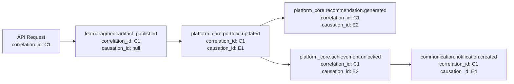

# Observability — Cross-Cutting Architecture

> **Document Type**: Cross-Cutting Concern Architecture Document
> **Parent**: [System Architecture](../../ARCHITECTURE.md)
> **Last Updated**: 2026-03-12
> **Owner**: Syntropy Core Team

---

## Purpose

Observability enables the team to understand the internal state of the Syntropy Ecosystem from the outside — through logs, metrics, and traces. Full event traceability (Vision §9 priority 8) is not only a monitoring concern but a core product promise: every action in the ecosystem leaves a verifiable trace. The observability stack must support both operational monitoring and the business requirement of causal chain reconstruction.

---

## Scope

This document applies to all 12 domains and all platform services. Every component that processes a request, emits an event, or changes state must participate in the observability stack.

---

## Principles

| Principle | Description |
|-----------|-------------|
| **Structured logging by default** | All logs are JSON-structured; no unstructured log output in production |
| **Correlation IDs on every request** | Every API request and event carries a correlation_id that links all downstream effects |
| **Causal chain in events** | Every EcosystemEvent includes causation_id (the event that caused this one) and correlation_id (the root initiating action) |
| **Distributed tracing propagated** | OpenTelemetry trace headers propagated across all service boundaries, including Kafka messages |
| **Metrics for every key business operation** | Not just technical metrics (latency, error rate) but business metrics (fragments published per day, contributions integrated per week) |
| **Audit logs for compliance operations** | Governance contract execution, value distribution, and data erasure requests produce immutable audit records |

---

## Standards

### Logging Standards

| Field | Format | Required? | Notes |
|-------|--------|-----------|-------|
| `timestamp` | ISO 8601 UTC | Yes | `2026-03-12T14:30:00.123Z` |
| `level` | INFO/WARN/ERROR/FATAL | Yes | Use WARN and above for actionable issues |
| `service` | `{domain}.{subdomain}` | Yes | Example: `platform_core.event_bus_audit` |
| `correlation_id` | UUID | Yes | From request header or generated at entry point |
| `causation_id` | UUID | Yes (for event handlers) | ID of the event that triggered this handler |
| `user_id` | UUID (or "system") | Yes (if available) | Anonymized to hashed ID for external log storage |
| `message` | string | Yes | Human-readable description |
| `data` | JSON object | No | Additional context |
| `error` | `{code, message, stack}` | Yes (for errors) | Stack trace in development; omit in production |

### Distributed Tracing Standards

Framework: **OpenTelemetry** (OTLP protocol)

All traces must include:
- `trace_id` — unique identifier for the full request trace
- `span_id` — unique identifier for this specific operation
- `parent_span_id` — links to parent span
- Service name, operation name, duration

**Propagation**: W3C TraceContext headers (`traceparent`, `tracestate`) propagated in:
- All HTTP requests (request and response)
- All Kafka messages (as message headers)
- All internal gRPC calls

### Metrics Standards

Framework: **Prometheus** (scrape model)

| Metric Type | Examples | Labels |
|-------------|----------|--------|
| Counter | `fragments_published_total`, `contributions_integrated_total` | `pillar`, `status` |
| Gauge | `active_ide_sessions`, `pending_doi_registrations` | `domain` |
| Histogram | `api_response_duration_seconds`, `event_log_append_duration_seconds` | `service`, `endpoint`, `status_code` |

---

## Patterns

### Causal Chain Tracking

Every EcosystemEvent in the AppendOnlyLog carries:
- `correlation_id`: the ID of the root action that initiated the causal chain
- `causation_id`: the ID of the immediately preceding event in the chain

This enables full causal reconstruction: "User X published Fragment Y → which triggered event E1 → which caused portfolio update E2 → which triggered recommendation recomputation E3."

### Compliance Audit Logging

The following operations produce separate, immutable audit log records (in addition to AppendOnlyLog):

| Operation | Audit Record Fields | Retention |
|-----------|--------------------|-|
| Governance contract execution | institution_id, proposal_id, executor_id, action, timestamp | Indefinite |
| AVU distribution / liquidation | treasury_id, amount, recipient, executor_id, timestamp | Indefinite |
| Data erasure request | user_id_hashed, request_id, fields_erased, timestamp | 7 years |
| Role assignment / revocation | user_id, role, granted_by, timestamp | 7 years |
| Moderation action | content_id, moderator_id, action, timestamp | 7 years |

---

## Domain Integration

### Per-Domain Observability Requirements

| Domain | Key Metrics | Key Audit Events |
|--------|-------------|------------------|
| Platform Core (Event Bus) | `events_logged_total`, `schema_validation_failures_total`, `log_hash_mismatch_total` | None (log IS the audit trail) |
| Platform Core (Portfolio) | `portfolio_updates_total`, `achievements_unlocked_total` | None |
| DIP | `artifacts_anchored_total`, `iacp_phases_completed_total`, `governance_executions_total` | Governance execution, AVU distribution |
| Identity | `logins_total`, `login_failures_total`, `token_verifications_total` | Role assignment, role revocation |
| Learn | `fragments_published_total`, `tracks_completed_total` | None |
| Hub | `contributions_integrated_total`, `issues_closed_total` | None |
| Labs | `articles_published_total`, `reviews_submitted_total`, `dois_registered_total` | Experiment data access |
| Sponsorship | `sponsorships_started_total`, `liquidations_completed_total` | Payment events |
| IDE | `ide_sessions_started_total`, `ide_sessions_terminated_total` | None |
| Governance & Moderation | `flags_submitted_total`, `moderation_actions_total` | All moderation actions |

---

## Monitoring & Alerting

### SLO-Backed Alerts

| SLO | Metric | Alert Threshold | Severity |
|-----|--------|-----------------|---------|
| API availability > 99.9% | `http_request_error_rate` | > 0.1% for 5 minutes | Critical |
| Portfolio query p99 < 200ms | `api_response_duration_seconds{endpoint=portfolio}` p99 | > 200ms for 5 minutes | High |
| Event log append p99 < 100ms | `event_log_append_duration_seconds` p99 | > 100ms for 5 minutes | High |
| Zero AppendOnlyLog hash mismatches | `log_hash_mismatch_total` | Any increment | Critical |
| Nostr anchoring success rate > 99% | `nostr_anchoring_failures_total` | > 1% of anchoring attempts | High |

---

## Key Decisions

| ADR | Summary |
|-----|---------|
| ADR-010 *(Prompt 01-C)* | Two-level event signing; causal chain IDs in all events; Event Schema Registry as inter-domain contract |

## Related Documents

| Document | Relationship |
|----------|-------------|
| [Event Bus & Audit](../../domains/platform-core/subdomains/event-bus-audit.md) | AppendOnlyLog is the primary observability artifact |
| [Data Integrity](../data-integrity/ARCHITECTURE.md) | Immutability guarantees that make audit logs trustworthy |
| [Resilience](../resilience/ARCHITECTURE.md) | Circuit breakers and DLQ are observable via metrics |
