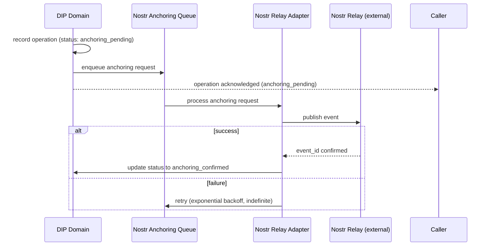

# Resilience — Cross-Cutting Architecture

> **Document Type**: Cross-Cutting Concern Architecture Document
> **Parent**: [System Architecture](../../ARCHITECTURE.md)
> **Last Updated**: 2026-03-12
> **Owner**: Syntropy Core Team

---

## Purpose

Resilience defines the availability targets, failure isolation patterns, and recovery strategies that protect the Syntropy Ecosystem from cascading failures. The platform has a reliability target of > 99.9% uptime (Vision §9 priority 1). This requires that no single external dependency — Kafka, Supabase, LLM APIs, Stripe, Nostr relays, Docker — can take down the entire platform.

---

## Scope

This document applies to all external integrations, the event bus, database connections, and all services that have non-trivial failure modes. It defines circuit breaker configurations, retry policies, fallback strategies, and DLQ (dead letter queue) handling.

---

## Availability Targets

| Component | Target Uptime | RTO | RPO |
|-----------|--------------|-----|-----|
| Overall platform (user-facing) | 99.9% | 1 hour | 0 (event log is source of truth) |
| API endpoints | 99.9% | — | — |
| Event bus processing | 99.9% | 30 minutes | 0 (Kafka durability) |
| DIP Nostr anchoring | 99.5% (best effort) | — | Events queued; retry indefinitely |
| LLM API (AI features) | 99.0% | — | Graceful degradation |

---

## Principles

| Principle | Description |
|-----------|-------------|
| **Fail fast** | Circuit breakers detect failing dependencies quickly; don't let callers wait for timeouts |
| **Degrade gracefully** | Non-critical features (AI agents, search recommendations) become unavailable without taking down critical paths |
| **Event bus durability first** | Kafka durability ensures events are never lost even if consumers are down; recovery is replay |
| **No synchronous dependency on Nostr for protocol events** | Nostr anchoring is asynchronous; DIP operations do not block on Nostr relay response |
| **Retry with exponential backoff** | All retryable failures use exponential backoff with jitter; no tight retry loops |
| **DLQ for poison pills** | Events that cannot be processed after max retries go to a Dead Letter Queue for manual review |

---

## Circuit Breaker Configurations

### External Dependencies

| Dependency | Timeout | Failure Threshold | Wait Duration | Fallback |
|------------|---------|-------------------|---------------|----------|
| Supabase / PostgreSQL | 5s | 50% in 30s | 60s | Read-only mode from cache |
| Kafka / Event Bus | 2s | 3 consecutive failures | 30s | Buffer locally; retry on recovery |
| LLM APIs (Anthropic/OpenAI) | 30s | 2 consecutive failures | 120s | Disable AI features; serve static response |
| Stripe | 10s | 5 consecutive failures | 120s | Queue payment operations; show pending status |
| Nostr Relays | 15s | 3 consecutive failures | 60s | Queue anchoring; retry indefinitely |
| Docker / Kubernetes | 30s | 2 consecutive failures | 60s | Disable IDE session creation |
| DataCite / CrossRef | 15s | 3 consecutive failures | 120s | Queue DOI registration; show pending status |

### Internal Service Dependencies

| Dependency | Timeout | Fallback |
|------------|---------|----------|
| Identity (token verification) | 2s | Reject request with 503 (do not cache stale tokens) |
| Platform Core portfolio query | 5s | Serve cached portfolio (< 5s stale) |
| AI Agents orchestration | 60s | Disable agent activation; show "AI unavailable" |

---

## Retry Policies

### Standard Retry Policy

Applied to all retryable failures (network errors, 5xx responses, connection timeouts):

```
max_attempts: 3
base_delay: 1s
backoff: exponential with jitter
max_delay: 30s

Delay schedule:
  Attempt 1: immediate
  Attempt 2: 1s + jitter(0-500ms)
  Attempt 3: 2s + jitter(0-1000ms)
  After attempt 3: → Dead Letter Queue (if event) or return error (if sync)
```

### Non-Retryable Failures

These errors must **not** be retried (retrying would cause harm):

| Error Type | Reason |
|------------|--------|
| 400 Bad Request | Request is malformed; retry will produce same result |
| 401 Unauthorized | Token expired or invalid; retrying without refreshing token is pointless |
| 403 Forbidden | Permission denied; retrying with same credentials is pointless |
| IACP phase skip attempt | Domain invariant violation; retrying is a bug |

---

## Event Bus Durability

### Kafka Configuration Requirements

| Setting | Value | Rationale |
|---------|-------|-----------|
| `acks` | all | All replicas must acknowledge before write is confirmed |
| `replication_factor` | 3 | Tolerates 2 broker failures without data loss |
| `min.insync.replicas` | 2 | Write rejected if fewer than 2 replicas in sync |
| `retention.ms` | -1 (indefinite) | Event log is permanent |
| Consumer group `enable.auto.commit` | false | Manual commit after successful processing only |

### Dead Letter Queue Handling

**DLQ naming convention**: `{domain}.{subdomain}.dlq`

Events go to DLQ after max retry exhaustion. DLQ processing:
1. Alert fires on any DLQ entry
2. On-call engineer reviews within SLA (Critical = 30 min, High = 4 hours)
3. Root cause identified; fix deployed if needed
4. Message replayed manually or via automated replay tool

---

## Nostr Anchoring Resilience

DIP protocol event anchoring to Nostr relays is **asynchronous and non-blocking**. The DIP operation (artifact publication, governance execution) completes as soon as the Nostr event is **published** (not confirmed). Confirmation is polled asynchronously.



---

## Graceful Degradation Map

| Feature | When Degraded | Degraded Behavior |
|---------|---------------|-------------------|
| AI agents | LLM API circuit open | Show "AI assistance unavailable"; all manual operations continue |
| Cross-pillar search | Search index stale | Show cached results with staleness indicator |
| Recommendations | Recommendation engine down | Show "Recommendations unavailable"; manual browse works |
| IDE sessions | Docker/K8s circuit open | Show "IDE unavailable"; code editor shows static preview |
| Nostr anchoring | Nostr circuit open | Anchoring queued; status shows "pending verification" |
| DOI registration | DataCite circuit open | Registration queued; article publication continues |
| Portfolio updates | Event bus consumer lagging | Show "portfolio updating" indicator; old data served from cache |

---

## Health Checks

All services expose a `/health` endpoint with:
- `status`: "healthy" / "degraded" / "unhealthy"
- `dependencies`: map of dependency name → status
- `circuit_breakers`: map of circuit breaker name → state (closed/open/half-open)

---

## Related Documents

| Document | Relationship |
|----------|-------------|
| [Background Services](../../platform/background-services/ARCHITECTURE.md) | Kafka topology and consumer configuration |
| [Observability](../observability/ARCHITECTURE.md) | Circuit breaker metrics; DLQ alerts |
| [Security](../security/ARCHITECTURE.md) | Availability targets and incident response |
| [Data Integrity](../data-integrity/ARCHITECTURE.md) | Event log durability guarantees |

## Key Decisions

| ADR | Summary |
|-----|---------|
| ADR-002 *(Prompt 01-C)* | Message broker selection (Kafka); durability configuration |
| ADR-003 *(Prompt 01-C)* | Asynchronous non-blocking Nostr anchoring |
