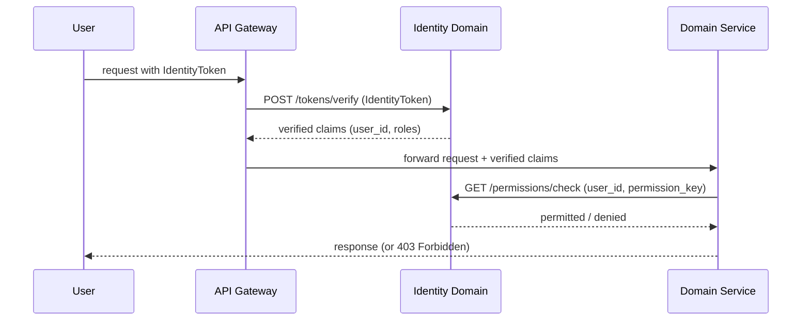

# Security — Cross-Cutting Architecture

> **Document Type**: Cross-Cutting Concern Architecture Document
> **Parent**: [System Architecture](../../ARCHITECTURE.md)
> **Last Updated**: 2026-03-12
> **Owner**: Syntropy Core Team

---

## Purpose

The Security cross-cutting concern defines the authentication, authorization, encryption, cryptographic key management, and compliance controls that apply uniformly across all 12 domains of the Syntropy Ecosystem. No domain may bypass these standards. Security is applied in layers — defense in depth — with controls at the edge (Identity), at each domain boundary (RBAC), and in storage (encryption at rest).

---

## Scope

This document applies to:
- All API endpoints (REST and internal)
- All data stored in any domain
- All data transmitted between components
- All external integrations (Stripe, LLM APIs, Nostr, DataCite, Docker)
- All user-facing applications (web app, embedded IDE)

---

## Principles

| Principle | Description | Implementation |
|-----------|-------------|----------------|
| **Authenticate at the edge** | No unauthenticated request reaches a domain service | Identity Open Host Service verifies IdentityToken at API gateway |
| **Authorize at the resource** | Permission checks happen closest to the resource being accessed | Each domain service checks permissions via Identity RBAC API |
| **Encrypt in transit** | All data in motion is encrypted | TLS 1.3 for all external; mTLS for all internal service-to-service |
| **Encrypt at rest** | All sensitive data is encrypted at storage layer | AES-256 for all Confidential and Restricted data |
| **Least privilege** | Services and users access only what they need | ToolScope per agent; service token scopes per domain |
| **Privacy by design** | Personal data minimization; PII classified explicitly | See Data Classification section |
| **Zero implicit trust** | Every inter-service call is authenticated | Service tokens required for internal APIs; no implicit same-network trust |

---

## Standards

### Authentication Standards

| Mechanism | Standard | Applies To |
|-----------|----------|------------|
| OAuth2 / OpenID Connect | OIDC 1.0 | End-user login (via Supabase Auth) |
| JWT | RFC 7519 | IdentityToken format |
| Magic Link | PKCE flow | Passwordless login |
| mTLS | TLS 1.3 + client cert | Internal service-to-service |
| API Keys | HMAC-signed tokens | Background service authentication |

### Encryption Standards

| Context | Standard | Notes |
|---------|----------|-------|
| Data at rest | AES-256-GCM | Applied to all Confidential and Restricted fields |
| Data in transit (external) | TLS 1.3 | Enforced at load balancer / API gateway |
| Data in transit (internal) | mTLS | All internal service calls |
| Event bus messages | TLS (Kafka) | Plaintext within encrypted transport |
| Artifact identity signing | Nostr event format (secp256k1) | Actor-signed DIP protocol events |

---

## Data Classification

All data in the ecosystem is classified into one of four tiers:

| Tier | Examples | Controls |
|------|----------|---------|
| **Public** | Published artifacts, institution profiles, article titles, track descriptions | No special access control; cached freely |
| **Internal** | Event log entries, achievement records, skill scores, service configuration | Authenticated access only; not exposed to end users directly |
| **Confidential** | User email, portfolio details, contribution drafts, agent conversation history, sponsorship amounts | Encrypted at rest; access-controlled; GDPR/LGPD/CCPA subject |
| **Restricted** | Cryptographic keys, payment credentials, Nostr private keys | Stored in Vault only; never logged; never in application memory longer than necessary |

### Domain Data Classification Map

| Domain | Confidential Data | Restricted Data |
|--------|-------------------|-----------------|
| Identity | User email, display name, session data | — |
| Platform Core | Portfolio details, recommendations | — |
| DIP | Treasury balances, draft IACP terms | Actor private keys (user-owned, never stored by platform) |
| AI Agents | AgentSession conversations, UserContextModel | LLM API keys |
| Learn | LearnerProgressRecord, draft Fragment content | — |
| Labs | Article drafts, experiment participant data | — |
| Sponsorship | Sponsorship amounts, sponsor identity | Stripe keys |
| Communication | Private messages, notification content | — |

---

## Cryptographic Key Management

### Actor Keys (DIP Protocol Signing)

DIP protocol events (artifact anchoring, governance execution) require actor-level cryptographic signatures using secp256k1 keys (Nostr format). These are **user-owned keys** — the platform **never stores** a user's private key.

**Key lifecycle**:
1. User generates a Nostr key pair in-browser
2. Public key is registered with the user's Identity ActorId
3. Signing operations happen client-side or in a secure enclave
4. Platform verifies signatures against the registered public key

### Service Keys (Ecosystem Event Signing)

Platform services use HMAC-SHA256 service keys to sign ecosystem events added to the AppendOnlyLog.

**Key lifecycle**:
1. Service keys generated and stored in Vault (HashiCorp Vault or equivalent)
2. Rotated quarterly or on suspected compromise
3. Event Bus & Audit service retrieves key at startup; re-fetches on rotation signal
4. Previous key versions retained for audit log verification

---

## Compliance Requirements

### Applicable Regulations

| Regulation | Applicability | Key Requirements |
|------------|---------------|-----------------|
| **GDPR** | EU users | Right to access, right to erasure, data portability, DPA consent |
| **LGPD** | Brazil users | Similar to GDPR; explicit consent required |
| **CCPA** | California users | Right to opt out of data sale; right to know; right to delete |

### Compliance Implementation

| Requirement | Implementation |
|-------------|----------------|
| Right to access | `GET /me` returns all personal data; admin export tool for compliance requests |
| Right to erasure | Pseudonymization of PII in AppendOnlyLog (user_id replaced with hashed identifier); soft-delete + anonymization in all domains |
| Data portability | Portfolio export endpoint in Platform Core API |
| Consent management | Consent captured at registration; preference center in user profile |
| Experiment participant data | Mandatory anonymization policy in Labs ExperimentDesign (Invariant ILabs4) |

### Data Retention Policies

| Data Type | Retention Period | Deletion Method |
|-----------|------------------|-----------------|
| Active user data | Lifetime of account | N/A |
| Deleted user data (PII) | 30 days after deletion request | Hard delete PII fields; retain anonymized ID |
| Session data | 30 days after session expiry | Hard delete |
| Event log entries | Indefinite (immutable log) | Pseudonymization only (user_id anonymized) |
| Agent session conversations | 90 days (configurable by user) | Hard delete |
| Experiment participant data | Per anonymization policy defined in ExperimentDesign | Per policy |

---

## Security Patterns

### Authentication Flow



### Defense in Depth Layers

```
Layer 1: Network (TLS 1.3, firewall rules, DDoS protection)
Layer 2: API Gateway (rate limiting, IP allowlisting for admin endpoints)
Layer 3: Authentication (IdentityToken verification on every request)
Layer 4: Authorization (RBAC permission check at domain boundary)
Layer 5: Data (encryption at rest for Confidential/Restricted data)
Layer 6: Application (input validation, SQL injection prevention, XSS prevention)
```

---

## Monitoring & Incident Response

### Security Events to Monitor

| Event | Alert Threshold | Response |
|-------|-----------------|---------|
| Failed authentication (single IP) | > 10 in 5 minutes | Block IP; alert |
| Failed RBAC check (single user) | > 5 in 1 minute | Alert; review session |
| AppendOnlyLog hash mismatch | Any occurrence | Critical alert; halt log writes; investigate |
| Nostr anchoring failure | > 3 consecutive failures | Alert; queue for retry; page on-call |
| Unusual data export volume | > 10x baseline | Alert; manual review |

### Incident Response Procedure

1. **Detection**: Automated monitoring or human report
2. **Triage**: Classify severity (Critical / High / Medium / Low)
3. **Containment**: Revoke compromised tokens/keys; isolate affected service
4. **Investigation**: Review audit logs; trace causal chain in AppendOnlyLog
5. **Remediation**: Fix root cause; rotate keys; patch
6. **Post-mortem**: Document; update monitoring thresholds

---

## Related Documents

| Document | Relationship |
|----------|-------------|
| [Identity Domain](../../domains/identity/ARCHITECTURE.md) | Authentication and RBAC implementation |
| [Data Integrity](../data-integrity/ARCHITECTURE.md) | Immutability and tamper-evidence controls |
| [DIP Domain](../../domains/digital-institutions-protocol/ARCHITECTURE.md) | Actor-level cryptographic signing (Nostr) |
| [Resilience](../resilience/ARCHITECTURE.md) | Availability guarantees and circuit breakers |

## Key Decisions

| ADR | Summary |
|-----|---------|
| ADR-005 *(Prompt 01-C)* | Supabase Auth + custom RBAC as Identity implementation |
| ADR-010 *(Prompt 01-C)* | Two-level signing hierarchy; actor-signed DIP events |
