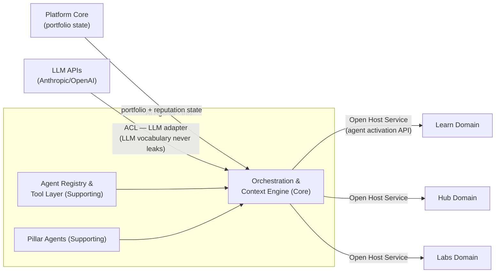
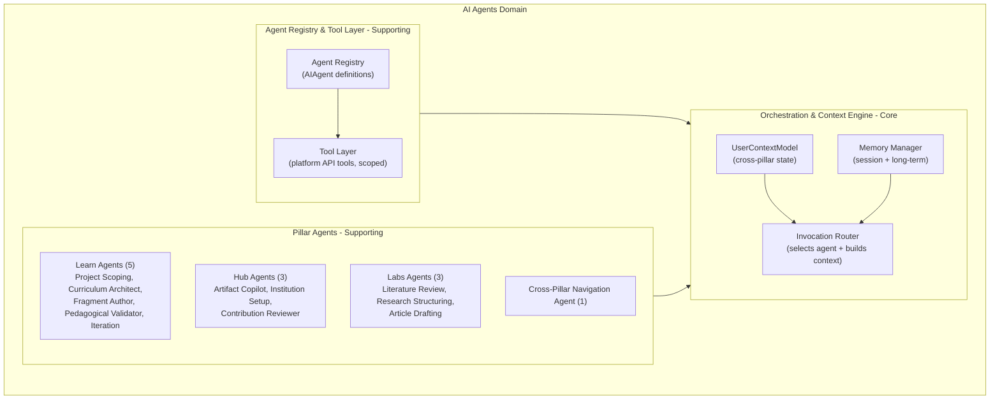
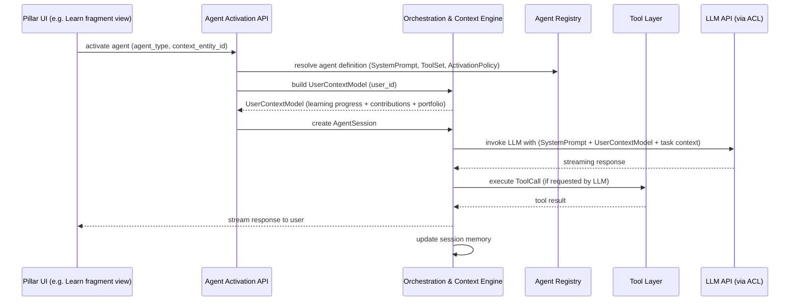
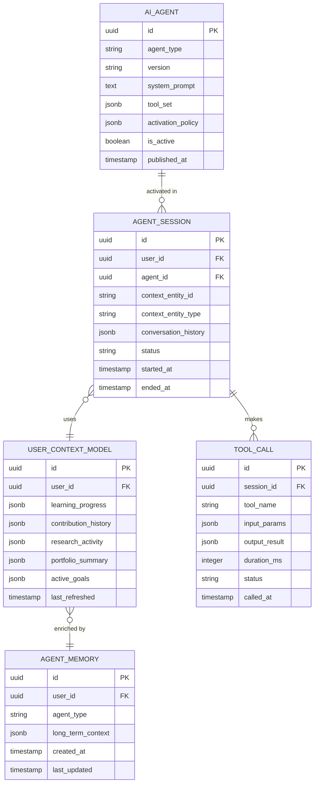

# AI Agents Domain Architecture

> **Document Type**: Domain Architecture Document (Level 2 - Container)
> **Parent**: [System Architecture](../../ARCHITECTURE.md)
> **Last Updated**: 2026-03-12
> **Domain Owner**: Syntropy Core Team
> **Subdomain Type**: Core Domain (Orchestration) / Supporting Subdomain (Pillar Agents)
> **Rationale**: The Orchestration & Context Engine is Core because the unified cross-pillar UserContextModel — combining learning progress, contribution history, research activity, and portfolio state — is the primary competitive differentiator of the AI integration. No off-the-shelf agent framework provides this cross-pillar context model. Pillar Agents are Supporting because each is a specialized application of the orchestration infrastructure.

---

## Vision Traceability

| Vision Element | Section | How This Domain Implements It |
|----------------|---------|-------------------------------|
| AI Copilot for learners (cap. 12 — Learn) | §23 | Learn Agents (Project Scoping, Curriculum Architect, Fragment Author, Pedagogical Validator, Iteration) |
| AI Copilot for creators (cap. 12 — Learn creator) | §24 | Creator AI Copilot agents use the same infrastructure with creator-scoped tool permissions |
| AI Copilot for Hub contributors (cap. 12 — Hub) | §28 | Hub Agents (Artifact Copilot, Institution Setup, Contribution Reviewer) |
| AI Copilot for researchers (cap. 12 — Labs) | §36 | Labs Agents (Literature Review, Research Structuring, Article Drafting) |
| Cross-pillar navigation and recommendations (cap. 3, 12) | §2, §3 | Cross-Pillar Navigation Agent uses unified UserContextModel to surface opportunities across pillars |
| AI Agent System value from unified context | §2 | Orchestration & Context Engine maintains unified cross-pillar UserContextModel making every agent context-aware beyond its pillar |

---

## Document Scope

This document describes the **AI Agents** bounded context — responsible for orchestrating AI interactions across all three pillars using a unified cross-pillar user context model.

### What This Document Covers

- Orchestration architecture and UserContextModel
- Agent registry and tool layer
- Pillar-specific agent catalog
- Integration pattern with pillar domains (Open Host Service)
- Memory management (session and long-term)

### What This Document Does NOT Cover

- LLM API implementation details (see ADR-006 in Prompt 01-C)
- Pillar-specific business logic (those domains own their own use cases)
- IDE container orchestration (see [IDE Architecture](../ide/ARCHITECTURE.md))

---

## Domain Overview

### Business Capability

The AI Agents domain makes every AI interaction in the ecosystem context-aware. A learner's AI copilot knows not just their current course progress but also their Hub contributions and Labs publications. A researcher's drafting assistant knows which artifacts they have published and which Hub projects they have contributed to. This cross-pillar awareness is what makes the AI system valuable rather than generic — it derives its value from the unified user context, not from the LLM model alone.

### Ubiquitous Language

| Term | Definition | Notes |
|------|------------|-------|
| **AIAgent** | A registered agent definition with a system prompt, tool set, and activation policy | Versioned; agents are defined in the Agent Registry |
| **AgentSession** | A single activation of an agent for a user, producing a conversation | Scoped to a specific task context (e.g., drafting a specific fragment) |
| **UserContextModel** | The unified cross-pillar context model for a user, combining learning progress, contribution history, research activity, and portfolio state | Maintained by the Orchestration & Context Engine; the primary differentiator |
| **AgentMemory** | Persisted context across AgentSessions for long-term continuity | Two types: session memory (transient) and long-term memory (persisted) |
| **ToolCall** | A structured invocation of a platform API or external tool by an agent | Scoped by pillar and permission level |
| **ToolSet** | The declared set of ToolCalls an agent is permitted to make | Defined in the Agent Registry; enforced at runtime |
| **ActivationPolicy** | The conditions under which an agent is offered to a user | Examples: "offered when fragment is in Theory state", "offered when issue has no assignee" |
| **SystemPrompt** | The base instruction set that shapes an agent's behavior and scope | Versioned; combined with UserContextModel at invocation |

---

## Subdomain Classification & Context Map Position

### Subdomain Classification

The domain contains two distinct subdomain types:
- **Orchestration & Context Engine** is **Core** — the UserContextModel and cross-pillar routing are irreplaceable competitive differentiators
- **Agent Registry & Tool Layer** and **Pillar Agents** are **Supporting** — important but implementable with standard agent frameworks and prompt engineering

### Context Map Position

| Other Context | Pattern | Direction | Description |
|---------------|---------|-----------|-------------|
| Learn | Open Host Service | AI Agents is upstream (provider) | Learn invokes agents via activation API; receives streaming responses |
| Hub | Open Host Service | AI Agents is upstream (provider) | Same pattern as Learn |
| Labs | Open Host Service | AI Agents is upstream (provider) | Same pattern as Learn |
| Platform Core | Customer-Supplier | AI Agents is downstream (consumer) | AI Agents reads portfolio state and reputation from Platform Core to populate UserContextModel |
| LLM APIs (external) | ACL | AI Agents wraps LLM | LLM API responses are translated; LLM vocabulary (tokens, model names, etc.) never leaks into domain language |

---

## Component Architecture

### Subdomain Map

| Subdomain | Type | Responsibility | Document |
|-----------|------|----------------|----------|
| **Orchestration & Context Engine** | Core | Unified cross-pillar UserContextModel, agent invocation routing, long-term and session memory management | [→ Architecture](./subdomains/orchestration-context-engine.md) |
| **Agent Registry & Tool Layer** | Supporting | Agent definitions (SystemPrompt, ToolSet, ActivationPolicy), versioning, discovery, platform API tools | [→ Architecture](./subdomains/agent-registry-tool-layer.md) |
| **Pillar Agents** | Supporting | 5 Learn agents, 3 Hub agents, 3 Labs agents, 1 Cross-Pillar Navigation agent | [→ Architecture](./subdomains/pillar-agents.md) |

### Subdomain Boundaries Diagram

### Agent Invocation Sequence

---

## Data Architecture

### Data Ownership

| Entity | Description | Sensitivity |
|--------|-------------|-------------|
| AIAgent | Agent definition (system prompt, tool set, policy) | Internal |
| AgentSession | Active or historical agent conversation | Confidential |
| UserContextModel | Cross-pillar user context snapshot | Confidential |
| AgentMemory | Persisted agent memory per user per agent type | Confidential |
| ToolCall | Record of tool invocations by agents | Internal |

### Entity Relationship Diagram

---

## API Design

### Internal API (Pillar Consumers)

Base URL: `http://ai-agents.internal/api/v1`

Authentication: Service token (pillar-scoped)

**Key endpoints**:
- `POST /sessions` — activate an agent session (returns session_id + streaming endpoint)
- `POST /sessions/{id}/messages` — send a message in an active session
- `GET /sessions/{id}` — fetch session state
- `DELETE /sessions/{id}` — end session
- `GET /agents?pillar={learn|hub|labs}&context_entity_type={type}` — list available agents for a context
- `GET /context/{user_id}` — fetch current UserContextModel (internal only)

---

## Event Contracts

### Events Published

| Event Type | When Published | Consumers |
|------------|----------------|-----------|
| `ai_agents.session.started` | On AgentSession creation | Platform Core (audit log) |
| `ai_agents.session.completed` | On session end | Platform Core (audit log) |

### Events Consumed

| Event Type | Source | Handler | Behavior |
|------------|--------|---------|---------|
| `learn.fragment.artifact_published` | Learn | Context Engine | Refresh learning_progress in UserContextModel |
| `hub.contribution.integrated` | Hub | Context Engine | Refresh contribution_history in UserContextModel |
| `labs.article.published` | Labs | Context Engine | Refresh research_activity in UserContextModel |
| `platform_core.portfolio.updated` | Platform Core | Context Engine | Refresh portfolio_summary in UserContextModel |

---

## Integration Points

### Upstream Dependencies

| Dependency | Type | Criticality | Fallback |
|------------|------|-------------|----------|
| Platform Core (portfolio + reputation) | Sync API | High | Use cached UserContextModel; degrade to limited context |
| Identity (user attribution) | Sync API | Critical | Reject unauthenticated agent sessions |
| LLM APIs (Anthropic/OpenAI) | Sync API (via ACL) | Critical | Circuit breaker; fallback to degraded "no AI" mode |

### Downstream Dependents

| Dependent | Integration Type | SLA Commitment |
|-----------|------------------|----------------|
| Learn | Sync API (agent activation) | 99.5% availability, p99 < 5s (LLM latency dominated) |
| Hub | Sync API (agent activation) | 99.5% availability, p99 < 5s |
| Labs | Sync API (agent activation) | 99.5% availability, p99 < 5s |

### External Integrations

| Provider | Purpose | Criticality |
|----------|---------|-------------|
| Anthropic Claude API | LLM inference for all agents | Critical (ADR-006) |
| OpenAI API | Fallback LLM provider | Non-critical (ADR-006) |

---

## Security Considerations

### Data Classification

UserContextModel and AgentMemory are **Confidential** — they contain aggregated cross-pillar user data. AgentSession conversations are **Confidential**. All AI-generated content is marked in the data model to distinguish it from human-authored content.

### Access Control

| Role | Permissions |
|------|-------------|
| Authenticated User | Activate agents in their permitted pillar context |
| Pillar Service | Activate agents on behalf of users in pillar-scoped tool contexts |
| Platform Admin | Access agent registry management, view session audit logs |

### Compliance Requirements

AI-generated content must be marked as such in all storage (ADR-006). User conversations are retained per privacy policy (default: 90 days). Users may request deletion of their agent session history.

---

## Domain-Specific Decisions

| ADR | Summary |
|-----|---------|
| ADR-006 *(Prompt 01-C)* | LLM API integration approach (Anthropic/OpenAI); agent registry and orchestration architecture; AI-generated content marking |

---

## Internal Subdomain Decomposition

See [Subdomain Map](#subdomain-map) above. Subdomain documents:

- [Orchestration & Context Engine](./subdomains/orchestration-context-engine.md)
- [Agent Registry & Tool Layer](./subdomains/agent-registry-tool-layer.md)
- [Pillar Agents](./subdomains/pillar-agents.md)
