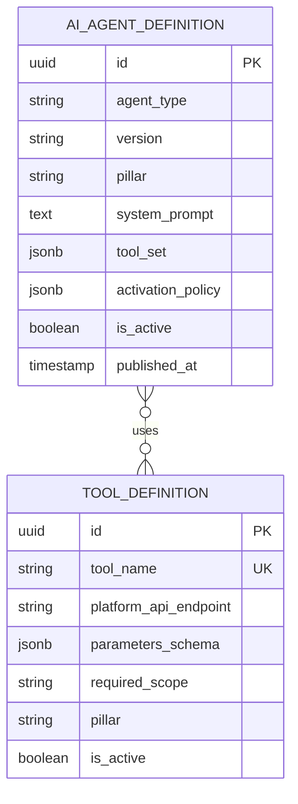

# Agent Registry & Tool Layer — Subdomain Architecture

> **Document Type**: Subdomain Architecture Document (Level 3 - Component)
> **Parent Domain**: [AI Agents](../ARCHITECTURE.md)
> **Root Architecture**: [System Architecture](../../../ARCHITECTURE.md)
> **Last Updated**: 2026-03-12
> **Subdomain Owner**: Syntropy Core Team

## Metadata

| Field | Value |
|-------|-------|
| **Subdomain Type** | Supporting Subdomain |
| **Parent Domain** | AI Agents |
| **Boundary Model** | Internal Module (within AI Agents domain) |
| **Implementation Status** | Not Started |

---

## Business Scope

### What This Subdomain Solves

The Agent Registry & Tool Layer is the catalog and permission system for all AI agents. It answers: "What agents exist, what can each agent do, and is this agent allowed to perform this tool call for this user in this context?" Without it, agent definitions would be hardcoded and tool permissions would be ungoverned.

### Subdomain Classification Rationale

**Type**: Supporting Subdomain. Agent registry and tool permission configuration are important but not novel. The logic is CRUD-based with permission evaluation — no rich domain model required.

---

## Ubiquitous Language

| Term | Definition | Diverges from Parent? | Notes |
|------|------------|-----------------------|-------|
| **ToolDefinition** | The declaration of a platform API tool an agent can call, including its name, parameters, and required permission | No | Examples: `learn.get_fragment_content`, `hub.submit_contribution_draft` |
| **ToolScope** | The permission constraint on a ToolDefinition — which pillar and permission level allows it | No | Example: scope = "learn:creator" |
| **ActivationPolicy** | The conditions under which an agent is automatically offered to a user | No | Evaluated by the Orchestration Engine at context entity display |

---

## Aggregate Roots

### AIAgent

**Responsibility**: Maintain a versioned, discoverable definition of an agent including its system prompt, tool set, and activation policy.

**Invariants**:
- An AIAgent version is immutable once published
- ToolSet is validated against ToolDefinition registry at publish time — no undefined tools permitted
- An AIAgent may only be activated if the user's current Role satisfies the ToolScope requirements for all tools in its ToolSet

---

## Domain Services

| Service | Responsibility | Operates On |
|---------|---------------|-------------|
| `AgentDiscoveryService` | Returns available agents for a given pillar, context_entity_type, and user role | AIAgent aggregate |
| `ToolPermissionEvaluator` | Evaluates whether the user's current Role satisfies ToolScope requirements for a tool call | ToolDefinition, user role context |

---

## Traceability

| Vision Element | Section | How This Subdomain Implements It |
|----------------|---------|----------------------------------|
| Agent registry (cap. 12) | §12 | AIAgent definitions with versioning, discovery, and tool permission scoping |
| Tool layer (cap. 12) | §12 | ToolDefinition catalog with scope-based permission evaluation |
