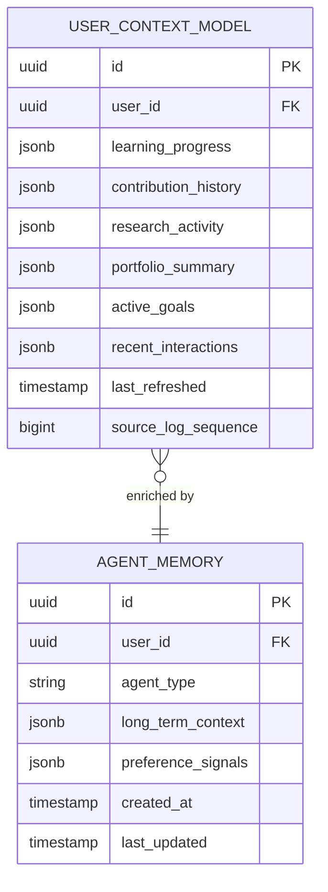

# Orchestration & Context Engine — Subdomain Architecture

> **Document Type**: Subdomain Architecture Document (Level 3 - Component)
> **Parent Domain**: [AI Agents](../ARCHITECTURE.md)
> **Root Architecture**: [System Architecture](../../../ARCHITECTURE.md)
> **Last Updated**: 2026-03-12
> **Subdomain Owner**: Syntropy Core Team

## Metadata

| Field | Value |
|-------|-------|
| **Subdomain Type** | Core Domain |
| **Parent Domain** | AI Agents |
| **Boundary Model** | Internal Module (within AI Agents domain) |
| **Implementation Status** | Not Started |

---

## Business Scope

### What This Subdomain Solves

The Orchestration & Context Engine answers: "What does this user know, what have they built, what are they researching, and how can an agent use that context to help them right now?" It maintains a unified, always-current model of the user's state across all three pillars — the foundation that makes every agent interaction smarter than it could be with pillar-specific context alone.

### Subdomain Classification Rationale

**Type**: Core Domain. The cross-pillar UserContextModel — combining learning progress, contribution history, research activity, and portfolio state — is the primary competitive differentiator of the AI system. Building this context requires subscribing to events from all three pillars and maintaining a coherent, queryable model.

---

## Ubiquitous Language

| Term | Definition | Diverges from Parent? | Notes |
|------|------------|-----------------------|-------|
| **UserContextSnapshot** | A point-in-time materialization of the UserContextModel used to build an agent system prompt | Yes — distinct from the continuously-updated model | Created at session activation; immutable for the session |
| **ContextRefreshTrigger** | An ecosystem event that signals that the UserContextModel for a specific user needs updating | No | Examples: fragment completed, contribution integrated |
| **MemorySlot** | A named, typed storage unit within AgentMemory for a specific type of context | No | Examples: "preferred_languages", "research_focus_areas", "recent_goals" |

---

## Aggregate Roots

### UserContextModel

**Responsibility**: Maintain a fresh, queryable model of a user's cross-pillar state; respond to ContextRefreshTriggers; produce UserContextSnapshots for agent activation.

**Invariants**:
- UserContextModel is always updated within 5 seconds of receiving a ContextRefreshTrigger
- A UserContextSnapshot is produced at session activation and is immutable for the duration of that session

**Entities within this aggregate**:
- `LearningContextSection` — current enrollments, completed fragments/courses/tracks, skills in progress
- `ContributionContextSection` — recent contributions, project memberships, issue assignments
- `ResearchContextSection` — articles in progress, submitted reviews, experiment designs
- `PortfolioContextSection` — XP, skills, achievements, reputation (from Platform Core)

**Domain Events emitted**:
- `ai_agents.context.refreshed` — when UserContextModel is updated (debounced, internal only)

---

## Domain Services

| Service | Responsibility | Operates On |
|---------|---------------|-------------|
| `ContextRefreshService` | Subscribes to ecosystem events; updates relevant UserContextModel sections | UserContextModel aggregate |
| `ContextSnapshotBuilder` | Builds a UserContextSnapshot from the current UserContextModel + AgentMemory for session activation | UserContextModel aggregate, AgentMemory |
| `InvocationRouter` | Selects the correct agent definition for a given context entity type and user state | Agent Registry (sibling), UserContextModel |
| `SessionMemoryManager` | Maintains conversation history within an AgentSession; writes significant insights to AgentMemory | AgentMemory aggregate |

---

## Integration with Sibling Subdomains

| Sibling Subdomain | Integration Direction | Mechanism | Data / Events Exchanged |
|-------------------|-----------------------|-----------|------------------------|
| Agent Registry & Tool Layer | Sibling → This | Service call | InvocationRouter queries Agent Registry for agent definitions |
| Pillar Agents | This → Sibling | Session activation | Context Engine builds snapshot and activates the relevant agent |

---

## Integration with Other Domains

| External Domain | Context Map Pattern | Direction | Purpose |
|-----------------|---------------------|-----------|---------|
| Platform Core | Customer-Supplier | Inbound | PortfolioContextSection populated from Platform Core portfolio query API |
| Learn, Hub, Labs | Published Language | Inbound | ContextRefreshTriggers from event stream |
| LLM APIs (external) | ACL | Outbound | LLMAdapter wraps API calls; LLM vocabulary never enters domain |

---

## Traceability

| Vision Element | Section | How This Subdomain Implements It |
|----------------|---------|----------------------------------|
| AI Agent System value from unified context | §2 | UserContextModel combines all three pillars into a single context for every agent |
| Cross-pillar navigation and recommendations | §3 | UserContextModel feeds the recommendation signals in Platform Core Search & Recommendation |
