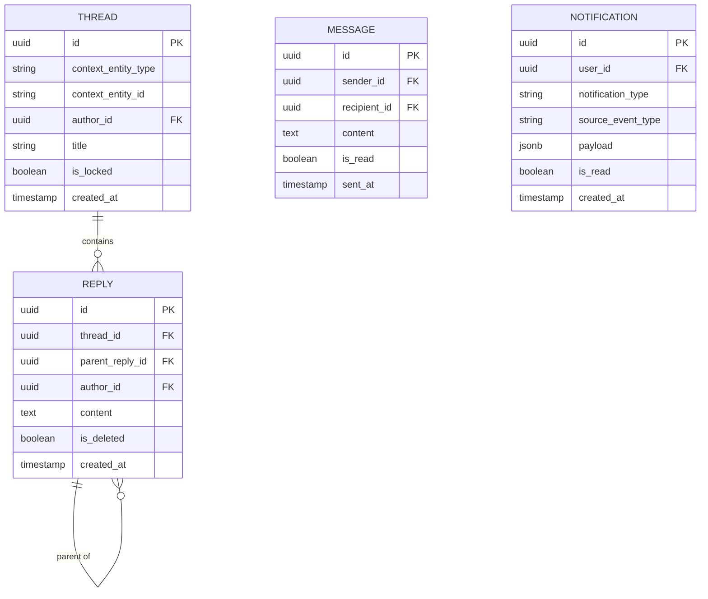

# Communication Domain Architecture

> **Document Type**: Domain Architecture Document (Level 2 - Container)
> **Parent**: [System Architecture](../../ARCHITECTURE.md)
> **Last Updated**: 2026-03-12
> **Domain Owner**: Syntropy Core Team
> **Subdomain Type**: Supporting Subdomain
> **Rationale**: Contextualized forums, messaging, and notifications are standard platform capabilities. The distinguishing design principle — that every Thread requires a ContextAnchor to an entity from another domain — makes this a supporting capability rather than a generic one, but it does not require the design investment of a Core Domain. The anchor requirement is a simple constraint, not a complex domain model.

---

## Vision Traceability

| Vision Element | Section | How This Domain Implements It |
|----------------|---------|-------------------------------|
| Contextualized community forums (cap. 8) | §8 | Thread requires ContextAnchor to domain entity; forums are always contextual, never free-floating |
| Direct messaging between users | §8 | Message entity for private 1-to-1 and 1-to-many communication |
| Activity feed | §8 | Notification feed driven by events from the Platform Core event log |
| Notifications for key ecosystem events | §8 | Notification entity pushed to users on achievement, contribution review, mentorship events |

---

## Document Scope

This document describes the **Communication** bounded context.

---

## Domain Overview

### Business Capability

Communication prevents the ecosystem from being a collection of siloed work artifacts with no social layer. Every learning track, project, article, and institution can have a forum thread anchored to it. Context anchoring prevents generic off-topic discussions — every conversation is grounded in a specific artifact, project, issue, or institution.

### Ubiquitous Language

| Term | Definition | Notes |
|------|------------|-------|
| **Thread** | A discussion associated with a specific ecosystem entity | Requires a ContextAnchor; never created without one |
| **Reply** | A response within a Thread | Supports threading (Reply to Reply) up to 3 levels |
| **ContextAnchor** | A reference to an entity in another domain by entity type and ID | Examples: fragment_id, article_id, issue_id, institution_id |
| **Message** | A private direct message between users | Not anchored to a public entity |
| **Notification** | A system-generated alert for a user about relevant ecosystem events | Driven by Platform Core event subscriptions |

---

## Subdomain Classification & Context Map Position

**Type**: Supporting Subdomain

The Conformist pattern makes Communication intentionally simple: it anchors to entity IDs from any domain without translating them. It does not need to understand what those entities mean — only that they exist and can be referenced.

| Other Context | Pattern | Direction | Description |
|---------------|---------|-----------|-------------|
| All domains | Conformist | Communication is downstream | Thread ContextAnchors reference entity IDs from any domain; Communication does not translate them — it simply stores and references |
| Platform Core | Customer-Supplier | Communication is downstream | Notification events derived from Platform Core event subscriptions (achievement.unlocked, contribution.integrated, etc.) |
| Identity | Open Host Service | Communication is downstream | User identity for message attribution and notification routing |

---

## Data Architecture

### Entity Relationship Diagram

---

## Event Contracts

### Events Consumed

| Event Type | Source | Behavior |
|------------|--------|---------|
| `platform_core.achievement.unlocked` | Platform Core | Create Notification for user |
| `platform_core.collectible.awarded` | Platform Core | Create Notification |
| `hub.contribution.integrated` | Hub | Create Notification for contributor and project maintainers |
| `learn.mentorship.proposed` | Learn | Create Notification for mentor |
| `labs.review.submitted` | Labs | Create Notification for article author |

---

## Security Considerations

### Data Classification

Private Messages are **Confidential**. Thread content for public entities is **Public**. Notifications are **Confidential** (per user).

### Access Control

| Role | Permissions |
|------|-------------|
| Authenticated User | Create threads on accessible entities, reply, send messages |
| PlatformModerator | Lock threads, remove replies |
