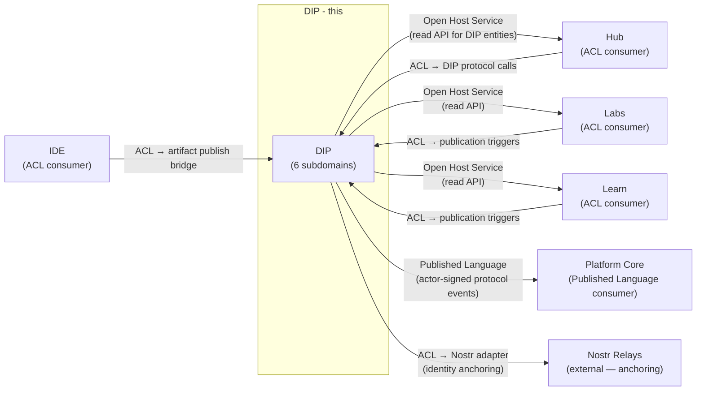
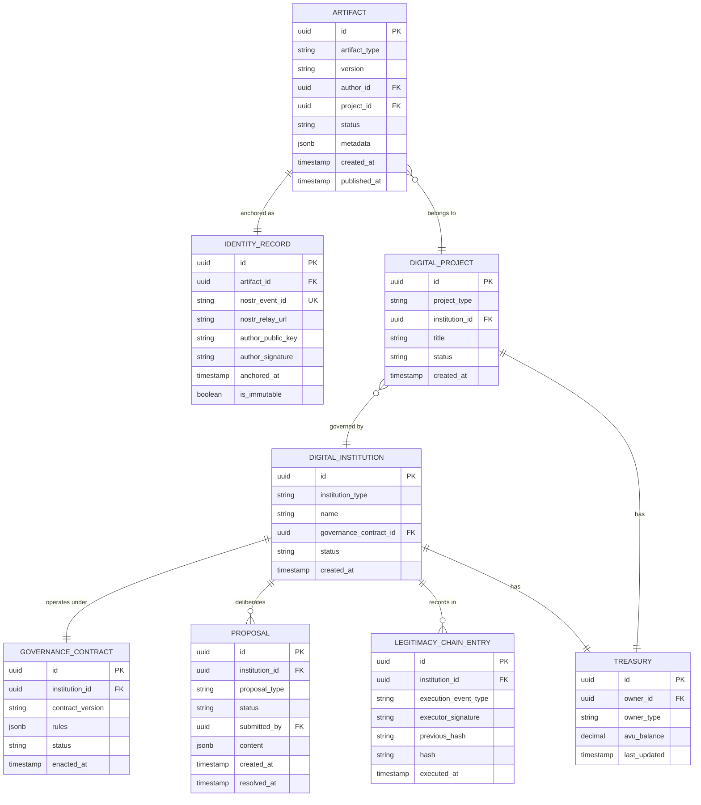

# Digital Institutions Protocol (DIP) Domain Architecture

> **Document Type**: Domain Architecture Document (Level 2 - Container)
> **Parent**: [System Architecture](../../ARCHITECTURE.md)
> **Last Updated**: 2026-03-12
> **Domain Owner**: Syntropy Core Team
> **Subdomain Type**: Core Domain
> **Rationale**: DIP is the foundational trust and ownership infrastructure of the ecosystem. It provides what no other system does: a complete digital institution — with verifiable artifact ownership, cryptographically governed contracts, traceable value distribution, and an immutable legitimacy chain — all in one place, without depending on external legal infrastructure. This is irreplaceable and cannot be purchased off-the-shelf.

---

## Vision Traceability

| Vision Element | Section | How This Domain Implements It |
|----------------|---------|-------------------------------|
| Creators own what they produce (cap. 13) | §2, §13 | Artifact Registry anchors artifact identity records to Nostr relays — cryptographic proof of authorship |
| IACP — Identification, Contract, Utilization, Registration (cap. 14) | §14 | IACP Engine executes the four-phase protocol enforcing no phase is skipped |
| Smart contract execution (cap. 15) | §15 | Smart Contract Engine evaluates contract terms deterministically |
| Project manifest and dependency graph (cap. 16) | §16 | Project Manifest & DAG maintains DAG with acyclicity invariant |
| Institutional governance with legitimacy chain (cap. 17) | §17 | Institutional Governance subdomain manages chambers, deliberation protocol, LegitimacyChain |
| Value distribution and treasury (cap. 18) | §18 | Value Distribution & Treasury computes AVU from usage events and manages oracle-based liquidation |

---

## Document Scope

This document describes the **Digital Institutions Protocol** bounded context — the single source of truth for all fundamental ecosystem entities: Artifact, DigitalProject, DigitalInstitution, GovernanceContract, Proposal, LegitimacyChain, AVU, Treasury, ArtifactManifesto, and DependencyGraph.

### What This Document Covers

- The six internal subdomains and their responsibilities
- Entity ownership model and DIP invariants
- ACL boundary with pillar domains (Hub, Labs, Learn, IDE)
- Event contracts for protocol events (actor-signed, Nostr-anchored)
- API surface exposed to pillar consumers

### What This Document Does NOT Cover

- Pillar-specific collaboration UI (see [Hub Architecture](../hub/ARCHITECTURE.md))
- Scientific context extension (see [Labs Architecture](../labs/ARCHITECTURE.md))
- Learning content structure (see [Learn Architecture](../learn/ARCHITECTURE.md))

---

## Domain Overview

### Business Capability

DIP is the legal-equivalent infrastructure of the digital world — without external legal dependency. It answers: "Who made this? Who can use it? What are the terms? Where did the value go? Who made this decision and when?"

Without DIP:
- Artifact authorship is a claim, not a proof
- Institutional governance is informal and unverifiable
- Value distribution depends on trust in a central platform operator
- Contribution history is controlled by whoever holds the database

With DIP, every artifact has a cryptographic identity anchor (Nostr), every governance decision has an immutable execution record, and every value distribution is traceable from usage event to treasury entry.

### Domain Invariants

| ID | Invariant | Enforcement Point |
|----|-----------|-------------------|
| I1 | DependencyGraph is always acyclic | Project Manifest & DAG subdomain — depth-first reachability check on every IACP Phase 2 event |
| I2 | IdentityRecord is immutable once anchored to Nostr | Artifact Registry subdomain — no update or delete operations permitted on anchored records |
| I3 | IACP phases must execute in order (no skipping) | IACP Engine subdomain — state machine enforces valid transitions only |
| I4 | Value conservation in treasury (no AVU created or destroyed outside defined rules) | Value Distribution & Treasury subdomain — all AVU computations are idempotent and event-sourced |
| I5 | Smart contract evaluation is deterministic | Smart Contract Engine subdomain — `C: Request × State → {permitted, denied} × State′` is a pure function |
| I6 | AVU exclusivity — no concrete currencies in distribution logic | Value Distribution & Treasury — AVU is the only unit in internal computations; liquidation happens only at treasury entry and exit |
| I7 | Every governance state transition is a signed, anchored execution event | Institutional Governance subdomain — `e_exec = Sign_executor(pid ∥ Hash(Inst_{k-1}) ∥ Hash(Inst_k) ∥ timestamp)` |

### Ubiquitous Language

| Term | Definition | Notes |
|------|------------|-------|
| **Artifact** | A versioned, identity-anchored creative or intellectual product | Typed subtypes: scientific-article, dataset, experiment, code, document |
| **IdentityRecord** | The immutable cryptographic anchor of an Artifact — its proof of existence and authorship | Anchored to Nostr relays; immutable once created |
| **IACP** | The Identification, Authorization, Contract negotiation, and Payment four-phase utilization protocol | No phase may be skipped (Invariant I3) |
| **UsageAgreementEvent** | An event emitted at IACP Phase 3 recording the agreed terms of utilization | Actor-signed |
| **UsageEvent** | An event emitted at IACP Phase 4 recording that utilization occurred | Actor-signed; triggers AVU computation |
| **DigitalProject** | A collaborative unit of work with an artifact dependency graph | Typed subtypes include research-line |
| **DigitalInstitution** | A governed digital organization with a chamber system and legitimacy chain | Typed subtypes include laboratory |
| **GovernanceContract** | An executable set of rules governing how a DigitalInstitution makes decisions | Evaluated by Smart Contract Engine |
| **Proposal** | A governance action submitted for deliberation under a GovernanceContract | Lifecycle: Draft→Discussion→Voting→Approved/Rejected→Contested→Executed |
| **LegitimacyChain** | The cryptographically linked sequence of all governance execution events for an institution | Each event references and hashes its predecessor |
| **AVU** | Abstract Value Unit — the internal unit for value distribution; never a currency | Computed from UsageEvents; liquidated to concrete currency only at treasury entry/exit |
| **Treasury** | The AVU balance ledger for a DigitalProject or DigitalInstitution | Managed by Value Distribution & Treasury subdomain |
| **ArtifactManifesto** | The declared set of governance terms attached to an Artifact at publication | Read-only after Artifact is anchored |
| **DependencyGraph** | The directed acyclic graph of Artifact dependencies within a DigitalProject | Acyclicity enforced (Invariant I1) |

---

## Subdomain Classification & Context Map Position

### Subdomain Classification

**Type**: Core Domain

DIP is the primary source of competitive differentiation alongside Platform Core. No off-the-shelf system provides: (a) cryptographic artifact identity anchoring with institutional attribution, (b) a four-phase utilization protocol with smart contract enforcement, (c) an institutional governance protocol with an immutable legitimacy chain, and (d) AVU-based value distribution with oracle liquidation — all integrated into a single bounded context accessible to all pillars via ACL.

### Context Map Position



| Other Context | Pattern | Direction | Description |
|---------------|---------|-----------|-------------|
| Hub | ACL (Hub side) + Open Host Service (DIP side) | Bidirectional | Hub translates institution management UI actions into DIP protocol calls via its ACL; DIP exposes read API for institution/project/governance state |
| Labs | ACL (Labs side) + Open Host Service (DIP side) | Bidirectional | Labs triggers artifact publication via ACL; reads DIP entities for scientific context extension |
| Learn | ACL (Learn side) + Open Host Service (DIP side) | Bidirectional | Learn triggers artifact publication; reads DIP DigitalProject by ID for ReferenceProject |
| IDE | ACL (IDE side) | IDE is downstream | IDE calls DIP artifact publish bridge via ACL |
| Platform Core | Published Language | DIP is emitter | DIP protocol events conform to registered EventSchema; Platform Core consumes via append-only log |
| Nostr Relays (external) | ACL (DIP side) | DIP is upstream | DIP Nostr adapter wraps relay protocol; DIP vocabulary never depends on Nostr internals |

---

## Component Architecture

### Subdomain Map

| Subdomain | Type | Responsibility | Document |
|-----------|------|----------------|----------|
| **Artifact Registry** | Core | Artifact lifecycle (publication, versioning), identity anchoring via Nostr, IdentityRecord immutability | [→ Architecture](./subdomains/artifact-registry.md) |
| **IACP Engine** | Core | Four-phase protocol execution, UsageAgreementEvent, UsageEvent | [→ Architecture](./subdomains/iacp-engine.md) |
| **Smart Contract Engine** | Core | Deterministic contract evaluation, state transition management | [→ Architecture](./subdomains/smart-contract-engine.md) |
| **Project Manifest & DAG** | Core | Dependency graph, InternalArtifact/ExternalArtifact, DAG acyclicity enforcement | [→ Architecture](./subdomains/project-manifest-dag.md) |
| **Institutional Governance** | Core | Chamber system, deliberation protocol, LegitimacyChain | [→ Architecture](./subdomains/institutional-governance.md) |
| **Value Distribution & Treasury** | Core | AVU computation, treasury balance management, oracle liquidation | [→ Architecture](./subdomains/value-distribution-treasury.md) |

### Subdomain Boundaries Diagram

```mermaid
graph TB
    subgraph dipBoundary [Digital Institutions Protocol Domain]
        subgraph artifactReg [Artifact Registry - Core]
            ARTIFACT_AGG["Artifact Aggregate\n(Artifact + IdentityRecord)"]
        end
        subgraph iacpEng [IACP Engine - Core]
            IACP_AGG["IACP Aggregate\n(protocol state machine)"]
        end
        subgraph smartContract [Smart Contract Engine - Core]
            CONTRACT_AGG["GovernanceContract Aggregate\n(deterministic evaluation)"]
        end
        subgraph projDag [Project Manifest & DAG - Core]
            PROJ_AGG["DigitalProject Aggregate\n(DependencyGraph, ArtifactManifesto)"]
        end
        subgraph instGov [Institutional Governance - Core]
            INST_AGG["DigitalInstitution Aggregate\n(chambers, proposals, LegitimacyChain)"]
        end
        subgraph valueDist [Value Distribution & Treasury - Core]
            TREASURY_AGG["Treasury Aggregate\n(AVU balance, liquidation)"]
        end

        artifactReg -->|"artifact anchored event"| iacpEng
        iacpEng -->|"usage events"| valueDist
        smartContract -->|"contract evaluation"| iacpEng
        smartContract -->|"contract evaluation"| instGov
        projDag -->|"artifact dependencies"| artifactReg
        instGov -->|"governance decisions"| projDag
    end
```



---

## Data Architecture

### Data Ownership

| Entity | Description | Sensitivity |
|--------|-------------|-------------|
| Artifact | Core creative/intellectual product | Public (after publication) / Confidential (draft) |
| IdentityRecord | Cryptographic anchor for Artifact | Public (after anchoring) |
| IACP | Utilization protocol state | Internal / Confidential (contract terms) |
| UsageAgreementEvent | Agreed utilization terms | Internal |
| UsageEvent | Recorded utilization | Internal |
| DigitalProject | Collaborative work unit | Public (after creation) |
| DigitalInstitution | Governed digital organization | Public (after creation) |
| GovernanceContract | Executable governance rules | Public |
| Proposal | Governance action under deliberation | Public |
| LegitimacyChain | Linked governance execution record | Public |
| AVU | Abstract value unit for distribution | Internal |
| Treasury | AVU balance ledger | Internal / Confidential |
| ArtifactManifesto | Artifact governance terms | Public |
| DependencyGraph | Artifact dependency DAG | Internal |

### Core Entity Relationship Diagram



---

## API Design

### Internal API (Pillar Consumers via ACL)

Base URL: `http://dip.internal/api/v1`

Authentication: Service token (mTLS) with pillar-specific scopes

**Artifact operations**:
- `POST /artifacts` — publish a new artifact (triggers anchoring workflow)
- `GET /artifacts/{id}` — fetch artifact metadata
- `GET /artifacts/{id}/identity-record` — fetch immutable identity record
- `GET /artifacts/{id}/versions` — list all versions

**Project operations**:
- `GET /projects/{id}` — fetch project details
- `GET /projects/{id}/dependency-graph` — fetch artifact DAG
- `POST /projects/{id}/artifacts` — add artifact to project (triggers DAG acyclicity check)

**Institution operations**:
- `POST /institutions` — initiate institution creation workflow
- `GET /institutions/{id}` — fetch institution details
- `GET /institutions/{id}/governance-contract` — fetch active contract
- `GET /institutions/{id}/legitimacy-chain` — fetch execution history
- `POST /institutions/{id}/proposals` — submit governance proposal

**IACP protocol**:
- `POST /iacp/initiate` — begin IACP Phase 1 (Identification)
- `POST /iacp/{id}/negotiate` — proceed to Phase 2 (Contract Negotiation)
- `POST /iacp/{id}/authorize` — proceed to Phase 3 (Authorization)
- `POST /iacp/{id}/register-usage` — execute Phase 4 (Usage Registration)

---

## Event Contracts

### Events Published (Protocol Events — Actor-Signed, Nostr-Anchored)

DIP protocol events are signed by the acting user's private key and anchored to Nostr relays. They also flow through the Platform Core event bus.

#### `dip.artifact.anchored`

```json
{
  "event_type": "dip.artifact.anchored",
  "event_schema_version": "1.0",
  "data": {
    "artifact_id": "uuid",
    "identity_record_id": "uuid",
    "nostr_event_id": "string",
    "author_actor_id": "string",
    "artifact_type": "string"
  },
  "signing": {
    "actor_signature": "nostr-event-signature",
    "signing_key": "actor-nostr-public-key"
  }
}
```

#### `dip.governance.proposal_executed`

```json
{
  "event_type": "dip.governance.proposal_executed",
  "event_schema_version": "1.0",
  "data": {
    "institution_id": "uuid",
    "proposal_id": "uuid",
    "execution_hash": "string",
    "previous_legitimacy_hash": "string",
    "nostr_event_id": "string"
  },
  "signing": {
    "executor_signature": "string",
    "signing_key": "string"
  }
}
```

#### `dip.usage.registered`

Published at IACP Phase 4. Triggers AVU computation.

#### `dip.iacp.agreement_created`

Published at IACP Phase 3. Records agreed utilization terms.

---

## Integration Points

### Upstream Dependencies

| Dependency | Type | Criticality | Fallback |
|------------|------|-------------|----------|
| Identity (actor attribution) | Sync API | Critical | Reject protocol operations without verified actor |
| Nostr Relays (identity anchoring) | Async (via adapter) | Critical for DIP protocol events | Queue anchoring operations; retry with backoff; never skip signing |

### Downstream Dependents

| Dependent | Integration Type | SLA Commitment |
|-----------|------------------|----------------|
| Hub | ACL (reads DIP entities, triggers protocol) | 99.9% availability |
| Labs | ACL (triggers publication, reads entities) | 99.9% availability |
| Learn | ACL (triggers publication, reads project by ID) | 99.9% availability |
| IDE | ACL (artifact publish bridge) | 99.9% availability |
| Platform Core | Async events (protocol events to AppendOnlyLog) | Best effort (event bus durability ensures delivery) |

### External Integrations

| Provider | Purpose | Criticality |
|----------|---------|-------------|
| Nostr Relays | Immutable artifact identity anchoring and governance event signing | Critical (ADR-003) |

---

## Security Considerations

### Data Classification

IdentityRecord and LegitimacyChain entries are **Public** after creation (externally verifiable). GovernanceContract terms may be **Confidential** for private institutions (pending governance decision). Treasury balances are **Internal**.

### Access Control

| Role | Permissions |
|------|-------------|
| Authenticated User | Publish artifacts, initiate IACP, submit proposals |
| InstitutionAdmin | Enact governance contracts, execute proposals |
| Platform Service (ACL) | Read any DIP entity, trigger protocol operations on behalf of pillar users |
| Platform Admin | Emergency administrative actions (audit only) |

### Compliance Requirements

Artifact IdentityRecords are permanent and cannot be deleted (by design — cryptographic proof of authorship). GovernanceContract execution events in the LegitimacyChain are permanent. See [Data Integrity Architecture](../../cross-cutting/data-integrity/ARCHITECTURE.md).

---

## Domain-Specific Decisions

| ADR | Summary |
|-----|---------|
| ADR-003 *(Prompt 01-C)* | Artifact identity anchoring via Nostr relays; ACL adapter isolating ledger from core domain |
| ADR-009 *(Prompt 01-C)* | AVU accounting model; prohibition on platform tokens; oracle-based liquidation |
| ADR-010 *(Prompt 01-C)* | Two-level event signing hierarchy; actor-signed DIP protocol events anchored to Nostr |

---

## Internal Subdomain Decomposition

See [Subdomain Map](#subdomain-map) above. Subdomain documents:

- [Artifact Registry](./subdomains/artifact-registry.md)
- [IACP Engine](./subdomains/iacp-engine.md)
- [Smart Contract Engine](./subdomains/smart-contract-engine.md)
- [Project Manifest & DAG](./subdomains/project-manifest-dag.md)
- [Institutional Governance](./subdomains/institutional-governance.md)
- [Value Distribution & Treasury](./subdomains/value-distribution-treasury.md)
