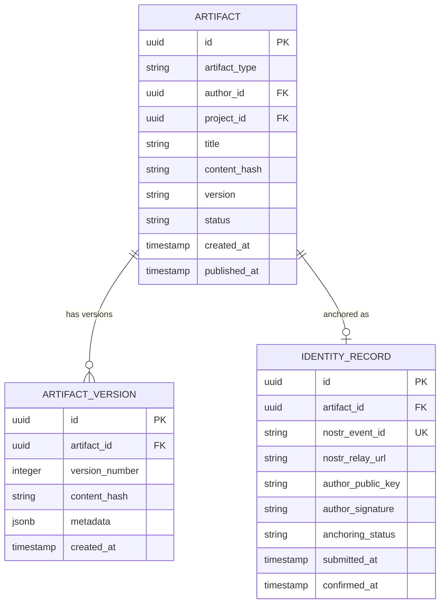

# Artifact Registry — Subdomain Architecture

> **Document Type**: Subdomain Architecture Document (Level 3 - Component)
> **Parent Domain**: [Digital Institutions Protocol](../ARCHITECTURE.md)
> **Root Architecture**: [System Architecture](../../../ARCHITECTURE.md)
> **Last Updated**: 2026-03-12
> **Subdomain Owner**: Syntropy Core Team

## Metadata

| Field | Value |
|-------|-------|
| **Subdomain Type** | Core Domain |
| **Parent Domain** | Digital Institutions Protocol (DIP) |
| **Boundary Model** | Internal Module (within DIP domain) |
| **Implementation Status** | Not Started |

---

## Business Scope

### What This Subdomain Solves

The Artifact Registry answers: "Who made this, when, and is this record authentic?" It provides cryptographic proof of artifact authorship and existence, anchored to an external immutable ledger (Nostr relays). Without it, artifact ownership is a claim on a centralized database that can be altered. With it, artifact identity is verifiable by anyone without trusting the platform.

### Why It Is a Separate Subdomain

Artifact lifecycle management and Nostr anchoring have distinct consistency requirements from IACP protocol execution and governance contract evaluation. Anchoring involves asynchronous external calls; the Artifact aggregate must remain consistent regardless of anchoring latency.

### Subdomain Classification Rationale

**Type**: Core Domain

Nostr-based artifact identity anchoring — cryptographic proof of authorship without a central authority — is the foundational trust layer. No off-the-shelf registry provides this.

---

## Ubiquitous Language

| Term | Definition | Diverges from Parent? | Notes |
|------|------------|-----------------------|-------|
| **PublicationRequest** | The action of submitting an artifact for registration and anchoring | No | Initiated by pillar consumers via ACL |
| **AnchoringStatus** | The current state of a Nostr anchoring operation | No | Pending → Confirmed → Failed |
| **AuthorPublicKey** | The user's Nostr public key used for event signing | No | Derived from Identity ActorId |

---

## Aggregate Roots

### Artifact

**Responsibility**: Manage artifact lifecycle from draft to published; enforce immutability after anchoring.

**Invariants**:
- `published_at` is set exactly once; no artifact can be republished to the same version
- Once `identity_record` is set, neither the artifact content hash nor the identity record may change
- `artifact_type` cannot be changed after creation

**Entities within this aggregate**:
- `ArtifactVersion` — a specific version of an artifact's content
- `IdentityRecord` — the immutable Nostr anchor

**Value Objects within this aggregate**:
- `ArtifactType` — enumeration: scientific-article, dataset, experiment, code, document
- `ContentHash` — SHA-256 of the artifact content; immutable after publication

**Domain Events emitted**:
- `dip.artifact.created` — when a new Artifact is registered
- `dip.artifact.anchored` — when IdentityRecord is created and Nostr event is confirmed

---

## Domain Services

| Service | Responsibility | Operates On |
|---------|---------------|-------------|
| `AnchoringService` | Submits artifact identity to Nostr relays; polls for confirmation; updates AnchoringStatus | Artifact aggregate, NostrRelayAdapter (ACL) |
| `ContentHashService` | Computes and verifies SHA-256 content hashes | Artifact aggregate |

---

## Integration with Sibling Subdomains

| Sibling Subdomain | Integration Direction | Mechanism | Data / Events Exchanged |
|-------------------|-----------------------|-----------|------------------------|
| IACP Engine | This → Sibling | Domain event | `dip.artifact.anchored` triggers IACP eligibility |
| Project Manifest & DAG | Sibling → This | Service call | Manifest queries artifact metadata for DAG construction |

---

## Integration with Other Domains

| External Domain | Context Map Pattern | Direction | Purpose |
|-----------------|---------------------|-----------|---------|
| Learn, Hub, Labs, IDE | ACL (consumer side) | Inbound | Pillar consumers trigger artifact publication via DIP Open Host Service |
| Nostr Relays (external) | ACL | Outbound | NostrRelayAdapter wraps relay protocol |
| Platform Core | Published Language | Outbound | `dip.artifact.anchored` event emitted to AppendOnlyLog |

---

## Traceability

| Vision Element | Section | How This Subdomain Implements It |
|----------------|---------|----------------------------------|
| Creators own what they produce (cap. 13) | §2, §13 | IdentityRecord anchored to Nostr = cryptographic proof of authorship |
| Artifact identity and immutability | Architecture Brief | Invariant I2: IdentityRecord immutable once anchored |
