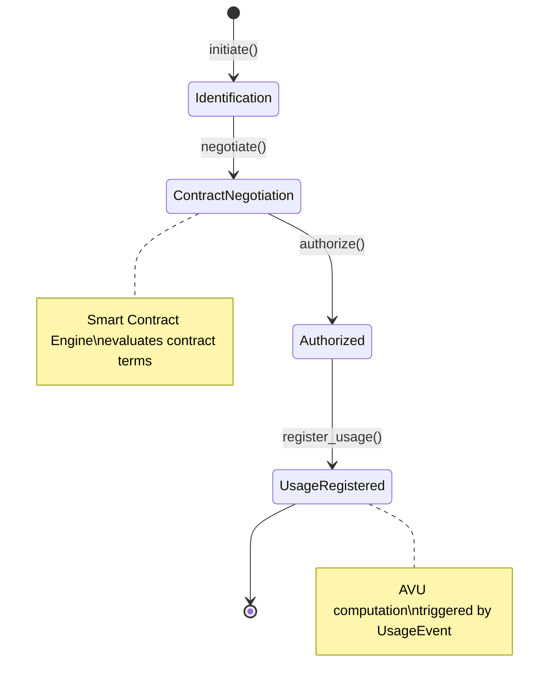
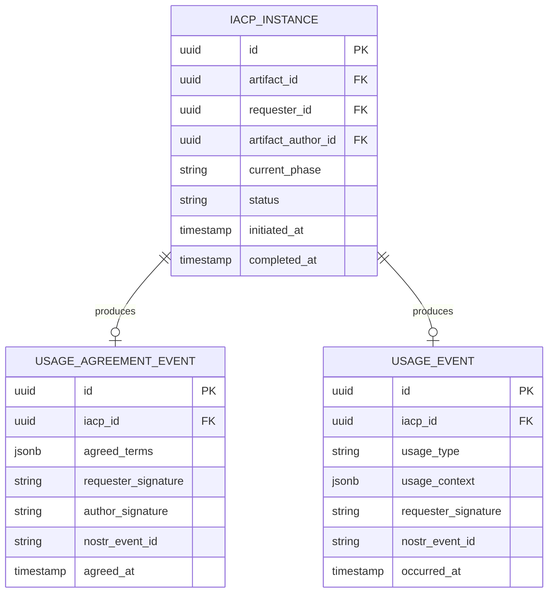

# IACP Engine — Subdomain Architecture

> **Document Type**: Subdomain Architecture Document (Level 3 - Component)
> **Parent Domain**: [Digital Institutions Protocol](../ARCHITECTURE.md)
> **Root Architecture**: [System Architecture](../../../ARCHITECTURE.md)
> **Last Updated**: 2026-03-12
> **Subdomain Owner**: Syntropy Core Team

## Metadata

| Field | Value |
|-------|-------|
| **Subdomain Type** | Core Domain |
| **Parent Domain** | Digital Institutions Protocol (DIP) |
| **Boundary Model** | Internal Module (within DIP domain) |
| **Implementation Status** | Not Started |

---

## Business Scope

### What This Subdomain Solves

The IACP Engine answers: "Under what terms can this artifact be used, and was that agreement honored?" It enforces the four-phase utilization protocol — no phase may be skipped — ensuring that every use of an artifact is explicitly identified, agreed upon under a contract, authorized, and recorded.

### Subdomain Classification Rationale

**Type**: Core Domain. The four-phase protocol with skip-prevention invariant is the core IP of the ecosystem's value attribution model.

---

## Ubiquitous Language

| Term | Definition | Diverges from Parent? | Notes |
|------|------------|-----------------------|-------|
| **Phase** | One of the four steps in the IACP protocol | No | Identification → ContractNegotiation → Utilization → UsageRegistration |
| **UsageAgreementEvent** | The signed record of agreed utilization terms at Phase 3 | No | Actor-signed; anchored to Nostr |
| **UsageEvent** | The signed record of actual utilization at Phase 4 | No | Actor-signed; triggers AVU computation |
| **IACPState** | The current phase of an IACP instance | No | State machine with valid transition rules |

---

## Aggregate Roots

### IACP

**Responsibility**: Enforce the four-phase protocol state machine; prevent phase skipping; emit protocol events.

**Invariants** (Invariant I3):
- Phase transitions must follow: Identification → ContractNegotiation → Utilization → UsageRegistration
- No phase may be skipped — a ContractNegotiation event is rejected if Identification has not been recorded
- Once UsageRegistration is complete, the IACP instance is sealed (no further transitions)

**Domain Events emitted**:
- `dip.iacp.identified` — Phase 1 complete
- `dip.iacp.agreement_created` — Phase 3 complete (UsageAgreementEvent)
- `dip.usage.registered` — Phase 4 complete (UsageEvent) → triggers AVU computation

---

## Domain Services

| Service | Responsibility | Operates On |
|---------|---------------|-------------|
| `PhaseTransitionValidator` | Validates that a requested phase transition is permitted from the current state | IACP aggregate |
| `UsageAgreementSigner` | Coordinates actor signatures for UsageAgreementEvent; invokes Nostr anchoring | IACP aggregate, AnchoringService (Artifact Registry) |

---

## Integration with Sibling Subdomains

| Sibling Subdomain | Integration Direction | Mechanism | Data / Events Exchanged |
|-------------------|-----------------------|-----------|------------------------|
| Smart Contract Engine | Sibling → This | Service call at Phase 3 | Contract terms evaluated by Smart Contract Engine before UsageAgreement |
| Value Distribution & Treasury | This → Sibling | Domain event | `dip.usage.registered` triggers AVU computation |
| Artifact Registry | Sibling → This | Domain event | `dip.artifact.anchored` makes artifact eligible for IACP |

---

## Traceability

| Vision Element | Section | How This Subdomain Implements It |
|----------------|---------|----------------------------------|
| IACP four-phase protocol (cap. 14) | §14 | State machine with Invariant I3 (no phase skipping) |
| Verifiable usage attribution | §14 | UsageEvent is actor-signed and Nostr-anchored |
