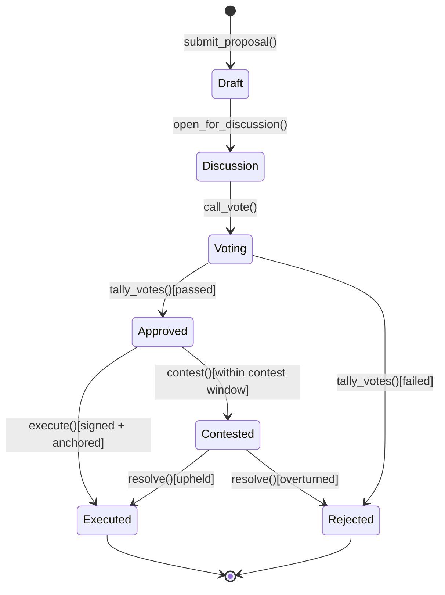
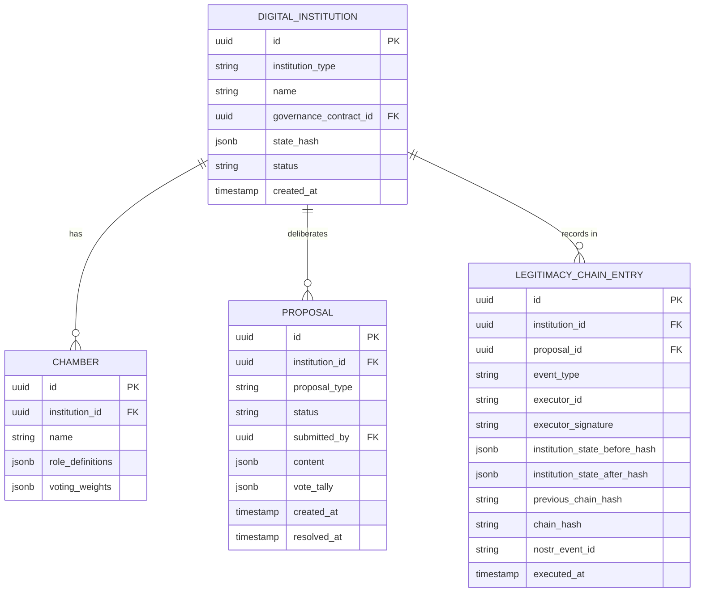

# Institutional Governance — Subdomain Architecture

> **Document Type**: Subdomain Architecture Document (Level 3 - Component)
> **Parent Domain**: [Digital Institutions Protocol](../ARCHITECTURE.md)
> **Root Architecture**: [System Architecture](../../../ARCHITECTURE.md)
> **Last Updated**: 2026-03-12
> **Subdomain Owner**: Syntropy Core Team

## Metadata

| Field | Value |
|-------|-------|
| **Subdomain Type** | Core Domain |
| **Parent Domain** | Digital Institutions Protocol (DIP) |
| **Boundary Model** | Internal Module (within DIP domain) |
| **Implementation Status** | Not Started |

---

## Business Scope

### What This Subdomain Solves

Institutional Governance answers: "What decisions has this institution made, who made them, and can that be verified by anyone?" The LegitimacyChain is the institution's decision history — cryptographically linked, Nostr-anchored, and permanently public. No action can be retroactively inserted into an institution's history.

### Subdomain Classification Rationale

**Type**: Core Domain. Cryptographically linked governance history with Nostr anchoring, chamber systems, and the deliberation protocol lifecycle are novel governance infrastructure. No DAO platform or governance tool provides this in the context of a digital institution with artifact ownership.

---

## Ubiquitous Language

| Term | Definition | Diverges from Parent? | Notes |
|------|------------|-----------------------|-------|
| **Chamber** | A governance body within a DigitalInstitution with defined roles and voting weights | No | Example: "Founding Members Chamber", "Contributors Chamber" |
| **DeliberationProtocol** | The ordered lifecycle stages a Proposal must pass through | No | Draft→Discussion→Voting→Approved/Rejected→Contested→Executed |
| **LegitimacyChain** | The cryptographically linked, Nostr-anchored sequence of all governance execution events | No | Each entry hashes its predecessor (Invariant I7) |
| **ExecutionEvent** | The signed, anchored record of a governance decision being executed | No | `e_exec = Sign_executor(pid ∥ Hash(Inst_{k-1}) ∥ Hash(Inst_k) ∥ timestamp)` |

---

## Aggregate Roots

### DigitalInstitution

**Responsibility**: Manage institution state, chamber composition, and governance lifecycle; enforce LegitimacyChain integrity.

**Invariants** (Invariant I7):
- Every governance state transition (Proposal execution) is recorded as an ExecutionEvent
- Every ExecutionEvent is signed by the executor and includes the hash of the previous and new institution state
- Every ExecutionEvent is anchored to Nostr before the transition is finalized
- LegitimacyChain is append-only; no entry may be deleted or modified

**Domain Events emitted**:
- `dip.governance.proposal_submitted` — Draft → Discussion
- `dip.governance.proposal_executed` — Approved → Executed (actor-signed, Nostr-anchored)
- `dip.governance.proposal_rejected` — Voting → Rejected

---

## Domain Services

| Service | Responsibility | Operates On |
|---------|---------------|-------------|
| `VotingService` | Tallies votes according to chamber weights; determines Approved/Rejected outcome | DigitalInstitution aggregate, Chamber definitions |
| `ExecutionEventBuilder` | Builds and signs the ExecutionEvent; invokes Nostr anchoring before finalizing | DigitalInstitution aggregate, LegitimacyChain |
| `LegitimacyChainVerifier` | Verifies the hash chain integrity of the entire LegitimacyChain for an institution | DigitalInstitution aggregate (read-only) |
| `ContestWindowEnforcer` | Enforces the time window during which an Approved proposal may be Contested | DigitalInstitution aggregate |

---

## Integration with Sibling Subdomains

| Sibling Subdomain | Integration Direction | Mechanism | Data / Events Exchanged |
|-------------------|-----------------------|-----------|------------------------|
| Smart Contract Engine | Sibling → This | Service call | Proposal execution calls ContractEvaluator to verify the action is permitted under current contract |
| Value Distribution & Treasury | This → Sibling | Domain event | `dip.governance.proposal_executed` (type: treasury_distribution) triggers treasury operations |

---

## Traceability

| Vision Element | Section | How This Subdomain Implements It |
|----------------|---------|----------------------------------|
| Institutional governance with legitimacy chain (cap. 17) | §17 | Chamber system, deliberation protocol, LegitimacyChain with Invariant I7 |
| Auditable decision history | §17 | Every execution event is signed, hashed, and Nostr-anchored; independently verifiable |
