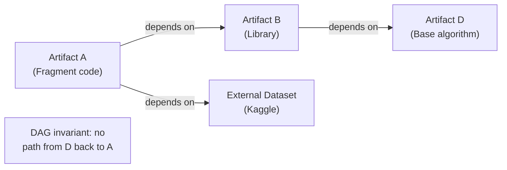
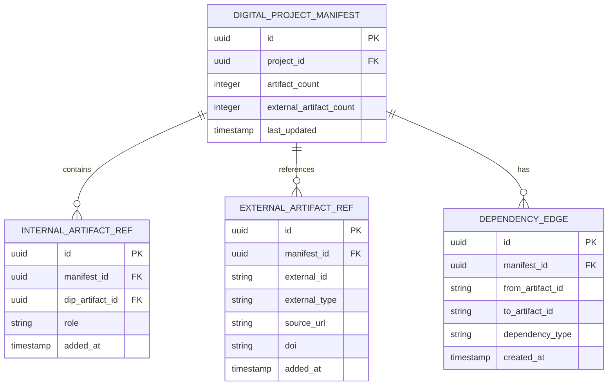

# Project Manifest & DAG — Subdomain Architecture

> **Document Type**: Subdomain Architecture Document (Level 3 - Component)
> **Parent Domain**: [Digital Institutions Protocol](../ARCHITECTURE.md)
> **Root Architecture**: [System Architecture](../../../ARCHITECTURE.md)
> **Last Updated**: 2026-03-12
> **Subdomain Owner**: Syntropy Core Team

## Metadata

| Field | Value |
|-------|-------|
| **Subdomain Type** | Core Domain |
| **Parent Domain** | Digital Institutions Protocol (DIP) |
| **Boundary Model** | Internal Module (within DIP domain) |
| **Implementation Status** | Not Started |

---

## Business Scope

### What This Subdomain Solves

Project Manifest & DAG tracks which artifacts a project depends on and which artifacts it produces — forming a dependency graph. It ensures the graph never becomes circular (Invariant I1) and provides the structure for value attribution: when a downstream artifact uses an upstream artifact, the dependency path is known and traceable for AVU computation.

### Subdomain Classification Rationale

**Type**: Core Domain. Dependency graph management with DAG acyclicity enforcement, tracking both internal (DIP-registered) and external artifacts, is a novel infrastructure requirement specific to this ecosystem.

---

## Ubiquitous Language

| Term | Definition | Diverges from Parent? | Notes |
|------|------------|-----------------------|-------|
| **InternalArtifact** | An artifact registered in the DIP Artifact Registry (DIP-owned identity record) | No | Full provenance available |
| **ExternalArtifact** | An artifact from outside the ecosystem referenced in the dependency graph | No | Referenced by URL, DOI, or identifier; no DIP identity record |
| **DependencyEdge** | A directed edge in the DependencyGraph from the depending artifact to the depended-upon artifact | No | Directed: A → B means A depends on B |
| **DependencyGraph** | The directed acyclic graph (DAG) of all artifact dependencies within a DigitalProject | No | Invariant I1: always acyclic |

---

## Aggregate Roots

### DigitalProject

**Responsibility**: Manage the dependency graph of a project; enforce DAG acyclicity on every edge addition.

**Invariants** (Invariant I1):
- `DependencyGraph` is always a DAG — no cycles permitted
- Every new DependencyEdge triggers a depth-first reachability check from the target node back to the source node; if reachable, the edge is rejected
- Invariant enforcement triggers on every IACP Phase 2 event (dependency declaration)

**Entities within this aggregate**:
- `InternalArtifact` — DIP-registered artifact in this project's graph
- `ExternalArtifact` — external artifact reference
- `DependencyEdge` — directed dependency relationship

**Domain Events emitted**:
- `dip.project.dependency_added` — when a new edge is successfully added to the DAG
- `dip.project.dependency_rejected` — when a cycle-creating edge is rejected

---

## Domain Services

| Service | Responsibility | Operates On |
|---------|---------------|-------------|
| `DAGAcyclicityEnforcer` | Depth-first reachability check on proposed new DependencyEdge; rejects if cycle detected | DigitalProject aggregate |
| `ArtifactManifestoBuilder` | Builds the ArtifactManifesto (declared governance terms + dependency summary) for a project artifact | DigitalProject aggregate, Artifact Registry |

---

## Traceability

| Vision Element | Section | How This Subdomain Implements It |
|----------------|---------|----------------------------------|
| Project manifest and dependency graph (cap. 16) | §16 | DependencyGraph with Invariant I1 (acyclicity enforcement) |
| Value attribution path | §18 | Dependency graph provides the provenance path for AVU computation via IACP usage events |
