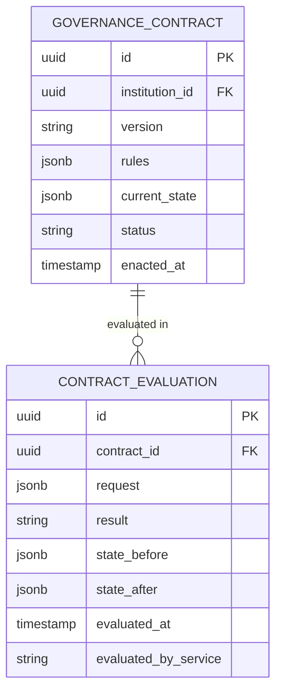

# Smart Contract Engine — Subdomain Architecture

> **Document Type**: Subdomain Architecture Document (Level 3 - Component)
> **Parent Domain**: [Digital Institutions Protocol](../ARCHITECTURE.md)
> **Root Architecture**: [System Architecture](../../../ARCHITECTURE.md)
> **Last Updated**: 2026-03-12
> **Subdomain Owner**: Syntropy Core Team

## Metadata

| Field | Value |
|-------|-------|
| **Subdomain Type** | Core Domain |
| **Parent Domain** | Digital Institutions Protocol (DIP) |
| **Boundary Model** | Internal Module (within DIP domain) |
| **Implementation Status** | Not Started |

---

## Business Scope

### What This Subdomain Solves

The Smart Contract Engine answers: "Is this action permitted under the current contract terms, and what does the new state look like?" It provides deterministic, auditable evaluation of governance and utilization contracts — no ambiguity, no manual interpretation.

### Subdomain Classification Rationale

**Type**: Core Domain. Deterministic contract evaluation with immutable state history is the trust foundation for both IACP utilization agreements and institutional governance decisions.

---

## Ubiquitous Language

| Term | Definition | Diverges from Parent? | Notes |
|------|------------|-----------------------|-------|
| **ContractEvaluation** | A single invocation of the evaluation function `C: Request × State → {permitted, denied} × State′` | No | Pure function; no side effects |
| **ContractState** | The current mutable state of a GovernanceContract | No | Evolves with each evaluation |
| **EvaluationRequest** | The input to a ContractEvaluation — the action being requested | No | Examples: join institution, submit proposal, distribute AVU |

---

## Aggregate Roots

### GovernanceContract

**Responsibility**: Maintain contract rules and current state; evaluate whether a requested action is permitted; record every evaluation in an immutable history.

**Invariants** (Invariant I5):
- ContractEvaluation is deterministic: same request on same state always produces same result
- ContractEvaluationHistory is append-only — no evaluation record may be deleted or modified
- A GovernanceContract cannot evaluate actions for an institution other than its own

**Domain Events emitted**:
- `dip.contract.evaluation_completed` — every time an evaluation is performed
- `dip.contract.version_enacted` — when a new contract version is enacted by governance

---

## Domain Services

| Service | Responsibility | Operates On |
|---------|---------------|-------------|
| `ContractEvaluator` | Executes the pure evaluation function `C: Request × State → {permitted, denied} × State′`; records result | GovernanceContract aggregate |
| `ContractVersionManager` | Handles contract version upgrades following governance approval; preserves evaluation history across versions | GovernanceContract aggregate, Institutional Governance |

---

## Integration with Sibling Subdomains

| Sibling Subdomain | Integration Direction | Mechanism | Data / Events Exchanged |
|-------------------|-----------------------|-----------|------------------------|
| IACP Engine | This → Sibling | Service call | IACP Phase 2 calls ContractEvaluator to validate utilization agreement |
| Institutional Governance | This → Sibling | Service call | Governance proposal execution calls ContractEvaluator |

---

## Traceability

| Vision Element | Section | How This Subdomain Implements It |
|----------------|---------|----------------------------------|
| Smart contract execution (cap. 15) | §15 | ContractEvaluator implements `C: Request × State → {permitted, denied} × State′` |
| Deterministic and auditable governance | §17 | Evaluation history is append-only and fully auditable |
