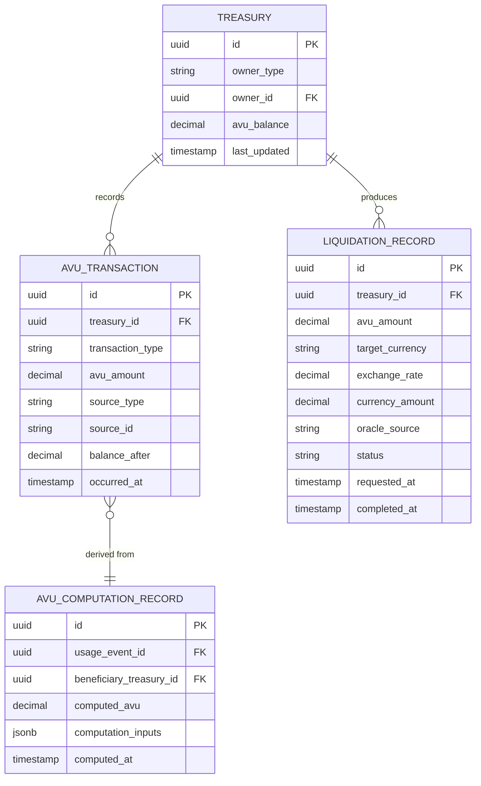

# Value Distribution & Treasury — Subdomain Architecture

> **Document Type**: Subdomain Architecture Document (Level 3 - Component)
> **Parent Domain**: [Digital Institutions Protocol](../ARCHITECTURE.md)
> **Root Architecture**: [System Architecture](../../../ARCHITECTURE.md)
> **Last Updated**: 2026-03-12
> **Subdomain Owner**: Syntropy Core Team

## Metadata

| Field | Value |
|-------|-------|
| **Subdomain Type** | Core Domain |
| **Parent Domain** | Digital Institutions Protocol (DIP) |
| **Boundary Model** | Internal Module (within DIP domain) |
| **Implementation Status** | Not Started |

---

## Business Scope

### What This Subdomain Solves

Value Distribution & Treasury answers: "When this artifact was used, how much value was generated, how is it distributed, and where did the money go?" It implements a provably fair, programmable value attribution model where AVU accrues to creators based on verifiable usage events, not platform operator decisions.

### Subdomain Classification Rationale

**Type**: Core Domain. The AVU model (Invariants I4 and I6), oracle-based liquidation, and idempotent event-sourced value computation are novel financial infrastructure for a digital ecosystem. No off-the-shelf billing or revenue-sharing platform implements this model.

---

## Ubiquitous Language

| Term | Definition | Diverges from Parent? | Notes |
|------|------------|-----------------------|-------|
| **AVU** | Abstract Value Unit — the internal unit of account for value distribution | No | Never a concrete currency; only liquidated at treasury boundaries (Invariant I6) |
| **AVUComputation** | The deterministic function that produces an AVU delta from a UsageEvent | No | `AVU(usage_event) = base_rate × usage_weight × dependency_factor` |
| **Treasury** | The AVU balance ledger for a project or institution | No | Balance = sum of all AVU credits minus all debits (Invariant I4) |
| **LiquidationRequest** | A request to convert AVU balance to concrete currency via an oracle | No | Exchange rate provided by external oracle; conversion is irreversible |
| **OracleLiquidation** | The process of converting AVU to concrete currency using an external exchange rate oracle | No | Only at treasury entry (creator receives AVU) and exit (creator withdraws currency) |

---

## Aggregate Roots

### Treasury

**Responsibility**: Maintain the AVU balance for a project or institution; process AVU credits from usage events; process liquidation requests.

**Invariants** (I4 — Value Conservation, I6 — AVU Exclusivity):
- `balance = sum(all AVU_credits) - sum(all AVU_debits)` — always maintained (I4)
- Balance never goes below 0 (no negative balances)
- All internal computations use AVU exclusively — no concrete currency values stored (I6)
- Concrete currency amounts appear only in LiquidationRequest and LiquidationRecord — never in balance computation

**Entities within this aggregate**:
- `AVUTransaction` — a credit or debit record with source UsageEvent or LiquidationRequest
- `LiquidationRecord` — the permanent record of a AVU→currency conversion

**Domain Events emitted**:
- `dip.treasury.avu_credited` — when AVU is added to a treasury
- `dip.treasury.liquidation_completed` — when AVU is liquidated to currency

---

## Domain Services

| Service | Responsibility | Operates On |
|---------|---------------|-------------|
| `AVUComputationService` | Deterministically computes AVU delta from a UsageEvent; produces AVUComputationRecord | Treasury aggregate, usage event payload |
| `DistributionService` | Distributes computed AVU across multiple beneficiary treasuries according to dependency graph weights | Multiple Treasury aggregates, DependencyGraph data |
| `LiquidationService` | Fetches exchange rate from oracle; executes currency conversion; records LiquidationRecord | Treasury aggregate, oracle ACL adapter |

---

## Integration with Sibling Subdomains

| Sibling Subdomain | Integration Direction | Mechanism | Data / Events Exchanged |
|-------------------|-----------------------|-----------|------------------------|
| IACP Engine | Sibling → This | Domain event | `dip.usage.registered` (UsageEvent) triggers AVUComputationService |
| Project Manifest & DAG | Sibling → This | Service call | DistributionService reads dependency graph for distribution weights |
| Institutional Governance | Sibling → This | Domain event | `dip.governance.proposal_executed` (type: treasury_distribution) triggers treasury operation |

---

## Traceability

| Vision Element | Section | How This Subdomain Implements It |
|----------------|---------|----------------------------------|
| Value distribution and treasury (cap. 18) | §18 | AVU computation, treasury management, oracle liquidation |
| Invariant I4 — value conservation | Architecture Brief | `balance = sum(credits) - sum(debits)` enforced at aggregate level |
| Invariant I6 — AVU exclusivity | Architecture Brief | No concrete currency in distribution logic; Stripe/payment only at liquidation boundary |
| ADR-009 — AVU model | Architecture Brief | No platform token; oracle liquidation; sponsor contributions in currency, distribution in AVU |
