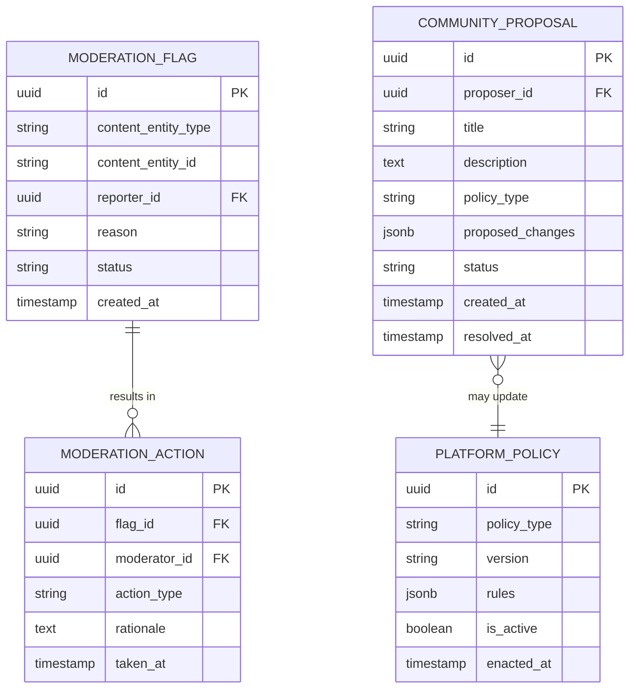

# Governance & Moderation Domain Architecture

> **Document Type**: Domain Architecture Document (Level 2 - Container)
> **Parent**: [System Architecture](../../ARCHITECTURE.md)
> **Last Updated**: 2026-03-12
> **Domain Owner**: Syntropy Core Team
> **Subdomain Type**: Supporting Subdomain
> **Rationale**: Platform-level content moderation and role policy management are important operational capabilities but not competitive differentiators. The key design principle — that Governance & Moderation defines policies while Identity enforces them — keeps the domain lightweight and prevents policy logic from polluting the authentication system.

---

## Vision Traceability

| Vision Element | Section | How This Domain Implements It |
|----------------|---------|-------------------------------|
| Platform governance (cap. 9) | §9 | CommunityProposal system for platform-level governance decisions |
| Content moderation (cap. 11) | §11 | ModerationFlag and ModerationAction lifecycle; PlatformPolicy enforcement |
| Role policy management | §10 constraints | PlatformPolicy defines role permission sets; Identity enforces at runtime |

---

## Domain Overview

### Business Capability

Governance & Moderation keeps the platform safe and governable at scale. It is distinct from DIP institutional governance (which governs individual institutions via smart contracts) — this domain governs the platform itself: what content is acceptable, what policies apply to roles, and how the platform community can propose and adopt platform-level changes.

**Key design separation**:
- **Governance & Moderation** defines and updates role permission policies (PlatformPolicy)
- **Identity** enforces them at the API boundary

This separation prevents governance policy changes from requiring changes to the authentication system.

### Ubiquitous Language

| Term | Definition | Notes |
|------|------------|-------|
| **ModerationFlag** | A report submitted by a user or automated system indicating potentially policy-violating content | Linked to a content entity in any domain via entity type + ID |
| **ModerationAction** | A decision taken by a moderator on a ModerationFlag | Examples: Remove, Warn, Ignore, Escalate |
| **PlatformPolicy** | A formal rule governing content, behavior, or role permissions on the platform | Versioned; changes emitted as events consumed by Identity |
| **CommunityProposal** | A community-initiated proposal for a platform-level policy change | Lifecycle: Draft→OpenForComment→Voting→Accepted/Rejected |

---

## Subdomain Classification & Context Map Position

**Type**: Supporting Subdomain

| Other Context | Pattern | Direction | Description |
|---------------|---------|-----------|-------------|
| Identity | Customer-Supplier | Governance & Moderation is upstream (supplier) | Governance & Moderation publishes PlatformPolicy updates; Identity enforces them |
| All domains | Conformist | Governance & Moderation is downstream | ModerationFlag references entity IDs from any domain without translation |
| Platform Core | Published Language | Governance & Moderation is emitter | Moderation actions and policy changes emitted to audit log |

---

## Data Architecture

### Entity Relationship Diagram

---

## Event Contracts

### Events Published

| Event Type | When Published | Consumer |
|------------|----------------|---------|
| `governance_moderation.role_policy.updated` | When a PlatformPolicy affecting role permissions is enacted | Identity (RBAC Engine update) |
| `governance_moderation.moderation.action_taken` | When a ModerationAction is recorded | Platform Core (audit log) |

### Events Consumed

None — Governance & Moderation initiates policy changes; it does not react to domain events to change policy.

---

## Security Considerations

### Data Classification

ModerationFlag reporter identity is **Confidential** (protected from the reported party). ModerationAction rationale is **Internal**. PlatformPolicy definitions are **Public**.

### Access Control

| Role | Permissions |
|------|-------------|
| Authenticated User | Submit ModerationFlags, participate in CommunityProposals |
| PlatformModerator | Review flags, take ModerationActions |
| PlatformAdmin | Enact PlatformPolicies, manage moderator roles |
