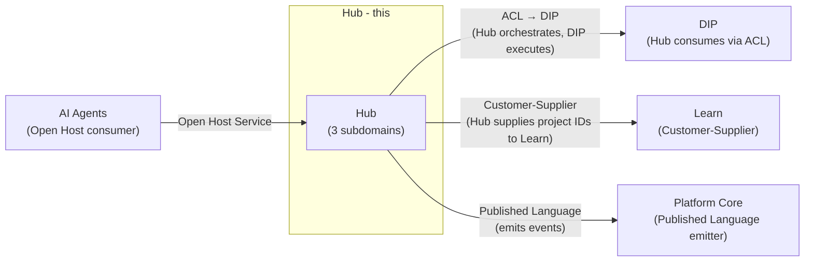
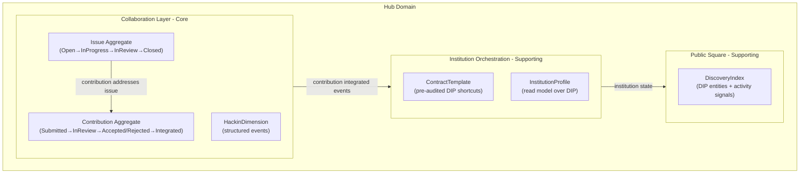
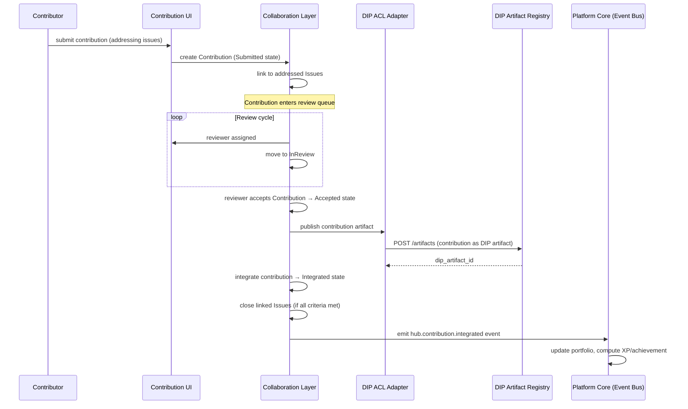
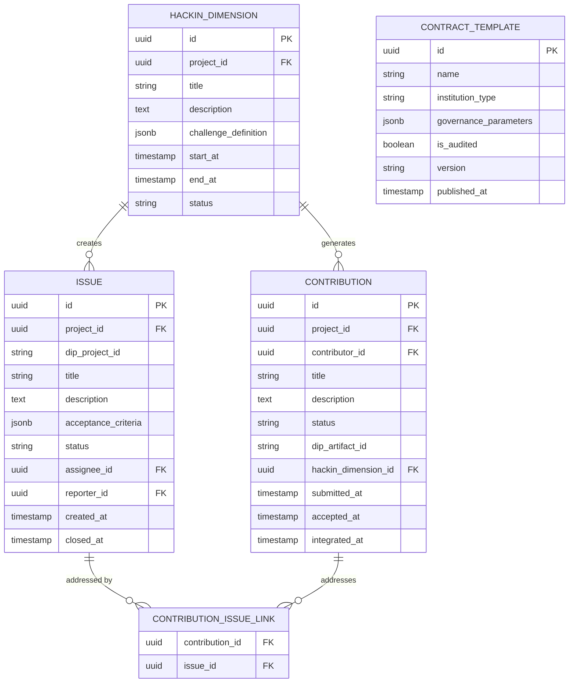

# Hub Domain Architecture

> **Document Type**: Domain Architecture Document (Level 2 - Container)
> **Parent**: [System Architecture](../../ARCHITECTURE.md)
> **Last Updated**: 2026-03-12
> **Domain Owner**: Syntropy Core Team
> **Subdomain Type**: Core Domain
> **Rationale**: Hub's core competitive advantage is its structured collaboration model — Issue, Contribution, and HackinDimension are novel concepts that solve the problem of "informal collaboration without structure." No existing platform combines verifiable contributor attribution (via DIP), structured governance (via DIP institutional contracts), and the hackin model (structured short-cycle contribution events) in a single coherent interface.

---

## Vision Traceability

| Vision Element | Section | How This Domain Implements It |
|----------------|---------|-------------------------------|
| Digital organization as complete entity (cap. 27) | §56 | Hub orchestrates institution creation via ContractTemplates over DIP governance; InstitutionProfile is the read model |
| Structured contribution workflow (cap. 28) | §28 | Collaboration Layer — Contribution lifecycle (Submitted→InReview→Accepted/Rejected→Integrated) |
| Issue system for project collaboration (cap. 29) | §29 | Collaboration Layer — Issue lifecycle (Open→InProgress→InReview→Closed) |
| Hackin model for structured contribution events (cap. 30) | §30 | HackinDimension management in Collaboration Layer |
| Public square for institution and project discovery (cap. 31) | §31 | Public Square subdomain — read model over DIP entities |
| Institution governance UI (cap. 32) | §32 | Institution Orchestration subdomain — wraps DIP governance via ContractTemplates |

---

## Document Scope

This document describes the **Hub** bounded context — responsible for structured digital collaboration and institution management.

### What This Document Covers

- Issue, Contribution, and HackinDimension as Hub's exclusively-owned collaboration concepts
- Institution Orchestration UI (ContractTemplates as shortcuts to DIP governance)
- Public Square as a discovery read model over DIP entities
- ACL with DIP (Hub orchestrates, DIP executes)

### What This Document Does NOT Cover

- DIP governance contract execution (Hub initiates via ACL; DIP executes — see [DIP Architecture](../digital-institutions-protocol/ARCHITECTURE.md))
- Platform-level moderation policies (see [Governance & Moderation](../governance-moderation/ARCHITECTURE.md))

---

## Domain Overview

### Business Capability

Hub solves the collaboration problem: no existing platform lets a digital organization exist as a complete entity with verifiable governance, contributor attribution, and structured collaboration in one place. Hub provides the collaboration layer (Issues, Contributions, Hackins) and the institution management UI (ContractTemplates) on top of DIP's foundational protocol. Without Hub, DIP's power would be inaccessible to most users — Hub is the UX layer that makes DIP manageable.

### Ubiquitous Language

| Term | Definition | Notes |
|------|------------|-------|
| **Issue** | A discrete unit of work in a DigitalProject, with a defined acceptance criteria | Lifecycle: Open→InProgress→InReview→Closed; Hub-exclusive |
| **Contribution** | A submitted piece of work addressing one or more Issues | Lifecycle: Submitted→InReview→Accepted/Rejected→Integrated; produces an Artifact anchored to DIP on acceptance |
| **HackinDimension** | A structured, time-bounded collaborative event organized around a specific problem or challenge | Hub-exclusive concept; creates Issues and records Contributions |
| **ContractTemplate** | A pre-audited shortcut to a DIP GovernanceContract — a standardized governance configuration for common institution types | Hub owns the templates; DIP executes the resulting contracts |
| **InstitutionProfile** | A read/presentation model over a DIP DigitalInstitution — Hub's view of institutional state for display | Hub never owns institution data; InstitutionProfile is a projection |
| **Collaborator** | A contributor who has submitted at least one Accepted Contribution to a project | Distinct from project member (governance role defined in DIP) |

---

## Subdomain Classification & Context Map Position

### Subdomain Classification

**Type**: Core Domain

Issue, Contribution, and HackinDimension represent novel collaboration models with no off-the-shelf equivalent in the context of verifiable contributor attribution and DIP integration. ContractTemplates require domain expertise about both governance patterns and DIP protocol — they are not configuration files.

### Context Map Position



| Other Context | Pattern | Direction | Description |
|---------------|---------|-----------|-------------|
| DIP | ACL (Hub side) + Open Host Service (DIP side) | Bidirectional | Hub's DIPOrchestrationAdapter translates institution management actions into DIP protocol calls; DIP read API supplies entity state |
| Learn | Customer-Supplier | Hub is upstream (supplier) | Hub DigitalProject IDs are referenced by Learn TrackProjectLinks |
| Platform Core | Published Language | Hub is emitter | Hub emits events conforming to EventSchema registry |
| AI Agents | Open Host Service | AI Agents is upstream | Hub activates Hub Agents via AI Agents API |

---

## Component Architecture

### Subdomain Map

| Subdomain | Type | Responsibility | Document |
|-----------|------|----------------|----------|
| **Collaboration Layer** | Core | Issue/Contribution/HackinDimension lifecycles, contributor attribution | [→ Architecture](./subdomains/collaboration-layer.md) |
| **Institution Orchestration** | Supporting | ContractTemplate management, InstitutionProfile read model, DIP governance configuration UI | [→ Architecture](./subdomains/institution-orchestration.md) |
| **Public Square** | Supporting | Read model for institution and project discovery, DIP entity rendering, prominence signals | [→ Architecture](./subdomains/public-square.md) |

### Subdomain Boundaries Diagram



### Contribution Review Sequence



---

## Data Architecture

### Data Ownership

| Entity | Description | Sensitivity |
|--------|-------------|-------------|
| Issue | Discrete work unit | Internal / Public (for public projects) |
| Contribution | Submitted work product | Internal / Public |
| HackinDimension | Structured collaborative event | Internal / Public |
| ContractTemplate | Pre-audited governance configuration | Internal |
| InstitutionProfile | Read model (no owned business data) | Derived (from DIP) |

### Entity Relationship Diagram



---

## Event Contracts

### Events Published

#### `hub.contribution.integrated`

```json
{
  "event_type": "hub.contribution.integrated",
  "event_schema_version": "1.0",
  "data": {
    "contribution_id": "uuid",
    "contributor_id": "uuid",
    "project_id": "uuid",
    "dip_project_id": "string",
    "dip_artifact_id": "string",
    "addressed_issues": ["uuid"]
  }
}
```

#### `hub.issue.closed`

Published when an Issue transitions to Closed state.

#### `hub.hackin.completed`

Published when a HackinDimension event concludes.

#### `hub.institution.created`

Published after Hub successfully orchestrates institution creation through DIP.

---

## Integration Points

### Upstream Dependencies

| Dependency | Type | Criticality | Fallback |
|------------|------|-------------|----------|
| DIP (institution/project operations) | Sync API via ACL | High | Queue requests; show pending state |
| Identity (contributor attribution) | Sync API | Critical | Block contribution without verified identity |
| AI Agents (Hub agents) | Sync API | Non-critical | Degrade to no-AI mode |

### Downstream Dependents

| Dependent | Integration Type | SLA Commitment |
|-----------|------------------|----------------|
| Learn | Hub project IDs available (Customer-Supplier) | 99.9% availability |
| Platform Core | Async events (contribution.integrated, hackin.completed) | Best effort |
| Communication | Async events (issue state changes, contribution reviews) | Best effort |

---

## Security Considerations

### Data Classification

Contribution content is **Internal** (can be made Public for open projects). ContractTemplate definitions are **Internal**.

### Access Control

| Role | Permissions |
|------|-------------|
| Contributor | Submit contributions, comment on issues |
| ProjectMaintainer | Review and accept contributions, manage issues |
| InstitutionAdmin | Manage institution configuration, apply ContractTemplates |

---

## Internal Subdomain Decomposition

See [Subdomain Map](#subdomain-map) above. Subdomain documents:

- [Collaboration Layer](./subdomains/collaboration-layer.md)
- [Institution Orchestration](./subdomains/institution-orchestration.md)
- [Public Square](./subdomains/public-square.md)
