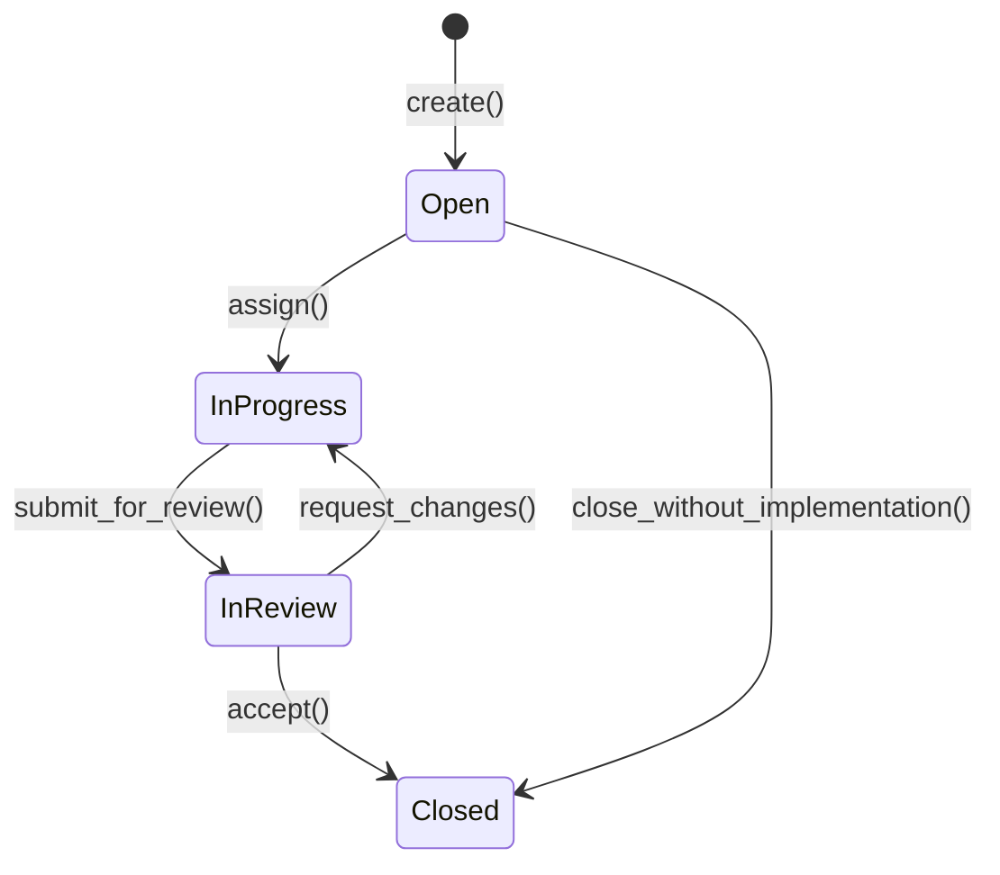
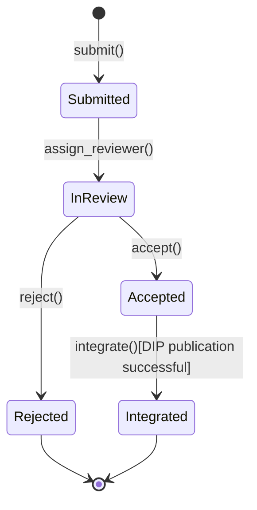

# Collaboration Layer — Subdomain Architecture

> **Document Type**: Subdomain Architecture Document (Level 3 - Component)
> **Parent Domain**: [Hub](../ARCHITECTURE.md)
> **Root Architecture**: [System Architecture](../../../ARCHITECTURE.md)
> **Last Updated**: 2026-03-13
> **Subdomain Owner**: Syntropy Core Team

## Metadata

| Field | Value |
|-------|-------|
| **Subdomain Type** | Core Domain |
| **Parent Domain** | Hub |
| **Boundary Model** | Internal Module (within Hub domain) |
| **Implementation Status** | Not Started |

---

## Business Scope

### What This Subdomain Solves

The Collaboration Layer is the heart of Hub — it provides the structured collaboration model that makes digital project work verifiable and organized. Issue, Contribution, and ContributionSandbox are Hub-exclusive concepts that solve the problem of "informal collaboration without attribution." When a Contribution is accepted and integrated, it becomes a DIP-anchored artifact with the contributor's cryptographic signature — permanent, verifiable proof of their contribution.

### Subdomain Classification Rationale

**Type**: Core Domain. The combination of structured Issue/Contribution lifecycles with automatic DIP artifact creation on contribution acceptance, plus the ContributionSandbox mechanism (safe clone-edit-PR flow for all contributors with artifact access), constitutes novel collaboration infrastructure.

---

## Aggregate Roots

### Issue

**Responsibility**: Define discrete units of work; manage work assignment and review status.

**Domain Events emitted**:
- `hub.issue.created` — when an Issue is opened
- `hub.issue.closed` — when an Issue transitions to Closed

### Contribution

**Responsibility**: Track submitted work products; manage review lifecycle; trigger DIP artifact publication on acceptance.

**Domain Events emitted**:
- `hub.contribution.submitted` — Submitted state
- `hub.contribution.integrated` — Integrated state (after DIP publication)

### ContributionSandbox

**Responsibility**: Encapsulate the contribution workflow: provision an isolated instance (or container, e.g. Docker); clone the artifact so the contributor can edit and see effects; optionally allow submission of a pull request (accepted or rejected). Applies to all DIP artifact types (code, documents, data). Available to every contributor who has access to the artifact — including owners and authorized contributors on private or closed projects; visibility (public vs private) does not restrict the mechanism, access permission does. Also orchestrates structured collaborative events; creates challenge-specific Issues; aggregates Contributions from the event.

**Domain Events emitted**:
- `hub.hackin.started` — ContributionSandbox session or event begins (event name retained for compatibility; see ADR-011)
- `hub.hackin.completed` — ContributionSandbox lifecycle event concludes (with participation summary)

---

## Domain Services

| Service | Responsibility | Operates On |
|---------|---------------|-------------|
| `ContributionIntegrationService` | On Contribution acceptance: calls DIP ACL adapter to publish artifact; sets dip_artifact_id; closes linked Issues if criteria met | Contribution, Issue aggregates, DIP adapter |
| `ContributionSandboxOrchestrator` | Manages ContributionSandbox lifecycle; provisions isolated instance/container, clone, edit session, optional PR; creates structured Issues from challenge definition; aggregates participation records | ContributionSandbox aggregate |

---

## Traceability

| Vision Element | Section | How This Subdomain Implements It |
|----------------|---------|----------------------------------|
| Structured contribution workflow (cap. 28) | §28 | Contribution lifecycle with DIP artifact creation on acceptance |
| Issue system (cap. 29) | §29 | Issue lifecycle from Open to Closed |
| Contribution sandbox (cap. 30) | §30 | ContributionSandbox — safe clone-edit-PR for all contributors with artifact access; time-bounded collaborative events |
