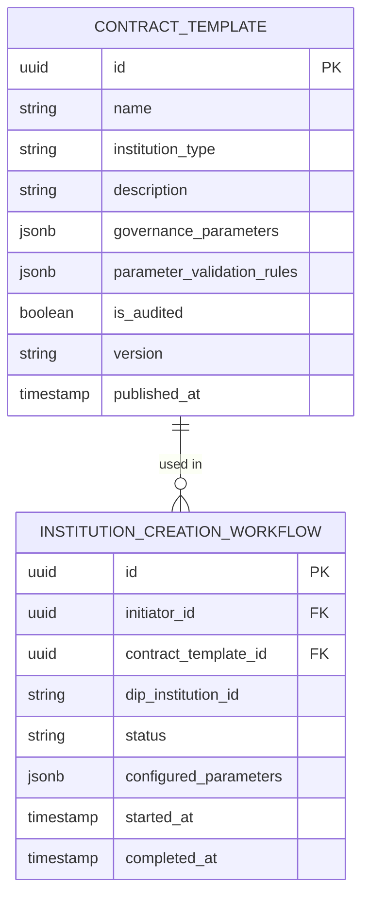

# Institution Orchestration — Subdomain Architecture

> **Document Type**: Subdomain Architecture Document (Level 3 - Component)
> **Parent Domain**: [Hub](../ARCHITECTURE.md)
> **Root Architecture**: [System Architecture](../../../ARCHITECTURE.md)
> **Last Updated**: 2026-03-12
> **Subdomain Owner**: Syntropy Core Team

## Metadata

| Field | Value |
|-------|-------|
| **Subdomain Type** | Supporting Subdomain |
| **Parent Domain** | Hub |
| **Boundary Model** | Internal Module (within Hub domain) |
| **Implementation Status** | Not Started |

---

## Business Scope

### What This Subdomain Solves

Institution Orchestration makes DIP's institutional governance accessible to non-technical users. ContractTemplates are pre-audited governance configurations that an institution admin can select and configure through a UI — rather than writing governance contract rules from scratch. InstitutionProfile is the read model that presents an institution's current state (from DIP) in a user-friendly format.

**Key design principle**: Hub orchestrates, DIP executes. Hub never stores institution governance state — it only provides the UI and configuration shortcuts (ContractTemplates) that produce DIP protocol calls.

### Subdomain Classification Rationale

**Type**: Supporting Subdomain. ContractTemplate management is configuration/CRUD; InstitutionProfile is a read model with no owned business logic.

---

## Aggregate Roots

### ContractTemplate

**Responsibility**: Maintain a library of pre-audited governance configuration shortcuts that map to DIP GovernanceContract parameters.

**Invariants**:
- A ContractTemplate must be audited (is_audited = true) before it can be used in production institution creation
- ContractTemplate parameters include validation rules enforced in the UI before submitting to DIP

### InstitutionProfile (Read Model)

**Responsibility**: Present a curated, user-friendly view of an institution's current state, sourced entirely from DIP.

**Key Design**: InstitutionProfile is a read-only projection — it queries DIP in real time (or from a short-lived cache) and does not persist institution data in Hub's database. Updates when DIP events indicate state change.

---

## Domain Services

| Service | Responsibility | Operates On |
|---------|---------------|-------------|
| `InstitutionCreationOrchestrator` | Guides user through ContractTemplate selection and parameter configuration; submits to DIP on completion | ContractTemplate, InstitutionCreationWorkflow, DIP ACL adapter |
| `InstitutionProfileProjector` | Queries DIP and projects institution state into InstitutionProfile view model | DIP API (read-only via ACL) |

---

## Traceability

| Vision Element | Section | How This Subdomain Implements It |
|----------------|---------|----------------------------------|
| Institution governance UI (cap. 32) | §32 | ContractTemplates as pre-audited shortcuts to DIP governance; InstitutionProfile as read model |
| Digital organization as complete entity (cap. 27) | §56 | InstitutionProfile presents the full DIP entity state in a consumable format |
