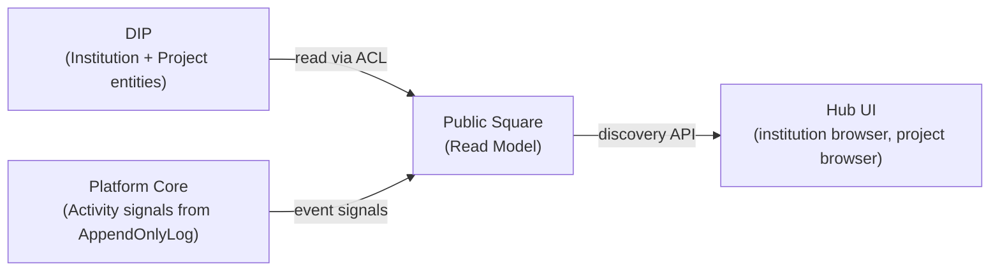
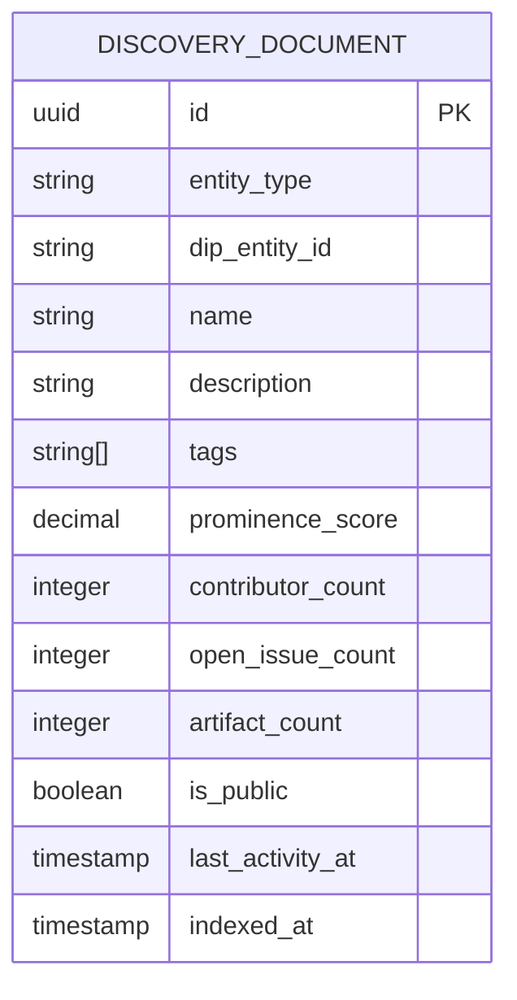

# Public Square — Subdomain Architecture

> **Document Type**: Subdomain Architecture Document (Level 3 - Component)
> **Parent Domain**: [Hub](../ARCHITECTURE.md)
> **Root Architecture**: [System Architecture](../../../ARCHITECTURE.md)
> **Last Updated**: 2026-03-12
> **Subdomain Owner**: Syntropy Core Team

## Metadata

| Field | Value |
|-------|-------|
| **Subdomain Type** | Supporting Subdomain |
| **Parent Domain** | Hub |
| **Boundary Model** | Internal Module (within Hub domain) |
| **Implementation Status** | Not Started |

---

## Business Scope

### What This Subdomain Solves

The Public Square is the discovery layer of Hub — a curated, ranked view of public institutions and projects that makes the ecosystem feel alive and discoverable. It answers: "What institutions and projects exist, which are most active, and which match what I'm looking for?"

### Subdomain Classification Rationale

**Type**: Supporting Subdomain. Public Square is a read model and ranking engine — no complex domain model required. The data sources are DIP (entity state) and Platform Core (activity signals).

---

## Business Scope: Read Model Over DIP + Platform Core

---

## Aggregate Roots

### DiscoveryIndex (Read Model)

**Responsibility**: Maintain a ranked, searchable index of public institutions and projects; compute prominence scores from activity signals.

**Key Design**: DiscoveryIndex is eventually consistent with DIP (entity creation/update events) and Platform Core (activity signals). It stores denormalized projection data for fast rendering — never owning the authoritative entity data.

**Prominence Scoring**:
- Recent contribution activity (event count in last 30 days)
- Number of active contributors
- Open issue count (signals active development)
- Recent artifact publications
- Community rating signals (from Communication domain threads)

---

## Domain Services

| Service | Responsibility | Operates On |
|---------|---------------|-------------|
| `ProminenceScorer` | Computes and updates prominence_score from activity signals | DiscoveryDocument |
| `PublicSquareIndexer` | Subscribes to DIP entity creation events and Platform Core activity signals; upserts DiscoveryDocuments | DiscoveryIndex aggregate |

---

## Traceability

| Vision Element | Section | How This Subdomain Implements It |
|----------------|---------|----------------------------------|
| Public square for discovery (cap. 31) | §31 | DiscoveryIndex renders public DIP entities with activity-based prominence scoring |
