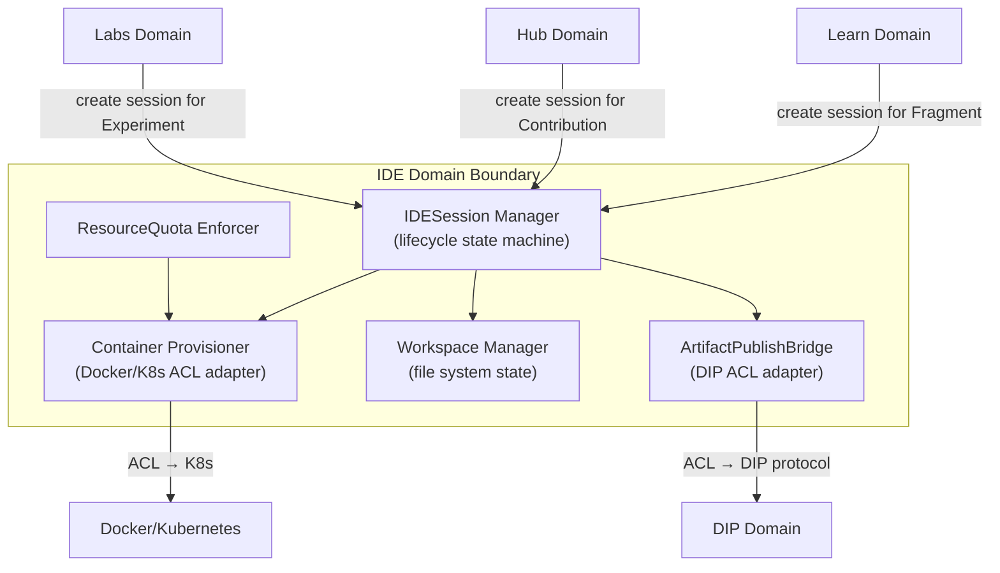
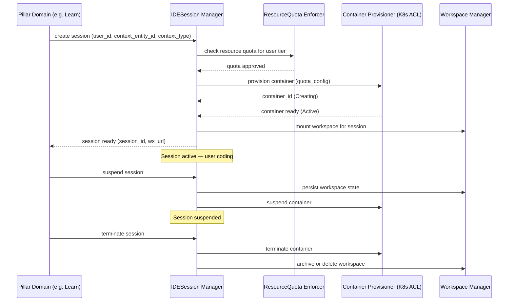
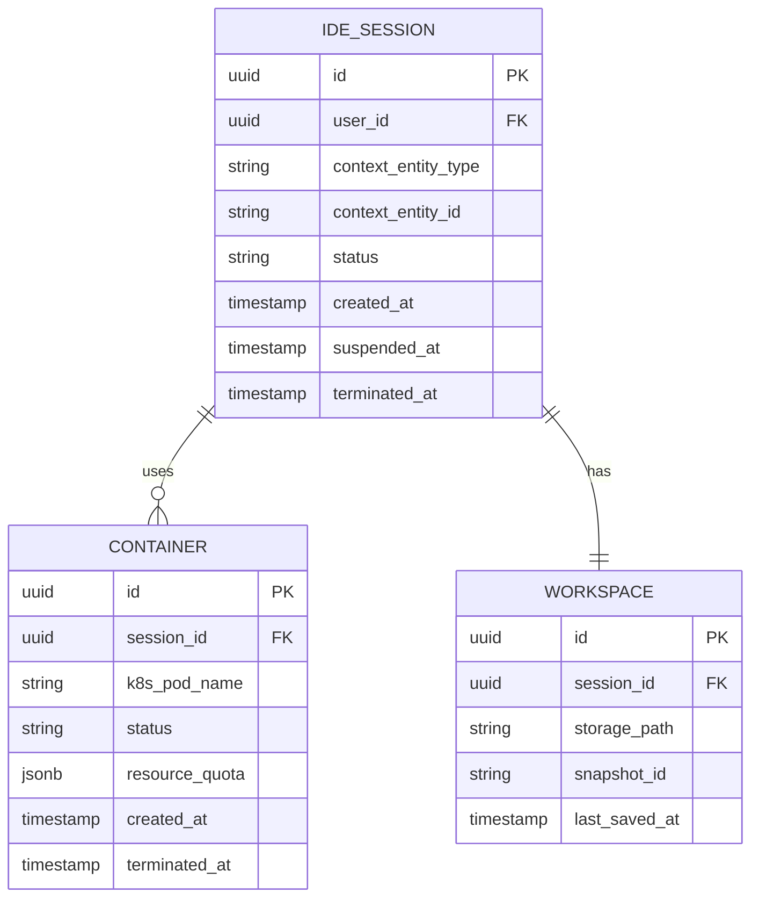

# IDE Domain Architecture

> **Document Type**: Domain Architecture Document (Level 2 - Container)
> **Parent**: [System Architecture](../../ARCHITECTURE.md)
> **Last Updated**: 2026-03-12
> **Domain Owner**: Syntropy Core Team
> **Subdomain Type**: Supporting Subdomain
> **Rationale**: The embedded IDE is critical infrastructure but not a competitive differentiator in itself — Monaco/VS Code are best-in-class solutions. The custom work is limited to: container lifecycle management per session, the artifact publish bridge to DIP, and resource quota enforcement. This is a Supporting Subdomain using off-the-shelf IDE technology wrapped in necessary integration logic.

---

## Vision Traceability

| Vision Element | Section | How This Domain Implements It |
|----------------|---------|-------------------------------|
| Embedded code editor across all pillars (cap. 5) | §5 | Monaco/VS Code embedded within the platform; shared service for Learn, Hub, Labs without context switch |
| Container isolation per session | §5 | IDESession creates an isolated container; resources are cleaned up on session end |
| Artifact publication from IDE directly to DIP | §5 | Artifact publish bridge: IDE → DIP ACL Adapter → DIP Artifact Registry |
| Experiment execution for Labs | §36 | Container lifecycle for experiment execution delegated from Labs ExperimentDesign |

---

## Domain Overview

### Business Capability

IDE eliminates the context switch between learning/building/researching and coding. A learner working on a Fragment artifact can code directly within the platform. A researcher can execute their experiment code in the same interface where they write the article. A contributor can code and publish an artifact to DIP without leaving the platform.

### Domain Invariants

| ID | Invariant | Enforcement Point |
|----|-----------|-------------------|
| IIDE1 | Only one active container per IDESession at any time | IDESession aggregate — container lifecycle state machine |
| IIDE2 | Resource quotas (CPU, memory, disk, execution time) are enforced at container creation | Container provisioning — quota check before CREATE |
| IIDE3 | Artifact publication from IDE always goes through DIP ACL Adapter — never directly to DIP | Artifact Publish Bridge — no direct DIP writes |

### Ubiquitous Language

| Term | Definition | Notes |
|------|------------|-------|
| **IDESession** | A user's active editing session within the embedded IDE | Scoped to a specific entity context (Fragment, Hub project, Labs article) |
| **Container** | An isolated execution environment provisioned for an IDESession | Lifecycle: Creating→Active→Suspended→Terminated |
| **Workspace** | The file system state associated with an IDESession | Persisted across session suspensions; cleaned up on termination |
| **ArtifactPublishBridge** | The ACL adapter that translates IDE publication requests to DIP protocol calls | Enforces IIDE3 |
| **ResourceQuota** | The per-session CPU, memory, disk, and execution time limits | Enforced at container creation; escalation available per tier |

---

## Subdomain Classification & Context Map Position

**Type**: Supporting Subdomain — thin custom layer around Monaco/VS Code + container orchestration.

| Other Context | Pattern | Direction | Description |
|---------------|---------|-----------|-------------|
| DIP | ACL (IDE side) | IDE is downstream | ArtifactPublishBridge translates IDE publication into DIP protocol |
| Learn | Customer-Supplier | IDE is upstream (provider) | Learn invokes IDE for Fragment Artifact coding sessions |
| Hub | Customer-Supplier | IDE is upstream (provider) | Hub invokes IDE for contribution coding sessions |
| Labs | Customer-Supplier | IDE is upstream (provider) | Labs delegates experiment execution to IDE |
| Docker/Kubernetes (external) | ACL | IDE wraps container orchestration | ContainerOrchestrationAdapter isolates K8s vocabulary from IDE domain |

---

## Component Architecture

### Container Lifecycle Sequence

---

## Data Architecture

### Entity Relationship Diagram

---

## Event Contracts

### Events Published

| Event Type | When Published |
|------------|----------------|
| `ide.session.started` | When IDESession becomes Active |
| `ide.session.terminated` | When IDESession is Terminated |
| `ide.artifact.published` | When an artifact is successfully published through ArtifactPublishBridge |

---

## Security Considerations

### Data Classification

Workspace content is **Confidential** (user's code and files). Container resource usage is **Internal**.

### Access Control

| Role | Permissions |
|------|-------------|
| Authenticated User | Create and manage own IDE sessions (within quota) |
| Platform Admin | View session audit logs, escalate quotas |

### Compliance Requirements

Container isolation must prevent cross-user data access. Resource quotas prevent denial-of-service. Workspace data subject to GDPR/LGPD right to erasure on account deletion.

---

## Domain-Specific Decisions

| ADR | Summary |
|-----|---------|
| ADR-007 *(Prompt 01-C)* | Monaco Editor / VS Code as IDE foundation; container orchestration strategy; IDE as shared service; resource quota enforcement |
