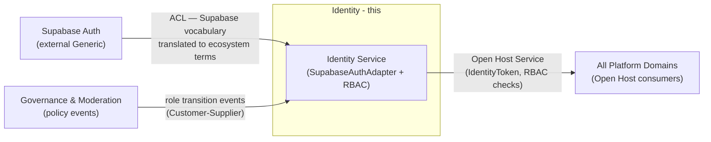
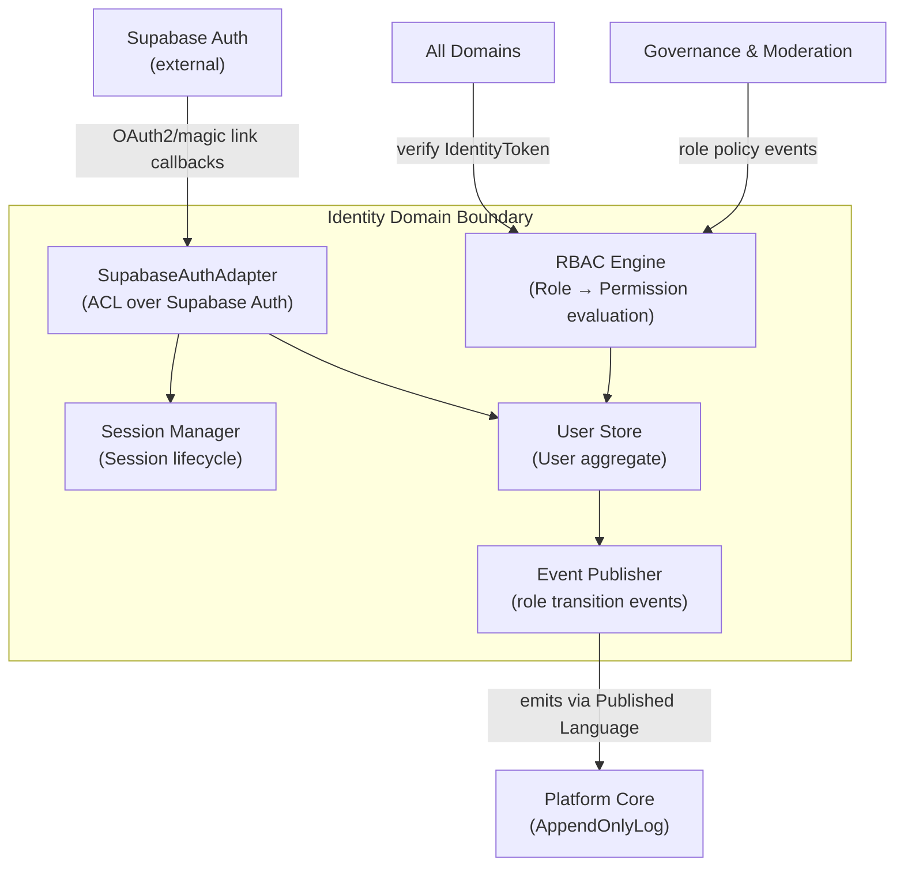
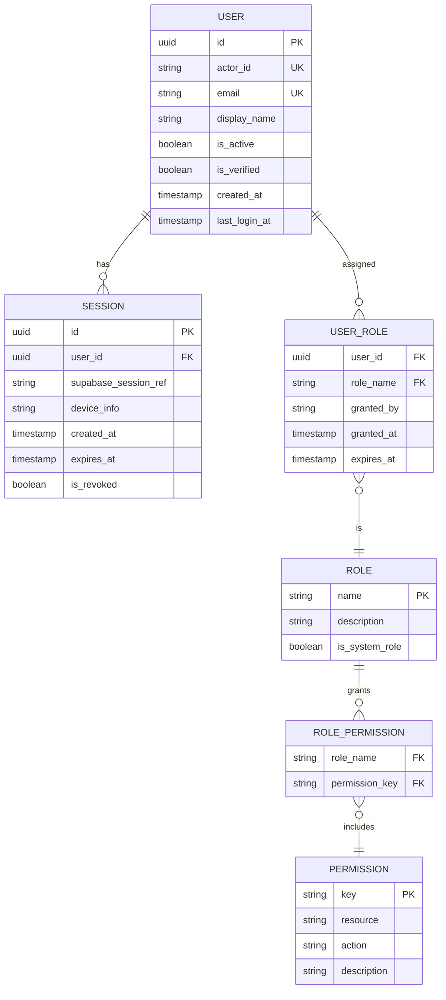

# Identity Domain Architecture

> **Document Type**: Domain Architecture Document (Level 2 - Container)
> **Parent**: [System Architecture](../../ARCHITECTURE.md)
> **Last Updated**: 2026-03-12
> **Domain Owner**: Syntropy Core Team
> **Subdomain Type**: Generic Subdomain
> **Rationale**: Authentication and authorization are well-understood, commoditized problems. Supabase Auth provides battle-tested OAuth2, magic link, and session management. The custom layer is limited to RBAC policy enforcement — the only non-commodity part, which is thin enough not to justify building from scratch.

---

## Vision Traceability

| Vision Element | Section | How This Domain Implements It |
|----------------|---------|-------------------------------|
| Identity and authentication (cap. 1) | §6 platform capabilities | User account creation, OAuth2 login, session lifecycle management |
| Role-based access control (cap. 9) | §10 constraints | RBAC enforcement for all platform resources; role definitions aligned to governance capabilities |
| Actor attribution for DIP events | §13–18 DIP capabilities | User identity anchored to actor ID used in DIP protocol event signing |

---

## Document Scope

This document describes the **Identity** bounded context. It is a Generic Subdomain — the implementation wraps Supabase Auth behind an ACL and adds a custom RBAC layer.

### What This Document Covers

- User account model, session management, role and permission structures
- ACL adapter over Supabase Auth
- RBAC enforcement interface exposed as Open Host Service
- Role transition events emitted to the Platform Core event bus

### What This Document Does NOT Cover

- DIP institutional governance (which has its own governance contracts — see [DIP Architecture](../digital-institutions-protocol/ARCHITECTURE.md))
- Platform-level moderation policy definition (see [Governance & Moderation](../governance-moderation/ARCHITECTURE.md))

---

## Domain Overview

### Business Capability

Identity enables every user to have a single, persistent identity across all three pillars of the Syntropy Ecosystem. It provides:
- **Authentication**: verify who a user is (password, OAuth2, magic link)
- **Session management**: maintain authenticated sessions securely
- **RBAC**: enforce what each role can do across all platform resources
- **Actor attribution**: provide the stable user ID that DIP uses for cryptographic actor attribution in protocol events

### Ubiquitous Language

| Term | Definition | Notes |
|------|------------|-------|
| **User** | An authenticated individual with a persistent identity across all pillars | Created once; referenced by ID everywhere |
| **Session** | An authenticated context representing a User's current interaction with the platform | Short-lived; scoped to a device or browser |
| **Role** | A named set of permissions assigned to a User | Examples: Learner, Creator, Researcher, InstitutionAdmin, PlatformModerator, PlatformAdmin |
| **Permission** | An atomic capability a Role grants | Example: `hub:contribution:submit`, `learn:track:publish`, `admin:user:suspend` |
| **ActorId** | The stable, platform-wide identifier for a User used in DIP cryptographic signing | Derived from User.id; never reassigned |
| **IdentityToken** | A short-lived JWT encoding the User's current Role set and ActorId | Issued by Identity; verified by all domains at the boundary |

---

## Subdomain Classification & Context Map Position

### Subdomain Classification

**Type**: Generic Subdomain

Authentication and session management are solved problems. Supabase Auth provides OAuth2 (Google, GitHub), magic link, and password flows. The only custom-built component is the RBAC layer — role-to-permission mapping and permission enforcement at the API gateway level. This is thin enough that no specialized domain model is needed. The ACL adapter prevents Supabase's internal model from leaking into the ecosystem's ubiquitous language.

**Design investment implications**:

| Classification | Design Approach Applied |
|----------------|------------------------|
| Core Domain | No |
| Supporting Subdomain | No |
| Generic Subdomain | Yes — Supabase Auth wrapped behind SupabaseAuthAdapter (ACL). RBAC implemented as a thin policy enforcement layer. External model vocabulary (Supabase user types, JWT claims format) translated to ecosystem terms at the adapter boundary. |

### Context Map Position



| Other Context | Pattern | Direction | Description |
|---------------|---------|-----------|-------------|
| Supabase Auth (external) | ACL | Identity wraps Supabase | SupabaseAuthAdapter translates Supabase user model to Identity's User/Session; Supabase vocabulary never leaks beyond the adapter |
| All platform domains | Open Host Service | Identity is upstream | All domains verify IdentityTokens at their API boundary; RBAC permission checks via sync API |
| Governance & Moderation | Customer-Supplier | Identity is downstream (receives role policy events) | Governance & Moderation defines platform-level role policies; Identity enforces them via RBAC evaluation |
| Sponsorship | Customer-Supplier | Identity is upstream (supplier) | Sponsorship consumes User identity for actor attribution |

---

## Component Architecture



---

## Data Architecture

### Data Ownership

| Entity | Description | Sensitivity |
|--------|-------------|-------------|
| User | Platform identity record | Confidential (PII) |
| Session | Active authentication context | Confidential |
| Role | Named permission bundle | Internal |
| Permission | Atomic capability definition | Internal |

### Entity Relationship Diagram



### Data Lifecycle

| Entity | Creation | Updates | Deletion | Retention |
|--------|----------|---------|----------|-----------|
| User | On first authentication | Profile updates, is_active | Soft delete (GDPR erasure = anonymize PII, retain id) | Lifetime of platform |
| Session | On login | Revocation | Hard delete on expiry | 30 days after expiry |
| Role | Platform admin action | Permission set update | Soft deprecation | Indefinite |
| Permission | Platform admin action | Description update | Soft deprecation | Indefinite |

---

## API Design

### Public API

Base URL: `https://api.syntropy.cc/v1/identity`

Authentication: `POST /auth/login`, `POST /auth/logout` — unauthenticated endpoints. All other endpoints require a valid IdentityToken in `Authorization: Bearer` header.

**Key endpoints**:
- `POST /auth/login` — initiate login (Supabase Auth redirect)
- `POST /auth/callback` — OAuth2 callback handler
- `POST /auth/logout` — revoke current session
- `GET /me` — fetch current user profile and roles
- `PATCH /me` — update profile (display name, preferences)
- `GET /users/{user_id}/roles` — fetch user's roles (platform admin only)
- `POST /users/{user_id}/roles` — assign role (platform admin only)
- `DELETE /users/{user_id}/roles/{role_name}` — revoke role

### Internal API (Other Domains)

Base URL: `http://identity.internal/api/v1`

Authentication: Service token (mTLS)

**Key endpoints**:
- `POST /tokens/verify` — verify IdentityToken and return decoded claims
- `GET /permissions/check?user_id={id}&permission={key}` — check if user has permission
- `GET /users/{user_id}/actor-id` — fetch the stable ActorId for DIP signing

---

## Event Contracts

### Events Published

#### `identity.user.created`

Published when a new user account is created.

```json
{
  "event_type": "identity.user.created",
  "event_schema_version": "1.0",
  "timestamp": "ISO8601",
  "data": {
    "user_id": "uuid",
    "actor_id": "string",
    "email_hash": "sha256-of-email"
  },
  "metadata": {
    "correlation_id": "uuid",
    "causation_id": "uuid"
  }
}
```

#### `identity.role.assigned`

Published when a role is assigned to a user.

```json
{
  "event_type": "identity.role.assigned",
  "event_schema_version": "1.0",
  "data": {
    "user_id": "uuid",
    "role_name": "string",
    "granted_by": "uuid"
  }
}
```

#### `identity.role.revoked`

Published when a role is revoked from a user.

### Events Consumed

#### `governance_moderation.role_policy.updated`

**Source**: Governance & Moderation domain

**Handler**: RBAC Engine

**Behavior**: Updates the permission set for the affected role. Invalidates cached permission evaluations for users holding that role.

---

## Integration Points

### Upstream Dependencies

| Dependency | Type | Criticality | Fallback |
|------------|------|-------------|----------|
| Supabase Auth | Sync (OAuth2 redirect flow) | Critical | Degrade to magic link if OAuth2 provider unavailable |

### Downstream Dependents

| Dependent | Integration Type | SLA Commitment |
|-----------|------------------|----------------|
| All platform domains | Sync API (token verification) | 99.99% availability, p99 < 50ms |
| Platform Core | Async Event (user.created, role.assigned) | Best effort |

### External Integrations

| Provider | Purpose | Criticality |
|----------|---------|-------------|
| Supabase Auth | OAuth2, magic link, password auth, session storage | Critical |

---

## Security Considerations

### Data Classification

User email and display name are **Confidential (PII)**. All other identity data is **Internal**.

### Access Control

| Role | Permissions |
|------|-------------|
| Learner | Enroll in tracks, submit artifacts, view own portfolio |
| Creator | Publish tracks, manage own projects, create collectible definitions |
| Researcher | Submit articles, design experiments, conduct peer reviews |
| InstitutionAdmin | Manage institution governance, assign contributor roles within institution |
| PlatformModerator | Flag and action content moderation cases |
| PlatformAdmin | Full access to role management, schema registration, platform configuration |

### Compliance Requirements

GDPR/LGPD/CCPA: right to access, right to erasure (anonymization of PII while retaining ID and event history pseudonymized). See [Security Architecture](../../cross-cutting/security/ARCHITECTURE.md).

---

## Domain-Specific Decisions

| ADR | Summary |
|-----|---------|
| ADR-005 *(Prompt 01-C)* | Supabase Auth + custom RBAC layer as Generic Subdomain; ACL wrapping Supabase Auth; role transition events on event bus |
