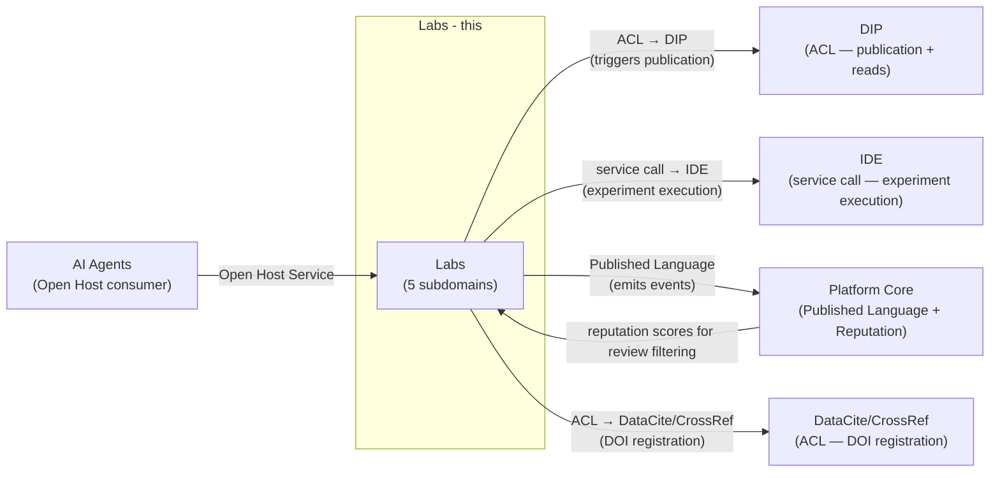
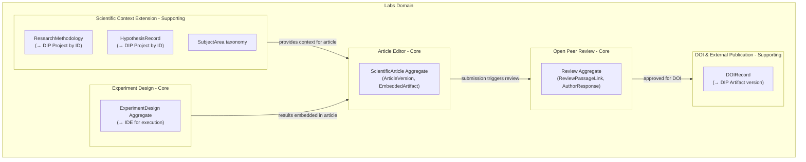
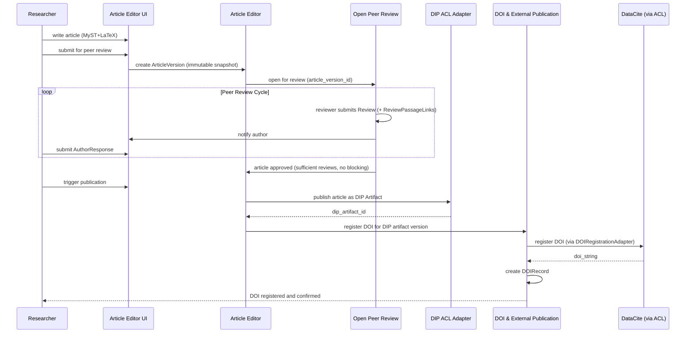
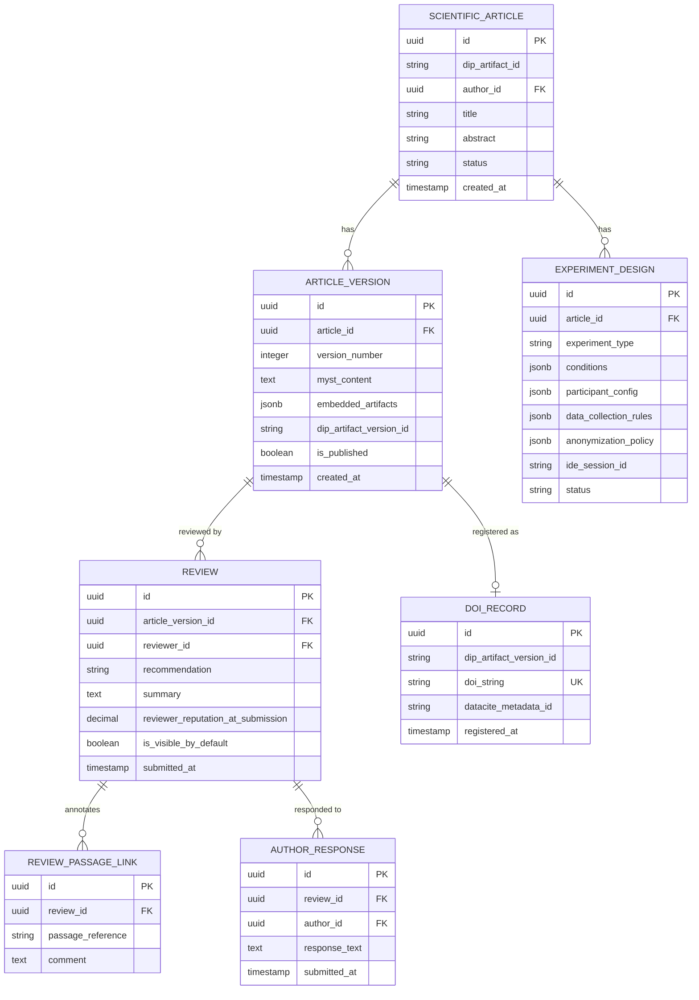

# Labs Domain Architecture

> **Document Type**: Domain Architecture Document (Level 2 - Container)
> **Parent**: [System Architecture](../../ARCHITECTURE.md)
> **Last Updated**: 2026-03-12
> **Domain Owner**: Syntropy Core Team
> **Subdomain Type**: Core Domain
> **Rationale**: Labs' competitive differentiation is the combination of open peer review with reputation-based filtering, executable artifact integration (code/datasets run directly in the article), and the DOI publication pathway — all connected to the DIP artifact ownership model. No existing platform combines all of these: arXiv lacks review and executable artifacts; open journal systems lack DIP integration and reputation-based filtering. Labs is irreplaceable as designed.

---

## Vision Traceability

| Vision Element | Section | How This Domain Implements It |
|----------------|---------|-------------------------------|
| Open scientific publishing without institutional barriers (cap. 33) | §60–64 | Labs enables article publication with DOI registration for any authenticated user; no institutional affiliation required |
| Transparent peer review (cap. 34) | §34 | Open Peer Review subdomain — full review history permanently public; reputation-based visibility filtering |
| Executable artifact integration (cap. 35) | §35 | Article Editor — EmbeddedArtifact references to DIP artifacts (code, datasets) that can be executed in-browser via IDE |
| Experiment design and reproducibility (cap. 36) | §36 | Experiment Design subdomain — ExperimentDesign model with anonymization policy; execution via IDE |
| DOI registration and external indexing (cap. 37) | §37 | DOI & External Publication subdomain — DataCite/CrossRef integration |
| Scientific context extension on DIP entities (cap. 38) | §38 | Scientific Context Extension subdomain — ResearchMethodology, HypothesisRecord, SubjectArea on DIP entities |
| Reputation-based review quality (cap. 39) | §39 | Open Peer Review — low-reputation reviews filtered (not removed); reviewer reputation from Platform Core |
| Author response cycle (cap. 40) | §40 | Open Peer Review — AuthorResponse with full public history |

---

## Document Scope

This document describes the **Labs** bounded context — responsible for open scientific research, publication, and peer review.

### What This Document Covers

- Scientific context extension on DIP entities (without re-ownership)
- Article editor (MyST + LaTeX) with immutable versioning
- Experiment design model and IDE delegation
- Open peer review with reputation-based visibility filtering
- DOI registration and external indexing

### What This Document Does NOT Cover

- DIP artifact identity anchoring (Labs triggers publication via ACL; DIP owns the artifact — see [DIP Architecture](../digital-institutions-protocol/ARCHITECTURE.md))
- IDE container orchestration (Labs delegates experiment execution to IDE domain — see [IDE Architecture](../ide/ARCHITECTURE.md))
- Researcher identity management (see [Identity Architecture](../identity/ARCHITECTURE.md))

---

## Domain Overview

### Business Capability

Labs eliminates the institutional barriers to open scientific research. A researcher without institutional affiliation can design an experiment, write an article with MyST+LaTeX, embed executable code and datasets, submit it for open peer review, and register a DOI — all within the ecosystem. Every step produces DIP-anchored artifacts. Every review is public. Reputation determines visibility, not gatekeeping.

### Domain Invariants

| ID | Invariant | Enforcement Point |
|----|-----------|-------------------|
| ILabs1 | Published article versions are permanent — no modification after DOI registration | Article Editor aggregate — once version is published, it is immutable; new content requires new version |
| ILabs2 | Labs never owns Laboratory (DigitalInstitution) or Research Line (DigitalProject) — it extends DIP entities by reference only | Scientific Context Extension — all scientific context records contain DIP entity IDs, never duplicate DIP data |
| ILabs3 | Review history is permanently public — low-reputation reviews are filtered by default but never deleted | Open Peer Review — filtering is a visibility property, not a deletion |
| ILabs4 | Experiment execution is delegated to IDE — Labs does not implement container orchestration | Experiment Design aggregate — execution_session_id references an IDE IDESession |

### Ubiquitous Language

| Term | Definition | Notes |
|------|------------|-------|
| **ScientificArticle** | A versioned, peer-reviewed intellectual artifact with MyST+LaTeX content | Typed subtype of DIP Artifact; Labs adds scientific metadata |
| **ArticleVersion** | An immutable snapshot of a ScientificArticle at a specific point in time | Published versions are permanent (ILabs1) |
| **EmbeddedArtifact** | A reference to a DIP Artifact (code, dataset) embedded within an article for inline execution | Labs references by DIP artifact ID; never copies data |
| **Review** | A structured evaluation of an article by a reviewer | Permanently public (ILabs3); visibility filtered by reviewer reputation |
| **ReviewPassageLink** | A connection between a Review comment and a specific passage in the article | Enables inline annotation |
| **AuthorResponse** | An author's reply to a specific Review | Part of the permanent public review history |
| **SubjectArea** | A hierarchical classification of scientific domains | Labs-owned taxonomy used for article categorization |
| **ResearchMethodology** | A record of the methodology used in a study, attached to a DIP DigitalProject by reference | Labs-owned; does not duplicate DIP Project data |
| **HypothesisRecord** | A formalized statement of a research hypothesis, attached to a DIP DigitalProject by reference | Labs-owned |
| **ExperimentDesign** | The specification of an experiment: type, conditions, participant configuration, data collection rules, anonymization policy | Execution delegated to IDE |
| **DOIRecord** | The link between a DIP Artifact version and its externally registered DOI | Labs-owned; connects DIP artifact to external scientific record |

---

## Subdomain Classification & Context Map Position

### Subdomain Classification

**Type**: Core Domain

The combination of: (1) reputation-based filtering that preserves history rather than deleting reviews, (2) author response cycles as permanent public record, (3) executable EmbeddedArtifact integration, and (4) DOI registration connected to DIP artifact anchoring — makes Labs a genuinely novel scientific infrastructure. No off-the-shelf open journal system provides this combination.

### Context Map Position



| Other Context | Pattern | Direction | Description |
|---------------|---------|-----------|-------------|
| DIP | ACL (Labs side) | Labs is downstream | DIPPublicationAdapter translates article publication into DIP protocol; Labs reads DIP entities by ID for scientific context extension |
| IDE | Service call | Labs is consumer | Labs calls IDE to create container sessions for experiment execution; IDE vocabulary does not enter Labs |
| Platform Core | Published Language (emitter) + Customer-Supplier (reputation consumer) | Bidirectional | Labs emits review and publication events; reads reviewer reputation scores from Platform Core |
| AI Agents | Open Host Service | AI Agents is upstream | Labs activates Labs Agents via AI Agents API |
| DataCite/CrossRef (external) | ACL | Labs wraps external | DOIRegistrationAdapter isolates external API from Labs vocabulary |

---

## Component Architecture

### Subdomain Map

| Subdomain | Type | Responsibility | Document |
|-----------|------|----------------|----------|
| **Scientific Context Extension** | Supporting | ResearchMethodology, HypothesisRecord, SubjectArea taxonomy — extends DIP entities by reference | [→ Architecture](./subdomains/scientific-context-extension.md) |
| **Article Editor** | Core | MyST+LaTeX writing interface, real-time rendering, EmbeddedArtifact references, immutable versioning | [→ Architecture](./subdomains/article-editor.md) |
| **Experiment Design** | Core | ExperimentDesign model, anonymization policy, IDE delegation for execution | [→ Architecture](./subdomains/experiment-design.md) |
| **Open Peer Review** | Core | Review lifecycle, ReviewPassageLink, reputation-based visibility filtering, AuthorResponse | [→ Architecture](./subdomains/open-peer-review.md) |
| **DOI & External Publication** | Supporting | DOIRecord, DataCite/CrossRef integration, external indexing | [→ Architecture](./subdomains/doi-external-publication.md) |

### Subdomain Boundaries Diagram



### Article Publication Cycle Sequence



---

## Data Architecture

### Data Ownership

| Entity | Description | Sensitivity |
|--------|-------------|-------------|
| ScientificArticle / ArticleVersion | Article content and version history | Confidential (draft) / Public (published) |
| Review | Peer review content | Public (after submission) |
| ReviewPassageLink | Review annotation linked to article passage | Public |
| AuthorResponse | Author reply to review | Public |
| SubjectArea | Scientific domain taxonomy | Public |
| ResearchMethodology | Methodology record linked to DIP Project | Internal |
| HypothesisRecord | Hypothesis linked to DIP Project | Internal |
| ExperimentDesign | Experiment specification | Internal |
| DOIRecord | DOI-to-artifact link | Public |

### Entity Relationship Diagram



---

## Event Contracts

### Events Published

#### `labs.article.published`

```json
{
  "event_type": "labs.article.published",
  "event_schema_version": "1.0",
  "data": {
    "article_id": "uuid",
    "article_version_id": "uuid",
    "author_id": "uuid",
    "dip_artifact_id": "string",
    "doi": "string",
    "subject_areas": ["string"]
  }
}
```

#### `labs.review.submitted`

Published when a reviewer submits a Review.

#### `labs.experiment.completed`

Published when an experiment execution in IDE completes and data is recorded.

---

## Integration Points

### Upstream Dependencies

| Dependency | Type | Criticality | Fallback |
|------------|------|-------------|----------|
| DIP (artifact publication) | Sync API via ACL | High | Queue publication; show pending state |
| Platform Core (reputation scores) | Sync API | High (for review visibility) | Use neutral reputation (0.5) as fallback |
| IDE (experiment execution) | Sync API | Non-critical | Show "execution unavailable" |
| DataCite/CrossRef (DOI registration) | Sync API via ACL | Non-critical | Queue DOI registration; show pending |
| AI Agents (Labs agents) | Sync API | Non-critical | Degrade to no-AI mode |

### Downstream Dependents

| Dependent | Integration Type | SLA Commitment |
|-----------|------------------|----------------|
| Platform Core | Async events (article.published, review.submitted) | Best effort |
| Communication | Async events (review notifications) | Best effort |

### External Integrations

| Provider | Purpose | Criticality |
|----------|---------|-------------|
| DataCite / CrossRef | DOI registration | Non-critical (queued) |
| OpenAlex / Google Scholar | External indexing (passive) | Non-critical |

---

## Security Considerations

### Data Classification

Article draft content is **Confidential**. Published articles are **Public**. Experiment data may be **Confidential** (participant data subject to anonymization policy — mandatory).

### Access Control

| Role | Permissions |
|------|-------------|
| Researcher | Create articles, submit experiments, respond to reviews |
| Reviewer | Submit reviews (reputation-gated invitation) |
| InstitutionAdmin | Manage laboratory association |

### Compliance Requirements

Experiment participant data: anonymization mandatory (Vision §10). GDPR/LGPD applies to any personally identifiable experiment data. See [Security Architecture](../../cross-cutting/security/ARCHITECTURE.md).

---

## Domain-Specific Decisions

| ADR | Summary |
|-----|---------|
| ADR-008 *(Prompt 01-C)* | MyST Markdown + LaTeX adoption; MyST-Parser for rendering; executable components via cloud containers |

---

## Internal Subdomain Decomposition

See [Subdomain Map](#subdomain-map) above. Subdomain documents:

- [Scientific Context Extension](./subdomains/scientific-context-extension.md)
- [Article Editor](./subdomains/article-editor.md)
- [Experiment Design](./subdomains/experiment-design.md)
- [Open Peer Review](./subdomains/open-peer-review.md)
- [DOI & External Publication](./subdomains/doi-external-publication.md)
