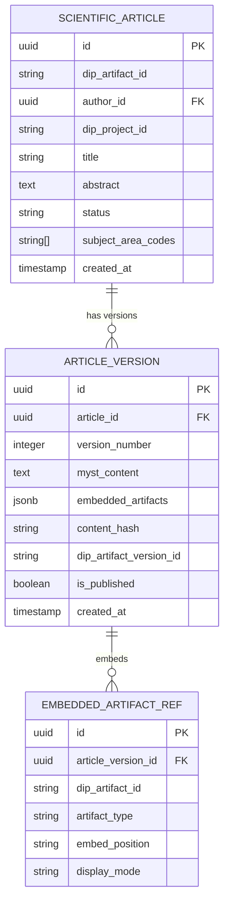

# Article Editor — Subdomain Architecture

> **Document Type**: Subdomain Architecture Document (Level 3 - Component)
> **Parent Domain**: [Labs](../ARCHITECTURE.md)
> **Root Architecture**: [System Architecture](../../../ARCHITECTURE.md)
> **Last Updated**: 2026-03-12
> **Subdomain Owner**: Syntropy Core Team

## Metadata

| Field | Value |
|-------|-------|
| **Subdomain Type** | Core Domain |
| **Parent Domain** | Labs |
> **Boundary Model**: Internal Module (within Labs domain)
> **Implementation Status**: Not Started

---

## Business Scope

### What This Subdomain Solves

The Article Editor provides the scientific writing environment for Labs — MyST Markdown + LaTeX with real-time rendering, inline code/dataset embedding via DIP artifact references, and immutable versioning. It answers: "How does a researcher write, version, and submit a scientific article with executable components?"

### Subdomain Classification Rationale

**Type**: Core Domain. The combination of MyST+LaTeX editing, EmbeddedArtifact integration (executable DIP artifacts inline in the article), and immutable versioning connected to DIP artifact anchoring is novel. No existing open journal editor provides this.

---

## Aggregate Roots

### ScientificArticle

**Responsibility**: Manage article content through its editing and versioning lifecycle; enforce immutable versioning after publication.

**Invariants** (Invariant ILabs1):
- Once an ArticleVersion is published (submitted for peer review or registered for DOI), it is permanently immutable — no field edits permitted
- New content changes require creation of a new ArticleVersion
- EmbeddedArtifact references are stored as DIP artifact IDs — never as copies of the artifact content

**Domain Events emitted**:
- `labs.article.version_created` — when a new ArticleVersion is created
- `labs.article.submitted_for_review` — when submitted to Open Peer Review

---

## Domain Services

| Service | Responsibility | Operates On |
|---------|---------------|-------------|
| `ArticleVersioningService` | Creates new ArticleVersion from current draft; computes content hash; enforces immutability | ScientificArticle aggregate |
| `MySTPrerenderService` | Renders MyST+LaTeX content to HTML for real-time preview; also used for final rendering pipeline | ArticleVersion content |
| `EmbeddedArtifactResolver` | Fetches DIP artifact metadata for display; enables in-browser execution via IDE | EmbeddedArtifactRef, DIP API |

---

## Traceability

| Vision Element | Section | How This Subdomain Implements It |
|----------------|---------|----------------------------------|
| Scientific writing environment (cap. 33, 35) | §33, §35 | MyST+LaTeX editor with EmbeddedArtifact support |
| Immutable article versioning | Invariant ILabs1 | ArticleVersioningService enforces immutability after publication |
| ADR-008 — MyST+LaTeX | Architecture Brief | MyST Markdown + LaTeX as the scientific writing format |
