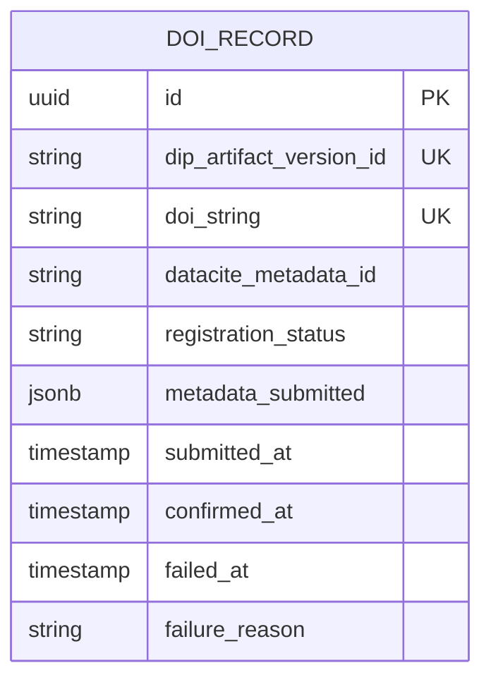

# DOI & External Publication — Subdomain Architecture

> **Document Type**: Subdomain Architecture Document (Level 3 - Component)
> **Parent Domain**: [Labs](../ARCHITECTURE.md)
> **Root Architecture**: [System Architecture](../../../ARCHITECTURE.md)
> **Last Updated**: 2026-03-12
> **Subdomain Owner**: Syntropy Core Team

## Metadata

| Field | Value |
|-------|-------|
| **Subdomain Type** | Supporting Subdomain |
| **Parent Domain** | Labs |
| **Boundary Model** | Internal Module (within Labs domain) |
| **Implementation Status** | Not Started |

---

## Business Scope

### What This Subdomain Solves

DOI & External Publication bridges the Syntropy ecosystem to the global scientific record. It registers DOIs for published articles via DataCite/CrossRef and ensures that Labs articles are discoverable in OpenAlex, Google Scholar, and other scientific indexes. It answers: "Has this article been registered in the global scholarly record, and can it be cited?"

### Subdomain Classification Rationale

**Type**: Supporting Subdomain. DOI registration is a well-understood process with established APIs. The custom work is limited to the DOIRecord entity and the ACL adapters wrapping DataCite/CrossRef.

---

## Aggregate Roots

### DOIRecord

**Responsibility**: Link a DIP Artifact version to its externally registered DOI; track registration status.

**Invariants**:
- DOIRecord is created exactly once per DIP artifact version — a version cannot have two DOIs
- Once `doi_string` is set and confirmed, it is immutable
- DOI registration is non-blocking — Labs article publication is not blocked by DOI registration; registration happens asynchronously

---

## Domain Services

| Service | Responsibility | Operates On |
|---------|---------------|-------------|
| `DOIRegistrationService` | Submits DOI registration request to DataCite/CrossRef via ACL adapter; polls for confirmation; updates DOIRecord | DOIRecord aggregate, DataCiteAdapter |
| `ExternalIndexingNotifier` | Submits article metadata to external indexing services (OpenAlex, etc.) after DOI confirmation | DOIRecord aggregate |

---

## Integration with Other Domains

| External Domain | Context Map Pattern | Direction | Purpose |
|-----------------|---------------------|-----------|---------|
| DataCite / CrossRef (external) | ACL | Outbound | DataCiteAdapter wraps external DOI registration API |
| OpenAlex / Google Scholar (external) | ACL (passive submission) | Outbound | Metadata submission for external indexing |

---

## Traceability

| Vision Element | Section | How This Subdomain Implements It |
|----------------|---------|----------------------------------|
| DOI registration and external indexing (cap. 37) | §37 | DOIRegistrationService with DataCite/CrossRef ACL adapter |
| Open scientific publishing (cap. 33) | §33 | DOI registration makes Labs articles part of the global scholarly record |
