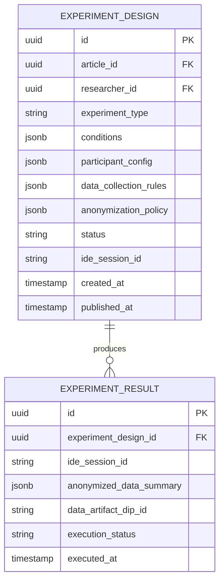

# Experiment Design — Subdomain Architecture

> **Document Type**: Subdomain Architecture Document (Level 3 - Component)
> **Parent Domain**: [Labs](../ARCHITECTURE.md)
> **Root Architecture**: [System Architecture](../../../ARCHITECTURE.md)
> **Last Updated**: 2026-03-12
> **Subdomain Owner**: Syntropy Core Team

## Metadata

| Field | Value |
|-------|-------|
| **Subdomain Type** | Core Domain |
| **Parent Domain** | Labs |
| **Boundary Model** | Internal Module (within Labs domain) |
| **Implementation Status** | Not Started |

---

## Business Scope

### What This Subdomain Solves

Experiment Design enables researchers to specify reproducible experiments with full documentation of methodology, participant configuration, data collection rules, and mandatory anonymization policies — and then execute those experiments in isolated containers via the IDE domain. It answers: "How was this experiment designed, and can it be reproduced?"

**Key design principle** (Invariant ILabs4): Labs does not implement container orchestration. Experiment execution is delegated to the IDE domain via a service call — Labs creates the ExperimentDesign spec, IDE creates the container.

### Subdomain Classification Rationale

**Type**: Core Domain. The ExperimentDesign model — with mandatory anonymization policy, typed experiment conditions, and participant configuration — plus the delegation-without-reimplementation pattern for container execution is novel.

---

## Aggregate Roots

### ExperimentDesign

**Responsibility**: Specify and version a reproducible experiment; delegate execution to IDE; record execution results.

**Invariants** (Invariant ILabs4):
- Execution always delegated to IDE — ExperimentDesign never directly provisions containers
- `anonymization_policy` is required and must be explicitly defined before execution (cannot be null or default)
- Published ExperimentDesign versions are immutable (same versioning principle as ArticleVersion)

**Domain Events emitted**:
- `labs.experiment.design_published` — when an ExperimentDesign is finalized
- `labs.experiment.execution_completed` — when IDE reports execution complete and results are recorded

---

## Domain Services

| Service | Responsibility | Operates On |
|---------|---------------|-------------|
| `ExperimentExecutionDelegator` | Calls IDE service to create a container session for experiment execution; stores returned ide_session_id | ExperimentDesign aggregate, IDE service API |
| `AnonymizationPolicyEnforcer` | Validates that the anonymization_policy is complete and compliant before execution authorization | ExperimentDesign aggregate |

---

## Traceability

| Vision Element | Section | How This Subdomain Implements It |
|----------------|---------|----------------------------------|
| Experiment design and reproducibility (cap. 36) | §36 | ExperimentDesign model with mandatory anonymization and reproducibility documentation |
| IDE delegation for execution | Invariant ILabs4 | ExperimentExecutionDelegator calls IDE API; Labs does not implement containers |
| Participant data anonymization (Vision §10 constraints) | §10 | AnonymizationPolicyEnforcer makes this mandatory, not optional |
