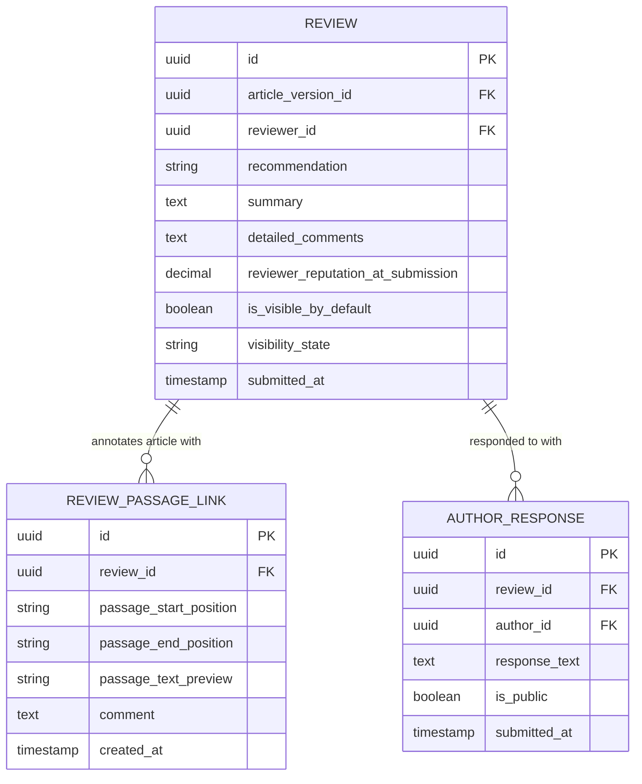

# Open Peer Review — Subdomain Architecture

> **Document Type**: Subdomain Architecture Document (Level 3 - Component)
> **Parent Domain**: [Labs](../ARCHITECTURE.md)
> **Root Architecture**: [System Architecture](../../../ARCHITECTURE.md)
> **Last Updated**: 2026-03-12
> **Subdomain Owner**: Syntropy Core Team

## Metadata

| Field | Value |
|-------|-------|
| **Subdomain Type** | Core Domain |
| **Parent Domain** | Labs |
| **Boundary Model** | Internal Module (within Labs domain) |
| **Implementation Status** | Not Started |

---

## Business Scope

### What This Subdomain Solves

Open Peer Review makes scientific review transparent, permanent, and reputation-aware. It answers: "Who reviewed this article, what did they say, and how did the author respond?" — and makes all of that permanently visible. Low-reputation reviews are filtered by default (not removed) so the signal-to-noise ratio is high without suppressing any voice.

### Subdomain Classification Rationale

**Type**: Core Domain. Reputation-based visibility filtering that preserves history (not censors it), the AuthorResponse cycle as permanent public record, and ReviewPassageLink for inline annotations constitute a novel peer review model.

---

## Aggregate Roots

### Review

**Responsibility**: Manage the lifecycle of a peer review including annotations, visibility, and author responses.

**Invariants** (Invariant ILabs3):
- Once submitted, a Review is permanently visible in the full review history — it can never be deleted
- `is_visible_by_default` is set at submission based on the reviewer's reputation score at that moment; it is immutable after submission
- AuthorResponse is permanent — cannot be edited or deleted after submission

**Domain Events emitted**:
- `labs.review.submitted` — when a Review is submitted
- `labs.review.author_responded` — when an AuthorResponse is submitted

---

## Domain Services

| Service | Responsibility | Operates On |
|---------|---------------|-------------|
| `ReviewVisibilityEvaluator` | Determines `is_visible_by_default` at review submission based on reviewer's current reputation score (from Platform Core) | Review aggregate, Platform Core reputation API |
| `RecommendationAggregator` | Aggregates review recommendations (major revision, minor revision, accept, reject) to produce an overall article status signal | Review aggregate |

---

## Integration with Other Domains

| External Domain | Context Map Pattern | Direction | Purpose |
|-----------------|---------------------|-----------|---------|
| Platform Core | Customer-Supplier | Inbound | Reviewer reputation score fetched from Platform Core at review submission |

---

## Traceability

| Vision Element | Section | How This Subdomain Implements It |
|----------------|---------|----------------------------------|
| Transparent peer review (cap. 34) | §34 | Full review history permanently public; ReviewPassageLink for inline annotations |
| Reputation-based review quality (cap. 39) | §39 | ReviewVisibilityEvaluator sets visibility based on reputation at submission |
| Author response cycle (cap. 40) | §40 | AuthorResponse is permanent and public (Invariant ILabs3) |
