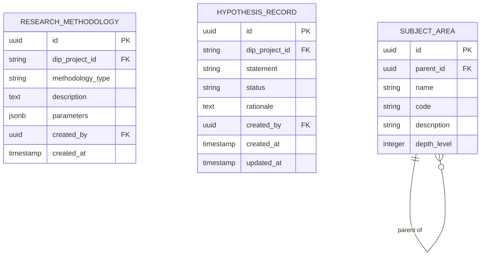

# Scientific Context Extension — Subdomain Architecture

> **Document Type**: Subdomain Architecture Document (Level 3 - Component)
> **Parent Domain**: [Labs](../ARCHITECTURE.md)
> **Root Architecture**: [System Architecture](../../../ARCHITECTURE.md)
> **Last Updated**: 2026-03-12
> **Subdomain Owner**: Syntropy Core Team

## Metadata

| Field | Value |
|-------|-------|
| **Subdomain Type** | Supporting Subdomain |
| **Parent Domain** | Labs |
| **Boundary Model** | Internal Module (within Labs domain) |
| **Implementation Status** | Not Started |

---

## Business Scope

### What This Subdomain Solves

Scientific Context Extension provides the scientific metadata layer that connects Labs' domain vocabulary (methodology, hypothesis, subject area) to DIP entities (DigitalProject for research lines, DigitalInstitution for laboratories) — without Labs re-owning those entities. It answers: "What is the scientific context of this research line?" while keeping the entity ownership in DIP.

**Key design principle** (Invariant ILabs2): Labs never owns Laboratory (DigitalInstitution) or Research Line (DigitalProject). It extends DIP entities by reference — storing its own scientific metadata alongside a DIP entity ID.

### Subdomain Classification Rationale

**Type**: Supporting Subdomain. Scientific metadata records are structured data with no complex invariants. The design is CRUD-based extension over DIP entity IDs.

---

## Aggregate Roots

### ResearchMethodology

**Responsibility**: Record the methodology employed in a research project, linked to a DIP DigitalProject by ID.

### HypothesisRecord

**Responsibility**: Formalize and version research hypotheses, linked to a DIP DigitalProject by ID.

### SubjectArea

**Responsibility**: Maintain a hierarchical taxonomy of scientific domains for article classification.

---

## Traceability

| Vision Element | Section | How This Subdomain Implements It |
|----------------|---------|----------------------------------|
| Scientific context extension on DIP entities (cap. 38) | §38 | ResearchMethodology and HypothesisRecord extend DIP DigitalProject by ID reference |
| SubjectArea taxonomy (cap. 34) | §34 | Hierarchical scientific domain taxonomy for article categorization |
