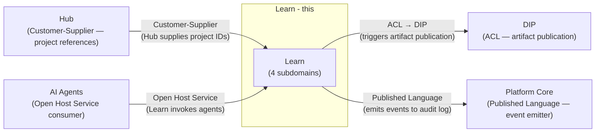
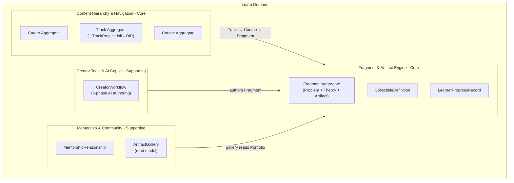
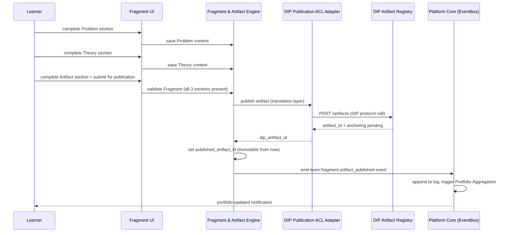
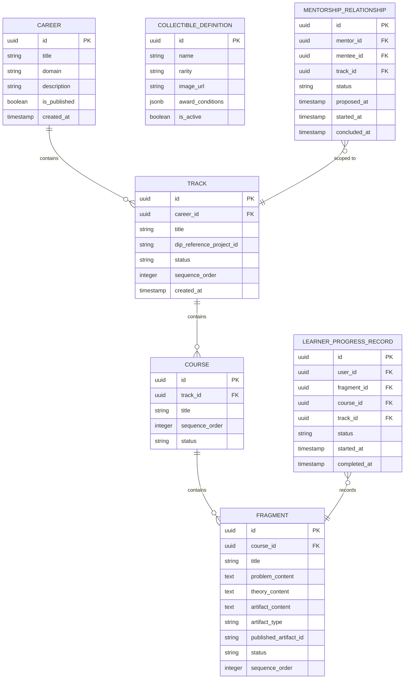

# Learn Domain Architecture

> **Document Type**: Domain Architecture Document (Level 2 - Container)
> **Parent**: [System Architecture](../../ARCHITECTURE.md)
> **Last Updated**: 2026-03-12
> **Domain Owner**: Syntropy Core Team
> **Subdomain Type**: Core Domain
> **Rationale**: Learn's competitive differentiation is the project-first pedagogy — the invariant that every Fragment must produce a real artifact (Problem→Theory→Artifact structure), that tracks are organized as construction plans rather than subject curricula, and that every completion is automatically recorded in a verifiable portfolio. This pedagogical model and its invariants are the core of the product and cannot be purchased off-the-shelf.

---

## Vision Traceability

| Vision Element | Section | How This Domain Implements It |
|----------------|---------|-------------------------------|
| Project-first education (cap. 19) | §96–100 | Track = construction plan for a real project; every fragment builds a piece of the project |
| Fixed Problem→Theory→Artifact structure (cap. 20) | §20 | Fragment domain invariant: no Fragment may exist without all three sections; enforced at aggregate level |
| Fog-of-war spatial navigation (cap. 21) | §21 | Content Hierarchy & Navigation subdomain — course map visible only as learner progresses |
| Automatic verifiable portfolio (cap. 22) | §22 | Fragment artifact publication triggers DIP anchoring; Platform Core records in portfolio |
| Creator tools with AI copilot (cap. 23, 24) | §23, §24 | Creator Tools & AI Copilot subdomain — 5-phase AI authoring workflow |
| Collectibles and gamification (cap. 25) | §25 | CollectibleDefinition owned by Learn; CollectibleInstance awarded by Platform Core |
| Mentorship marketplace (cap. 26) | §26 | Mentorship & Community subdomain — MentorshipRelationship lifecycle |

---

## Document Scope

This document describes the **Learn** bounded context.

### What This Document Covers

- Content hierarchy (Career, Track, Course, Fragment)
- Fragment invariants (Problem→Theory→Artifact)
- Creator tools and AI copilot workflow
- Mentorship and community gallery
- Integration with DIP (artifact publication via ACL)
- Integration with Hub (project references via Customer-Supplier)

### What This Document Does NOT Cover

- DIP artifact registry (Learn triggers publication; DIP owns the result — see [DIP Architecture](../digital-institutions-protocol/ARCHITECTURE.md))
- Platform Core portfolio (Learn emits events; Platform Core builds portfolio — see [Platform Core Architecture](../platform-core/ARCHITECTURE.md))
- AI agent implementation (see [AI Agents Architecture](../ai-agents/ARCHITECTURE.md))

---

## Domain Overview

### Business Capability

Learn enables anyone to go from zero to a portfolio of real, verifiable artifacts by building projects — not by passing assessments. The key capability is the Fragment invariant: every unit of learning must produce an artifact. By the end of a track, the learner has not completed a curriculum — they have built a real project whose every component is a verifiable, DIP-anchored artifact in their portfolio.

### Domain Invariants

| ID | Invariant | Enforcement Point |
|----|-----------|-------------------|
| IL1 | Every Fragment must have exactly three sections: Problem, Theory, Artifact | Fragment aggregate — creation and update operations reject incomplete structures |
| IL2 | A Track must reference a DigitalProject (via ReferenceProject ID) — Learn does not own the Project | TrackProjectLink — must resolve to a valid DIP DigitalProject ID at creation |
| IL3 | A Fragment Artifact section, once published to DIP, becomes immutable within Learn | Fragment aggregate — published_artifact_id is set once and never changed |
| IL4 | CollectibleDefinition templates belong to Learn; CollectibleInstances belong to Platform Core | Entity ownership separation enforced at domain boundary |

### Ubiquitous Language

| Term | Definition | Notes |
|------|------------|-------|
| **Career** | A top-level learning path covering a broad professional domain (e.g., "Software Engineering") | Organizational container; learner chooses one or more careers |
| **Track** | A construction plan for building a specific real project within a Career | Organized as a sequence of courses leading to a complete project |
| **Course** | A coherent unit of learning within a Track, covering a specific aspect of the project | Contains ordered fragments |
| **Fragment** | The smallest learning unit — must produce an artifact (Problem→Theory→Artifact) | Domain invariant: all three sections required |
| **Problem** | The first Fragment section — defines what the learner will build and why | Motivates the learning; written before Theory |
| **Theory** | The second Fragment section — provides the knowledge needed to build the artifact | Bridges Problem to Artifact |
| **Artifact** | The third Fragment section — the actual created output; published to DIP on completion | After publication: immutable in Learn; DIP-anchored |
| **TrackProjectLink** | The reference from a Track to a DIP DigitalProject by ID | Learn does not own the Project; it references it |
| **LearnerProgressRecord** | The record of a learner's progress through fragments, courses, and tracks | Owned by Learn; referenced by Platform Core portfolio |
| **CollectibleDefinition** | A template defining a collectible reward (design, rarity, conditions) | Owned by Learn; instances awarded by Platform Core |
| **MentorshipRelationship** | A formal pairing between a mentor and mentee with defined scope and duration | Lifecycle: Proposed→Active→Concluded |
| **ArtifactGallery** | A per-track curated display of published learner artifacts from Portfolio | Read model over DIP+Platform Core data |

---

## Subdomain Classification & Context Map Position

### Subdomain Classification

**Type**: Core Domain

The Problem→Theory→Artifact invariant, the fog-of-war navigation model, the Track-as-construction-plan structure, and the 5-phase AI authoring workflow are all novel pedagogical designs that differentiate Syntropy Learn from every existing learning platform. These require a rich domain model with explicitly enforced invariants.

### Context Map Position



| Other Context | Pattern | Direction | Description |
|---------------|---------|-----------|-------------|
| DIP | ACL (Learn side) | Learn is downstream | DIPPublicationAdapter translates Learn's publication request into DIP protocol calls; DIP vocabulary (IACP, IdentityRecord) never enters Learn's language |
| Hub | Customer-Supplier | Learn is downstream (customer) | Learn references Hub DigitalProject IDs for TrackProjectLink; Hub does not depend on Learn |
| Platform Core | Published Language | Learn is emitter | Learn events conform to EventSchema registry; Portfolio Aggregation subscribes |
| AI Agents | Open Host Service | AI Agents is upstream | Learn activates agents via AI Agents API; receives streaming responses |

---

## Component Architecture

### Subdomain Map

| Subdomain | Type | Responsibility | Document |
|-----------|------|----------------|----------|
| **Content Hierarchy & Navigation** | Core | Career→Track→Course structure, fog-of-war navigation, TrackProjectLink to DIP | [→ Architecture](./subdomains/content-hierarchy-navigation.md) |
| **Fragment & Artifact Engine** | Core | Problem→Theory→Artifact invariant, CollectibleDefinition templates, LearnerProgressRecord | [→ Architecture](./subdomains/fragment-artifact-engine.md) |
| **Creator Tools & AI Copilot** | Supporting | 5-phase AI-assisted authoring workflow, creator retains authorship | [→ Architecture](./subdomains/creator-tools-copilot.md) |
| **Mentorship & Community** | Supporting | MentorshipRelationship lifecycle, ArtifactGallery per track | [→ Architecture](./subdomains/mentorship-community.md) |

### Subdomain Boundaries Diagram



### Fragment Lifecycle Sequence



---

## Data Architecture

### Data Ownership

| Entity | Description | Sensitivity |
|--------|-------------|-------------|
| Career | Top-level learning path definition | Internal |
| Track | Construction plan with project reference | Internal |
| Course | Learning unit within a Track | Internal |
| Fragment | Learning unit with Problem/Theory/Artifact | Internal |
| CollectibleDefinition | Collectible reward template | Internal |
| LearnerProgressRecord | User's progress through learning content | Confidential |
| MentorshipRelationship | Mentor-mentee pairing record | Confidential |

### Entity Relationship Diagram



---

## Event Contracts

### Events Published

#### `learn.fragment.artifact_published`

```json
{
  "event_type": "learn.fragment.artifact_published",
  "event_schema_version": "1.0",
  "data": {
    "fragment_id": "uuid",
    "learner_id": "uuid",
    "course_id": "uuid",
    "track_id": "uuid",
    "dip_artifact_id": "uuid",
    "artifact_type": "string"
  }
}
```

#### `learn.track.completed`

Published when all fragments in all courses of a track are completed.

#### `learn.course.completed`

Published when all fragments in a course are completed.

#### `learn.collectible_definition.published`

Published when a new CollectibleDefinition is approved and made available.

---

## Integration Points

### Upstream Dependencies

| Dependency | Type | Criticality | Fallback |
|------------|------|-------------|----------|
| DIP (artifact publication) | Sync API via ACL | High | Queue publication; show pending status to learner |
| Hub (project ID validation) | Sync API | Non-critical | Allow TrackProjectLink with unvalidated ID; validate async |
| Identity (user auth) | Sync API | Critical | Block fragment submission without verified identity |
| AI Agents (copilot activation) | Sync API | Non-critical | Degrade to no-AI mode; all content still creatable manually |

### Downstream Dependents

| Dependent | Integration Type | SLA Commitment |
|-----------|------------------|----------------|
| Platform Core | Async events (fragment published, track completed) | Best effort (event bus durability) |
| Communication | Async events (mentorship state changes) | Best effort |

---

## Security Considerations

### Data Classification

LearnerProgressRecord is **Confidential**. Fragment content in draft state is **Confidential**. Published artifacts are **Public** (controlled by DIP after anchoring).

### Access Control

| Role | Permissions |
|------|-------------|
| Learner | Enroll in tracks, complete fragments, submit artifacts |
| Creator | Author tracks, courses, fragments; publish tracks |
| PlatformModerator | Review and flag inappropriate content |

---

## Domain-Specific Decisions

| ADR | Summary |
|-----|---------|
| ADR-001 *(Prompt 01-C)* | Modular monolith; Learn communicates with DIP via ACL (not direct import) |

---

## Internal Subdomain Decomposition

See [Subdomain Map](#subdomain-map) above. Subdomain documents:

- [Content Hierarchy & Navigation](./subdomains/content-hierarchy-navigation.md)
- [Fragment & Artifact Engine](./subdomains/fragment-artifact-engine.md)
- [Creator Tools & AI Copilot](./subdomains/creator-tools-copilot.md)
- [Mentorship & Community](./subdomains/mentorship-community.md)
