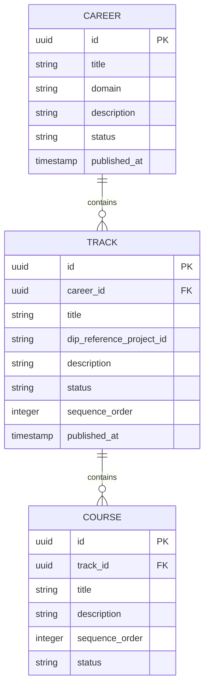

# Content Hierarchy & Navigation — Subdomain Architecture

> **Document Type**: Subdomain Architecture Document (Level 3 - Component)
> **Parent Domain**: [Learn](../ARCHITECTURE.md)
> **Root Architecture**: [System Architecture](../../../ARCHITECTURE.md)
> **Last Updated**: 2026-03-12
> **Subdomain Owner**: Syntropy Core Team

## Metadata

| Field | Value |
|-------|-------|
| **Subdomain Type** | Core Domain |
| **Parent Domain** | Learn |
| **Boundary Model** | Internal Module (within Learn domain) |
| **Implementation Status** | Not Started |

---

## Business Scope

### What This Subdomain Solves

Content Hierarchy & Navigation answers: "What is this track building, what courses does it contain, and how far has this learner progressed?" It provides the organizational structure — Career → Track → Course — and the fog-of-war navigation that reveals content progressively as learners advance.

### Subdomain Classification Rationale

**Type**: Core Domain. Fog-of-war navigation (content revealed progressively) and the Track-as-construction-plan model (Track linked to a real DIP DigitalProject) are novel UX and data model decisions.

---

## Aggregate Roots

### Career

**Responsibility**: Define top-level learning domains; organize tracks within a professional area.

**Invariants**:
- A Career is published (visible to learners) only after at least one Track in it is also published

### Track

**Responsibility**: Represent a construction plan for building a specific project; link to a DIP DigitalProject as the reference artifact.

**Invariants** (Invariant IL2 from parent domain):
- Every Track must reference a DIP DigitalProject via `dip_reference_project_id` at creation
- The reference is set once and never changed (the project the track builds is immutable)

**Domain Events emitted**:
- `learn.track.published` — when a Track becomes available to learners

### Course

**Responsibility**: Group related fragments within a Track; provide structured progression checkpoints.

**Domain Events emitted**:
- `learn.course.completed` — when all fragments in a course are completed by a learner

---

## Domain Services

| Service | Responsibility | Operates On |
|---------|---------------|-------------|
| `FogOfWarNavigationService` | Determines which courses and fragments are visible to a specific learner based on their progress | Course aggregate, LearnerProgressRecord |
| `TrackProjectLinkValidator` | Validates that a DIP DigitalProject ID is resolvable at Track creation | Track aggregate, DIP API (via ACL) |

---

## Traceability

| Vision Element | Section | How This Subdomain Implements It |
|----------------|---------|----------------------------------|
| Project-first tracks (cap. 19) | §96–100 | Track linked to a DIP DigitalProject — the track is organized around building that project |
| Fog-of-war spatial navigation (cap. 21) | §21 | FogOfWarNavigationService reveals content progressively |
