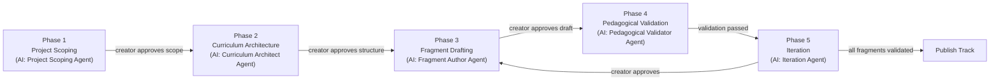
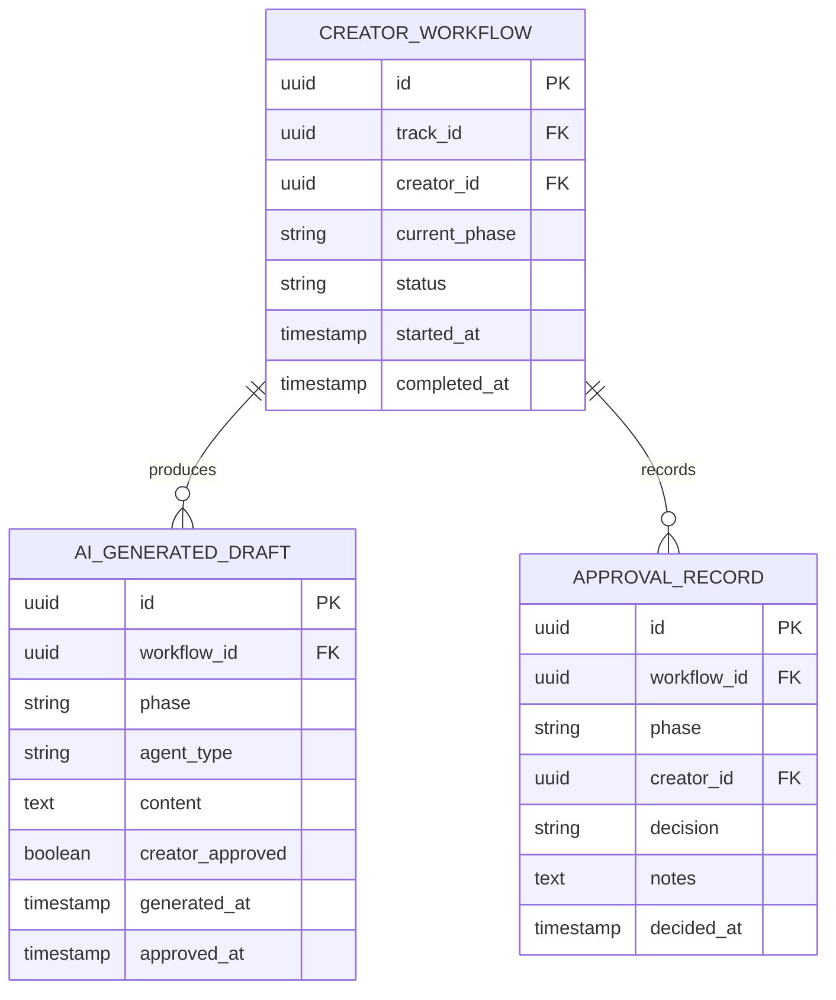

# Creator Tools & AI Copilot — Subdomain Architecture

> **Document Type**: Subdomain Architecture Document (Level 3 - Component)
> **Parent Domain**: [Learn](../ARCHITECTURE.md)
> **Root Architecture**: [System Architecture](../../../ARCHITECTURE.md)
> **Last Updated**: 2026-03-12
> **Subdomain Owner**: Syntropy Core Team

## Metadata

| Field | Value |
|-------|-------|
| **Subdomain Type** | Supporting Subdomain |
| **Parent Domain** | Learn |
| **Boundary Model** | Internal Module (within Learn domain) |
| **Implementation Status** | Not Started |

---

## Business Scope

### What This Subdomain Solves

Creator Tools & AI Copilot provides the 5-phase AI-assisted authoring workflow that enables educators and creators to produce high-quality learning content efficiently. The key design principle: AI generates drafts, the creator reviews and approves everything. Creator authorship is never compromised.

### Subdomain Classification Rationale

**Type**: Supporting Subdomain. The 5-phase workflow orchestrates calls to the AI Agents domain. The domain logic here is workflow state management — not rich domain modeling.

---

## Business Scope: The 5-Phase Authoring Workflow

**Key invariant**: At every phase, the creator sees the AI output, can modify it freely, and explicitly approves before proceeding. No phase auto-advances without explicit creator action.

---

## Ubiquitous Language

| Term | Definition | Diverges from Parent? | Notes |
|------|------------|-----------------------|-------|
| **CreatorWorkflow** | An instance of the 5-phase authoring workflow for a specific Track | No | Tracks the creator's current phase and approval history |
| **AIGeneratedDraft** | Content produced by an AI agent in any phase; requires creator review before use | No | Tagged as AI-generated in storage; creator may edit freely |
| **ApprovalRecord** | The creator's explicit approval of an AI-generated draft at a specific phase | No | Audit trail of creator decisions |

---

## Aggregate Roots

### CreatorWorkflow

**Responsibility**: Manage the state and approval history of the 5-phase authoring workflow for a specific Track.

**Invariants**:
- No phase may advance without an explicit ApprovalRecord from the creator
- AIGeneratedDraft content is always tagged with `ai_generated: true` before storage
- A CreatorWorkflow can be abandoned and restarted at any phase

---

## Integration with Other Domains

| External Domain | Context Map Pattern | Direction | Purpose |
|-----------------|---------------------|-----------|---------|
| AI Agents | Open Host Service | Inbound (Learn calls AI Agents) | Creator Tools activates Learn agents (Project Scoping, Curriculum Architect, etc.) via AI Agents API |

---

## Traceability

| Vision Element | Section | How This Subdomain Implements It |
|----------------|---------|----------------------------------|
| Creator tools with AI copilot (cap. 23, 24) | §23, §24 | 5-phase AI-assisted authoring workflow with creator approval at each phase |
