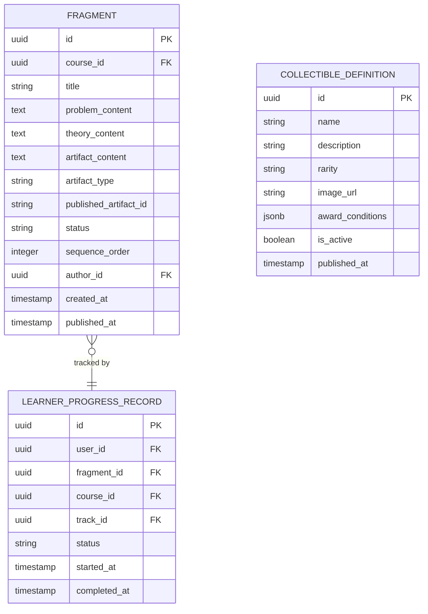

# Fragment & Artifact Engine — Subdomain Architecture

> **Document Type**: Subdomain Architecture Document (Level 3 - Component)
> **Parent Domain**: [Learn](../ARCHITECTURE.md)
> **Root Architecture**: [System Architecture](../../../ARCHITECTURE.md)
> **Last Updated**: 2026-03-12
> **Subdomain Owner**: Syntropy Core Team

## Metadata

| Field | Value |
|-------|-------|
| **Subdomain Type** | Core Domain |
> **Parent Domain**: Learn
> **Boundary Model**: Internal Module (within Learn domain)
> **Implementation Status**: Not Started

---

## Business Scope

### What This Subdomain Solves

The Fragment & Artifact Engine enforces the foundational pedagogical invariant: every Fragment must produce an artifact. It manages the complete lifecycle of a Fragment from draft to DIP-published artifact, tracks learner progress, and manages CollectibleDefinition templates.

### Subdomain Classification Rationale

**Type**: Core Domain. The Problem→Theory→Artifact invariant, enforced at the aggregate level, is the core intellectual property of the pedagogical model.

---

## Aggregate Roots

### Fragment

**Responsibility**: Enforce the Problem→Theory→Artifact structure; manage lifecycle from draft to published; trigger DIP artifact publication.

**Invariants** (Invariant IL1):
- A Fragment cannot transition to `published` state unless all three sections (problem_content, theory_content, artifact_content) are non-empty
- Once `published_artifact_id` is set (DIP artifact registered), it cannot be changed
- `artifact_type` cannot be changed after the Fragment is created

**Entities within this aggregate**:
- `FragmentSection` — one of: Problem, Theory, Artifact; typed within the aggregate

**Domain Events emitted**:
- `learn.fragment.artifact_published` — when DIP publication succeeds and `published_artifact_id` is set
- `learn.fragment.draft_saved` — internal, used by Creator Tools

```mermaid
stateDiagram-v2
    [*] --> Draft : create()
    Draft --> InReview : submit_for_review()
    InReview --> Draft : request_revisions()
    InReview --> Published : approve()
    Published --> [*]

    note right of Published : DIP publication triggered;\npublished_artifact_id set (immutable)
```

### CollectibleDefinition

**Responsibility**: Define collectible reward templates for learner achievements within the Learn domain.

**Invariants** (Invariant IL4):
- CollectibleDefinition belongs to Learn; CollectibleInstance belongs to Platform Core
- A CollectibleDefinition's `award_conditions` cannot be changed after it is published (platform admin only exception for emergency corrections)

---

## Domain Services

| Service | Responsibility | Operates On |
|---------|---------------|-------------|
| `FragmentPublicationService` | Validates Fragment completeness; calls DIP ACL adapter to publish artifact; sets published_artifact_id | Fragment aggregate, DIPPublicationAdapter |
| `ProgressTrackingService` | Updates LearnerProgressRecord on Fragment completion; triggers course/track completion checks | LearnerProgressRecord, Course hierarchy |
| `CollectibleAwardEvaluator` | Evaluates CollectibleDefinition award_conditions against learner portfolio events; emits award signal to Platform Core | CollectibleDefinition, LearnerProgressRecord |

---

## Traceability

| Vision Element | Section | How This Subdomain Implements It |
|----------------|---------|----------------------------------|
| Fixed Problem→Theory→Artifact structure (cap. 20) | §20 | Fragment aggregate invariant IL1 — enforced at domain level, no exceptions |
| Automatic verifiable portfolio (cap. 22) | §22 | Fragment publication triggers `learn.fragment.artifact_published` → Platform Core portfolio update |
| Collectibles and gamification (cap. 25) | §25 | CollectibleDefinition templates owned here; instances awarded by Platform Core |
