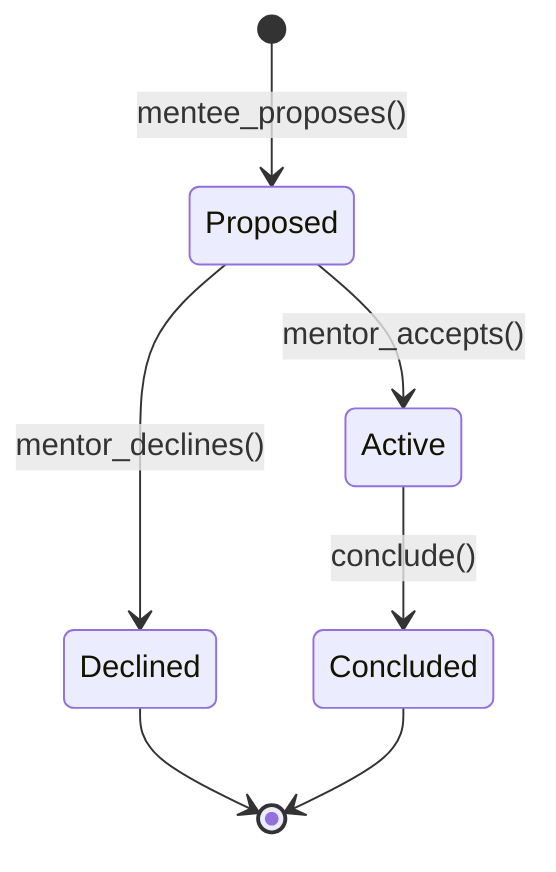
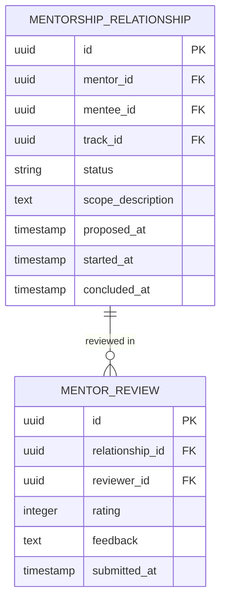

# Mentorship & Community — Subdomain Architecture

> **Document Type**: Subdomain Architecture Document (Level 3 - Component)
> **Parent Domain**: [Learn](../ARCHITECTURE.md)
> **Root Architecture**: [System Architecture](../../../ARCHITECTURE.md)
> **Last Updated**: 2026-03-12
> **Subdomain Owner**: Syntropy Core Team

## Metadata

| Field | Value |
|-------|-------|
| **Subdomain Type** | Supporting Subdomain |
| **Parent Domain** | Learn |
| **Boundary Model** | Internal Module (within Learn domain) |
| **Implementation Status** | Not Started |

---

## Business Scope

### What This Subdomain Solves

Mentorship & Community provides the social and collaborative layer for the Learn domain. MentorshipRelationship connects advanced practitioners with learners working on the same track area. ArtifactGallery showcases what learners have built — making Learn feel like a community of builders, not just a content consumption platform.

### Subdomain Classification Rationale

**Type**: Supporting Subdomain. Mentorship matching and relationship lifecycle management are standard features. The ArtifactGallery is a read model over DIP + Platform Core data.

---

## Aggregate Roots

### MentorshipRelationship

**Responsibility**: Manage the lifecycle of a mentor-mentee pairing; provide structure for scheduling and coordination.

**Invariants**:
- A MentorshipRelationship requires explicit acceptance from the mentor (cannot be auto-matched)
- A user may not have more than 3 active MentorshipRelationships simultaneously as mentor

**Domain Events emitted**:
- `learn.mentorship.proposed` — when a mentee proposes a relationship
- `learn.mentorship.started` — when mentor accepts
- `learn.mentorship.concluded` — when relationship formally concludes

### ArtifactGallery (Read Model)

**Responsibility**: Display a curated per-track view of published learner artifacts, sourced from DIP (artifact data) and Platform Core (portfolio data).

**Key Design**: ArtifactGallery is a read-only projection — it owns no data. It queries:
- DIP Artifact Registry for published artifact metadata and identity records
- Platform Core for learner portfolio context (who published what, when)

---

## Traceability

| Vision Element | Section | How This Subdomain Implements It |
|----------------|---------|----------------------------------|
| Mentorship marketplace (cap. 26) | §26 | MentorshipRelationship lifecycle with explicit acceptance |
| Community and gallery | §22 | ArtifactGallery as read model over DIP + Platform Core data |
