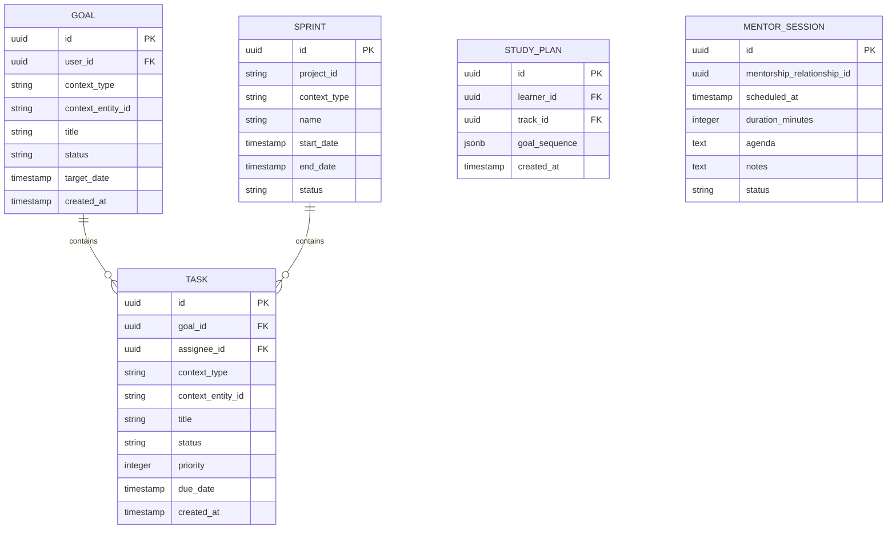

# Planning Domain Architecture

> **Document Type**: Domain Architecture Document (Level 2 - Container)
> **Parent**: [System Architecture](../../ARCHITECTURE.md)
> **Last Updated**: 2026-03-12
> **Domain Owner**: Syntropy Core Team
> **Subdomain Type**: Supporting Subdomain
> **Rationale**: Cross-pillar planning board is important for coordinating work across the ecosystem but is not a competitive differentiator on its own. The vocabulary adaptation per pillar (kanban for Hub, study plan for Learn, research sprint for Labs) is a configuration concern, not a rich domain model.

---

## Vision Traceability

| Vision Element | Section | How This Domain Implements It |
|----------------|---------|-------------------------------|
| Cross-pillar planning board (cap. 6) | §6 | Task and Goal entities adapt vocabulary based on pillar context |
| Mentor coordination (cap. 26) | §26 | MentorSession scheduling and coordination within MentorshipRelationship |
| Sprint planning for projects and research | §29 | Sprint entity groups Tasks for Hub projects and Labs research lines |
| Study plan for learners | §21 | StudyPlan organizes learning goals and fragment completion targets |

---

## Domain Overview

### Business Capability

Planning enables users to organize their work across all three pillars from a single interface without context-switching between tools. A learner sees their study plan; a contributor sees their project kanban; a researcher sees their research sprint. The data model adapts to the context while sharing the same underlying Task and Goal abstractions.

### Ubiquitous Language

| Term | Definition | Notes |
|------|------------|-------|
| **Task** | An atomic unit of work with a status, assignee, and due date | Status: Todo→InProgress→Done; context-aware labels per pillar |
| **Goal** | A higher-level objective that groups related Tasks | Examples: "Complete Track X", "Submit Article Y", "Close Issues in Sprint Z" |
| **Sprint** | A time-bounded iteration of Tasks for Hub projects or Labs research | Hub context: kanban sprint; Labs context: research sprint |
| **StudyPlan** | A personalized sequence of Goals and Tasks for a learner's learning journey | Learn context only |
| **MentorSession** | A scheduled interaction between mentor and mentee with a defined agenda | Links to MentorshipRelationship in Learn domain |

---

## Subdomain Classification & Context Map Position

**Type**: Supporting Subdomain

Planning is a CRUD-based coordination layer. No novel domain model is required. The vocabulary adaptation is achieved through a context_type field that controls label rendering in the UI.

| Other Context | Pattern | Direction | Description |
|---------------|---------|-----------|-------------|
| Learn | Customer-Supplier | Planning is downstream | StudyPlan references Learn Fragment and Course IDs |
| Hub | Customer-Supplier | Planning is downstream | Sprint and Task reference Hub Issue IDs and DigitalProject IDs |
| Labs | Customer-Supplier | Planning is downstream | Sprint references Labs ExperimentDesign and article IDs |
| Identity | Open Host Service | Planning is downstream | Task assignees are Identity user IDs |

---

## Data Architecture

### Entity Relationship Diagram

---

## Security Considerations

### Data Classification

Task and Goal content is **Internal**. MentorSession notes are **Confidential** (between mentor and mentee only).

### Access Control

| Role | Permissions |
|------|-------------|
| Authenticated User | Manage own tasks and goals |
| Mentor | View and annotate MentorSessions for own relationships |
| ProjectMaintainer | View and assign Tasks within their projects |
