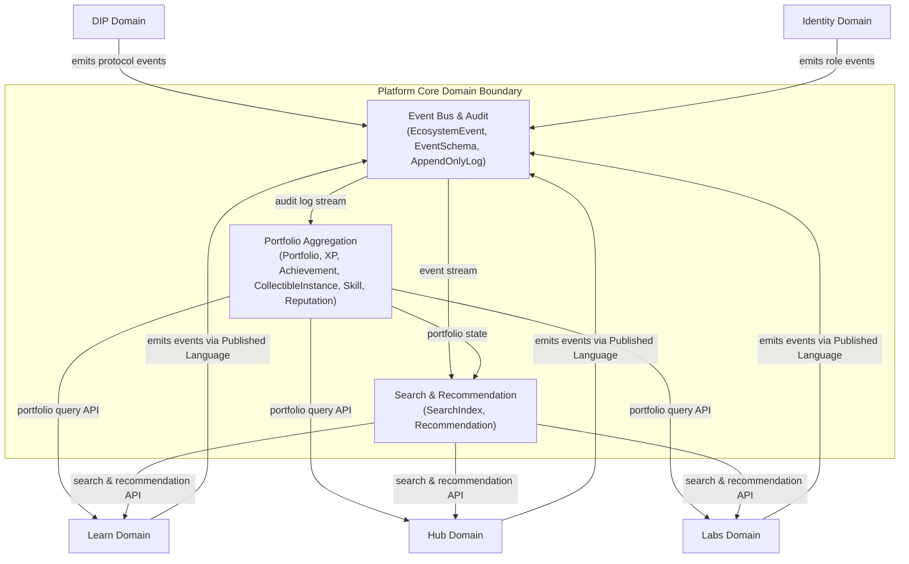
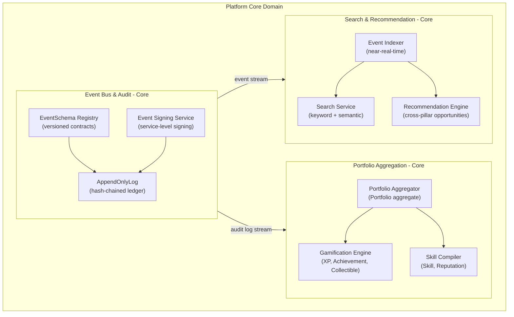
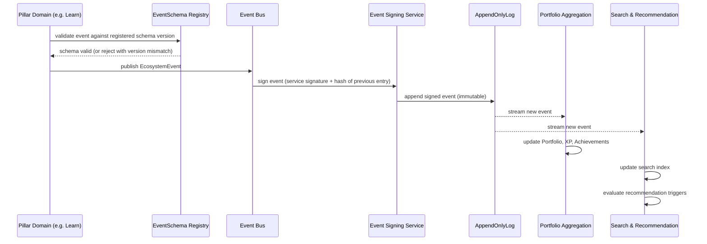
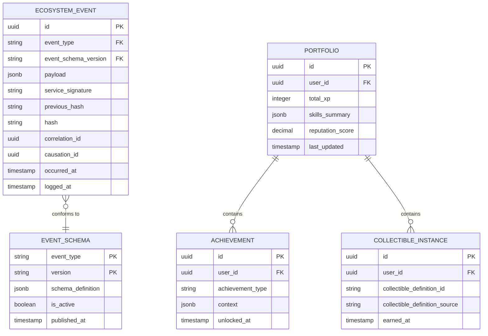

# Platform Core Domain Architecture

> **Document Type**: Domain Architecture Document (Level 2 - Container)
> **Parent**: [System Architecture](../../ARCHITECTURE.md)
> **Last Updated**: 2026-03-12
> **Domain Owner**: Syntropy Core Team
> **Subdomain Type**: Core Domain
> **Rationale**: Platform Core is the irreplaceable backbone of the ecosystem — it owns the event bus, the verifiable append-only audit log, the dynamic portfolio that makes creator ownership real, and the cross-pillar recommendation engine that turns portfolio records into opportunities. No off-the-shelf solution combines these four capabilities with the cryptographic guarantees the ecosystem requires.

---

## Vision Traceability

| Vision Element | Section | How This Domain Implements It |
|----------------|---------|-------------------------------|
| Verifiable automatic portfolio (cap. 2) | §2, §7 | Portfolio Aggregation subdomain subscribes to audit log and builds Portfolio, XP, Achievement, CollectibleInstance, Skill, Reputation automatically — no manual curation |
| Cross-pillar recommendation engine (cap. 3) | §2, §3 | Search & Recommendation subdomain indexes all events in near-real-time and surfaces opportunities proactively across Learn, Hub, and Labs |
| Gamification engine (cap. 7) | §7 | Portfolio Aggregation processes gamification rules (XP gains, achievement unlock conditions, collectible award logic) |
| Full event traceability (cap. 10) | §9 priority 8 | Event Bus & Audit subdomain maintains append-only hash-chained log with causal chain tracking and correlation IDs |

---

## Document Scope

This document describes the architecture of the **Platform Core** bounded context. For system-wide context, see the [root architecture document](../../ARCHITECTURE.md).

### What This Document Covers

- Internal structure of the Platform Core domain (3 subdomains)
- Event schema registry and signing hierarchy
- Portfolio aggregation and gamification engine
- Cross-pillar search index and recommendation engine
- APIs exposed to other domains
- Integration points with all pillar domains

### What This Document Does NOT Cover

- Pillar-specific business logic (see domain documents for Learn, Hub, Labs)
- Infrastructure configuration (see [Background Services](../../platform/background-services/ARCHITECTURE.md))
- System-wide security policies (see [Security](../../cross-cutting/security/ARCHITECTURE.md))

---

## Domain Overview

### Business Capability

Platform Core is the connective tissue of the Syntropy Ecosystem. Without it:
- There is no shared event record — domains would not know what happened in other pillars
- There is no automatic portfolio — users would have to manually curate their contributions
- There is no cross-pillar recommendation — opportunities discovered in one pillar would never surface in another
- There is no gamification — XP, achievements, and collectibles would have no reliable source of truth

Platform Core transforms isolated pillar activity into a unified, verifiable, and rewarding ecosystem experience.

### Domain Boundaries

### Ubiquitous Language

| Term | Definition | Notes |
|------|------------|-------|
| **EcosystemEvent** | An immutable record of something that happened in the ecosystem, conforming to a registered EventSchema | Service-signed and stored in the AppendOnlyLog |
| **EventSchema** | A versioned contract defining the shape, required fields, and semantics of a specific event type | Published once; immutable after publication; new versions required for breaking changes |
| **AppendOnlyLog** | The hash-chained, tamper-evident ledger of all EcosystemEvents | Each entry contains the hash of the previous entry; no modification or deletion permitted |
| **Portfolio** | The verifiable, automatically computed record of a user's contributions across all pillars | Built by subscribing to the AppendOnlyLog; never manually edited |
| **XP** | Experience points awarded for contributions recorded in the AppendOnlyLog | Computed deterministically from event history |
| **Achievement** | A milestone unlocked when specific conditions derived from event history are met | Condition evaluation is deterministic and repeatable |
| **CollectibleInstance** | An earned, user-owned instance of a CollectibleDefinition (template defined by Learn domain) | Awarded by Platform Core; definition owned by Learn |
| **Skill** | A competency area derived from artifact contributions and course completions | Computed from portfolio state |
| **Reputation** | A cross-pillar trust score computed from peer interactions, review quality, and contribution impact | Used by Labs for review visibility filtering |
| **Recommendation** | A proactive cross-pillar opportunity surfaced to a user based on their portfolio state and event history | Examples: open Hub issues matching a learner's new skill, Labs articles relevant to a contributor's domain |
| **SearchIndex** | The near-real-time cross-pillar index populated from the event stream | Enables keyword and semantic search across Learn tracks, Hub projects, Labs articles |

---

## Subdomain Classification & Context Map Position

### Subdomain Classification

**Type**: Core Domain

Platform Core is classified as Core because its combination of capabilities — a cryptographically verifiable event log, an automatic portfolio with no manual curation, and a cross-pillar recommendation engine — constitutes the primary competitive differentiator of the ecosystem. The verifiable portfolio is what makes creator ownership real. The recommendation engine is what makes the ecosystem feel unified rather than fragmented. No off-the-shelf product provides all three with the trust model the ecosystem requires.

**Design investment implications**:

| Subdomain Type | Applies? | Design Approach |
|----------------|----------|-----------------|
| Core Domain | Yes | Rich model — Aggregates with invariants, Value Objects, Domain Events, Domain Services. AppendOnlyLog invariant enforced at aggregate level. Ubiquitous language enforced in all code. |
| Supporting Subdomain | No | — |
| Generic Subdomain | No | — |

### Context Map Position

| Other Context | Pattern | Direction | Description |
|---------------|---------|-----------|-------------|
| Learn | Published Language | Learn is downstream (emitter) | Learn emits events conforming to registered EventSchema versions; Platform Core consumes and logs them |
| Hub | Published Language | Hub is downstream (emitter) | Same pattern as Learn |
| Labs | Published Language | Labs is downstream (emitter) | Same pattern as Learn |
| DIP | Published Language | DIP is downstream (emitter) | DIP protocol events also conform to EventSchema; additionally anchored to Nostr |
| Identity | Published Language | Identity is downstream (emitter) | Role transition events flow through the audit log |
| All pillars | Open Host Service | Platform Core is upstream (provider) | Portfolio query API and search/recommendation API served to all pillars |

---

## Component Architecture

### Subdomain Map

| Subdomain | Type | Responsibility | Document |
|-----------|------|----------------|----------|
| **Event Bus & Audit** | Core | Event Schema Registry, two-level signing hierarchy, append-only hash-chained log, causal chain tracking | [→ Architecture](./subdomains/event-bus-audit.md) |
| **Portfolio Aggregation** | Core | Subscribes to audit log; builds Portfolio, XP, Achievement, CollectibleInstance, Skill, Reputation; gamification engine | [→ Architecture](./subdomains/portfolio-aggregation.md) |
| **Search & Recommendation** | Core | Cross-pillar search index (near-real-time from event stream); recommendation engine triggered by events; proactive opportunity surfacing | [→ Architecture](./subdomains/search-recommendation.md) |

### Subdomain Boundaries Diagram

### Event Flow Sequence

---

## Data Architecture

### Data Ownership

| Entity | Description | Sensitivity |
|--------|-------------|-------------|
| EcosystemEvent | Immutable record of ecosystem activity | Internal |
| EventSchema | Versioned event contract | Internal |
| AppendOnlyLog | Hash-chained ledger of all events | Internal (audit-critical) |
| Portfolio | User's verifiable contribution record | Confidential |
| XP | Experience point accumulation per user | Internal |
| Achievement | Unlocked milestones per user | Internal |
| CollectibleInstance | Earned collectible item (definition from Learn) | Internal |
| Skill | Computed competency areas | Internal |
| Reputation | Cross-pillar trust score | Internal |
| Recommendation | Surfaced cross-pillar opportunities | Internal |

### Entity Relationship Diagram

### Data Lifecycle

| Entity | Creation | Updates | Deletion | Retention |
|--------|----------|---------|----------|-----------|
| EcosystemEvent | On event publication | Never — immutable | Never — append-only | Indefinite |
| EventSchema | On schema registration | Never — immutable once published | Never | Indefinite |
| AppendOnlyLog entry | On event signing | Never | Never | Indefinite |
| Portfolio | On user creation | On every new relevant event | Never (soft deactivation) | Lifetime of user |
| Achievement | When condition met | Never | Never (historical record) | Indefinite |
| CollectibleInstance | When earned | Never | Never | Indefinite |

### Data Shared with Other Domains

| Data | Consuming Domain | Mechanism | Freshness |
|------|------------------|-----------|-----------|
| Portfolio state | Learn, Hub, Labs | Sync query API | Near-real-time (< 5s lag) |
| Search index results | Learn, Hub, Labs | Sync query API | Near-real-time (< 30s lag) |
| Recommendations | Learn, Hub, Labs | Sync query API + push notification event | Near-real-time |
| Reputation score | Labs (peer review visibility) | Sync query API | Near-real-time |

---

## API Design

### Internal API (Other Domains)

Base URL: `http://platform-core.internal/api/v1`

Authentication: Service token (mTLS in production)

**Key endpoints**:
- `GET /portfolio/{user_id}` — fetch user's full portfolio state
- `GET /portfolio/{user_id}/skills` — fetch user's computed skills
- `GET /portfolio/{user_id}/reputation` — fetch user's reputation score
- `GET /search?q={query}&pillar={learn|hub|labs|all}` — cross-pillar keyword search
- `GET /recommendations/{user_id}` — fetch personalized cross-pillar recommendations
- `GET /event-schemas/{event_type}/{version}` — fetch registered schema for validation
- `POST /event-schemas` — register a new event schema version (platform admin only)

---

## Event Contracts

### Events Consumed (from all domains)

All domains emit events conforming to registered EventSchema versions. Platform Core consumes all events indiscriminately — it is the universal subscriber.

**Key events Platform Core acts on**:

| Event Type | Source Domain | Portfolio Aggregation Action |
|------------|---------------|------------------------------|
| `learn.fragment.artifact_published` | Learn | Award XP, check achievement conditions, update skills |
| `learn.track.completed` | Learn | Award track completion achievement, update career profile |
| `hub.contribution.integrated` | Hub | Award XP, update skill in contribution domain |
| `hub.hackin.completed` | Hub | Award XP and ContributionSandbox achievement (event name retained; see ADR-011) |
| `labs.review.submitted` | Labs | Award review XP, update reviewer reputation |
| `labs.article.published` | Labs | Award publication achievement |
| `dip.artifact.anchored` | DIP | Record in portfolio as verified artifact |
| `dip.usage.registered` | DIP | Update impact metrics in portfolio |

### Events Published

| Event Type | When Published | Consumers |
|------------|----------------|-----------|
| `platform_core.recommendation.generated` | When new recommendations are computed for a user | All pillar frontends (notification) |
| `platform_core.achievement.unlocked` | When an achievement condition is met | Communication domain (notification) |
| `platform_core.collectible.awarded` | When a collectible instance is earned | Communication domain (notification) |

---

## Integration Points

### Upstream Dependencies

| Dependency | Type | Criticality | Fallback |
|------------|------|-------------|----------|
| Identity (user identity) | Sync API | Critical | Cache last-known user identity |
| All pillar domains (event emission) | Async Event | Critical | Events buffered in event bus; processed when consumer recovers |

### Downstream Dependents

| Dependent | Integration Type | SLA Commitment |
|-----------|------------------|----------------|
| Learn | Portfolio query API + Search API | 99.9% availability, p99 < 200ms |
| Hub | Portfolio query API + Search API | 99.9% availability, p99 < 200ms |
| Labs | Portfolio query API + Reputation API + Search API | 99.9% availability, p99 < 200ms |
| Communication | Achievement and collectible awarded events | Best effort (notification) |

---

## Operational Characteristics

### Performance Requirements

| Operation | Target (p50) | Target (p99) |
|-----------|--------------|--------------|
| Portfolio query | < 50ms | < 200ms |
| Search query | < 100ms | < 500ms |
| Recommendation fetch | < 100ms | < 300ms |
| Event log append | < 20ms | < 100ms |

### Availability

| Metric | Target |
|--------|--------|
| Uptime | > 99.9% |
| RTO | 1 hour |
| RPO | 0 (event log is the source of truth; portfolio is recomputable from it) |

---

## Security Considerations

### Data Classification

Portfolio data is **Confidential**. AppendOnlyLog entries are **Internal** (audit-critical). EventSchema definitions are **Internal**.

### Access Control

| Role | Permissions |
|------|-------------|
| Authenticated User | Read own portfolio, search, receive recommendations |
| Platform Service | Emit events, read any portfolio for rendering |
| Platform Admin | Register EventSchema versions |

### Compliance Requirements

Portfolio data is subject to GDPR/LGPD right-to-access and right-to-erasure. However, AppendOnlyLog entries are never deleted — erasure is implemented by dissociating user identity from log entries (pseudonymization) while preserving the causal chain integrity. See [Security Architecture](../../cross-cutting/security/ARCHITECTURE.md).

---

## Domain-Specific Decisions

| ADR | Summary |
|-----|---------|
| ADR-010 *(Prompt 01-C)* | Two-level event signing hierarchy: actor-signed DIP protocol events + service-signed ecosystem events; Event Schema Registry as versioned inter-domain contract |

---

## Internal Subdomain Decomposition

See [Subdomain Map](#subdomain-map) above. Subdomain documents:

- [Event Bus & Audit](./subdomains/event-bus-audit.md)
- [Portfolio Aggregation](./subdomains/portfolio-aggregation.md)
- [Search & Recommendation](./subdomains/search-recommendation.md)
