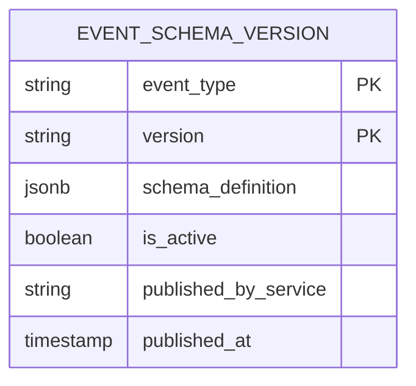
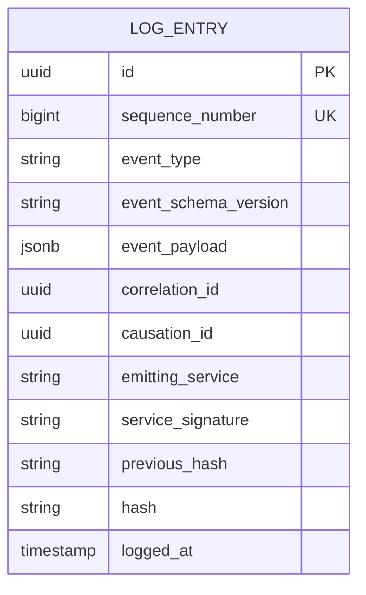

# Event Bus & Audit — Subdomain Architecture

> **Document Type**: Subdomain Architecture Document (Level 3 - Component)
> **Parent Domain**: [Platform Core](../ARCHITECTURE.md)
> **Root Architecture**: [System Architecture](../../../ARCHITECTURE.md)
> **Last Updated**: 2026-03-12
> **Subdomain Owner**: Syntropy Core Team

## Metadata

| Field | Value |
|-------|-------|
| **Subdomain Type** | Core Domain |
| **Parent Domain** | Platform Core |
| **Boundary Model** | Internal Module (within Platform Core domain) |
| **Implementation Status** | Not Started |

---

## Business Scope

### What This Subdomain Solves

The Event Bus & Audit subdomain is the nervous system of the ecosystem. Without it, there is no shared record of what happened, no way for Portfolio Aggregation to build portfolios automatically, no inter-domain contract enforcement, and no causal chain linking a governance decision to a treasury update. It answers: "What happened, when, by whom, and in what order?"

### Why It Is a Separate Subdomain

Event schema governance, signing hierarchy enforcement, and append-only log integrity are distinct responsibilities with different consistency requirements and invariants from portfolio state management and search indexing. Separating them makes the log's immutability guarantees explicit and independently verifiable.

### Subdomain Classification Rationale

**Type**: Core Domain

The two-level signing hierarchy (actor-signed DIP protocol events via Nostr + service-signed ecosystem events with hash chaining), the append-only log invariant, and the Event Schema Registry as a versioned inter-domain contract are novel designs that cannot be purchased off-the-shelf. Kafka provides reliable delivery; the trust model and schema governance are Platform Core's own design.

---

## Ubiquitous Language

| Term | Definition | Diverges from Parent? | Notes |
|------|------------|-----------------------|-------|
| **EventSchema** | A versioned, immutable contract defining the required fields and semantics of a specific event type | No | Schema version is immutable once published |
| **AppendOnlyLog** | The hash-chained ledger where every EcosystemEvent is stored in causal order | No | No delete or update operations permitted |
| **LogEntry** | A single record in the AppendOnlyLog containing an EcosystemEvent, its service signature, and the hash of the previous entry | Yes — "LogEntry" is distinct from "EcosystemEvent" | Hash chain is the tamper-evidence mechanism |
| **CausalChain** | The ordered sequence of LogEntries linked by causation_id and correlation_id fields | No | Enables full causal reconstruction |
| **ServiceSignature** | A cryptographic signature produced by the emitting platform service | Yes — distinct from actor-level signing | HMAC or asymmetric key per service; not user key |

---

## Aggregate Roots

### EventSchema (Registry)

**Responsibility**: Maintain the versioned registry of event type contracts; enforce that no event is logged without a registered schema.

**Invariants**:
- An EventSchema version, once published, is immutable (no field additions or removals)
- Breaking changes (removing fields, changing types) require a new version number
- At most one active version per event type at any time

**Entities within this aggregate**:
- `EventSchemaVersion` — the versioned schema definition

**Value Objects within this aggregate**:
- `SchemaDefinition` — the JSON schema body; immutable value
- `EventType` — the namespaced string (e.g., `learn.fragment.artifact_published`); value object

**Domain Events emitted**:
- `event_bus_audit.event_schema.published` — when a new schema version is registered

### AppendOnlyLog

**Responsibility**: Accept, sign, hash-chain, and store EcosystemEvents; enforce append-only invariant.

**Invariants**:
- Every LogEntry's hash is computed from `Hash(event_payload ∥ previous_hash ∥ service_signature ∥ timestamp)`
- No LogEntry may be deleted or modified
- LogEntry sequence_number is monotonically increasing

**Entities within this aggregate**:
- `LogEntry` — the stored record

**Value Objects within this aggregate**:
- `ServiceSignature` — computed at write time; stored as part of LogEntry
- `EntryHash` — the hash of the entry; links to next entry

**Domain Events emitted**:
- None — the AppendOnlyLog IS the event store; emitting events from it would be circular

---

## Domain Services

| Service | Responsibility | Operates On |
|---------|---------------|-------------|
| `SchemaValidationService` | Validates incoming event payloads against the registered EventSchema version before logging | EventSchema aggregate, incoming event payload |
| `EventSigningService` | Computes service-level HMAC signature and hash-chain entry for each incoming event | AppendOnlyLog aggregate |
| `CausalChainTracer` | Reconstructs the full causal sequence of events from a given correlation_id or causation_id | AppendOnlyLog query (read-only) |

---

## Integration with Sibling Subdomains

| Sibling Subdomain | Integration Direction | Mechanism | Data / Events Exchanged |
|-------------------|-----------------------|-----------|------------------------|
| Portfolio Aggregation | This → Sibling | Event stream (Kafka consumer group) | All LogEntries streamed to portfolio aggregation subscriber |
| Search & Recommendation | This → Sibling | Event stream (Kafka consumer group) | All LogEntries streamed to search indexer subscriber |

---

## Integration with Other Domains

| External Domain | Context Map Pattern | Direction | Purpose |
|-----------------|---------------------|-----------|---------|
| All pillar domains | Published Language | Inbound | All domains emit events that conform to registered EventSchema versions |
| DIP | Published Language + special (Nostr-anchored) | Inbound | DIP protocol events are additionally anchored to Nostr before or concurrently with logging |

---

## Data Architecture

### Owned Data

| Entity | Description | Sensitivity | Storage |
|--------|-------------|-------------|---------|
| EventSchemaVersion | Versioned event type contract | Internal | `platform_core.event_schema_versions` |
| LogEntry | Immutable hash-chained event record | Internal (audit-critical) | `platform_core.append_only_log` |

### Data Lifecycle

| Entity | Creation Trigger | Update Rules | Deletion Policy | Retention |
|--------|------------------|--------------|-----------------|-----------|
| EventSchemaVersion | Schema registration API call | Never (immutable) | Never | Indefinite |
| LogEntry | Event publication | Never (append-only) | Never | Indefinite |

---

## Implementation Notes

This is a Core Domain. Key design patterns:
- **Event Sourcing**: AppendOnlyLog is the system of record; all downstream state (Portfolio, SearchIndex) is derived from it
- **Pessimistic Locking on log writes**: sequence_number must be monotonically increasing; row-level locking on the `MAX(sequence_number)` row prevents gaps
- **Schema Registry enforcement at write boundary**: no event enters the log without schema validation; rejected events are returned to emitters with validation errors

### Technology Choices

| Decision | Choice | Rationale |
|----------|--------|-----------|
| Persistence | PostgreSQL (Supabase) append-only table | Familiar stack; row-level locking prevents gaps; backup and HA from Supabase |
| Transport | Kafka (ADR-002) | Durable topic partitioning; consumer groups for Portfolio Aggregation and Search |
| Schema validation | JSON Schema (draft-07) | Widely supported; sufficient for event payload validation |
| Signing | HMAC-SHA256 (service key per service) | Lightweight; service key rotation manageable; sufficient for internal audit trail |

---

## Traceability

| Vision Element | Section | How This Subdomain Implements It |
|----------------|---------|----------------------------------|
| Full event traceability (cap. 10) | §9 priority 8 | AppendOnlyLog with hash chaining provides tamper-evident audit trail |
| Two-level signing hierarchy (ADR-010) | Architecture Brief | Level 1: actor-signed Nostr events (DIP); Level 2: service-signed ecosystem events (this subdomain) |
| Event Schema Registry as inter-domain contract | Architecture Brief §IMPL-010 | EventSchemaVersion registry enforced at every event publication |
