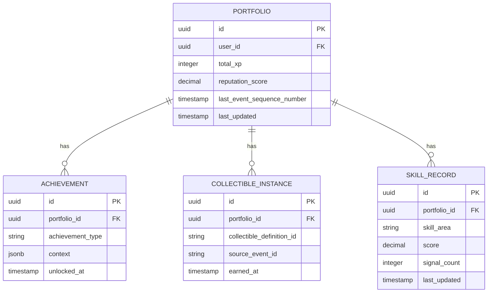

# Portfolio Aggregation — Subdomain Architecture

> **Document Type**: Subdomain Architecture Document (Level 3 - Component)
> **Parent Domain**: [Platform Core](../ARCHITECTURE.md)
> **Root Architecture**: [System Architecture](../../../ARCHITECTURE.md)
> **Last Updated**: 2026-03-12
> **Subdomain Owner**: Syntropy Core Team

## Metadata

| Field | Value |
|-------|-------|
| **Subdomain Type** | Core Domain |
| **Parent Domain** | Platform Core |
| **Boundary Model** | Internal Module (within Platform Core domain) |
| **Implementation Status** | Not Started |

---

## Business Scope

### What This Subdomain Solves

Portfolio Aggregation transforms the raw event stream from the AppendOnlyLog into meaningful, queryable user state: portfolios, XP totals, earned achievements, collectible items, computed skills, and cross-pillar reputation scores. Without it, the ecosystem's promise of automatic verifiable portfolios would be empty — the data would exist in the log but be inaccessible without complex event sourcing queries.

### Why It Is a Separate Subdomain

Portfolio state management and gamification rule evaluation are distinct from event logging and schema governance. Separating them makes the portfolio derivation logic independently testable, and makes it possible to rebuild portfolios from scratch by replaying the AppendOnlyLog — a key operational capability.

### Subdomain Classification Rationale

**Type**: Core Domain

The automatic portfolio is a primary competitive differentiator. The XP/achievement/collectible system, skill derivation from artifact contributions, and cross-pillar reputation computation are novel combinations of gamification with a verifiable event record. No off-the-shelf gamification platform connects XP to cryptographically anchored artifacts.

---

## Ubiquitous Language

| Term | Definition | Diverges from Parent? | Notes |
|------|------------|-----------------------|-------|
| **PortfolioProjection** | The current computed state of a user's portfolio, derived from replaying relevant log entries | Yes — "projection" is the event sourcing term for this | Deterministic; reproducible from the AppendOnlyLog |
| **XPRule** | A declarative rule defining how many XP points a specific event type awards | No | Stored as configuration; evaluated on event receipt |
| **AchievementCondition** | A predicate evaluated against a user's PortfolioProjection to determine if an achievement is unlocked | No | Can be complex (e.g., "publish 10 artifacts in 3 different domains") |
| **SkillSignal** | A raw contribution record (artifact publication, course completion) that contributes to a skill area | No | Multiple signals are aggregated into a Skill score |
| **ReputationSignal** | A raw interaction record (review quality rating, contribution acceptance rate) that contributes to Reputation | No | Weighted aggregation |

---

## Aggregate Roots

### Portfolio

**Responsibility**: Maintain a user's current, consistent portfolio state across all pillars; ensure consistency between XP, achievements, and skills.

**Invariants**:
- XP total is always the sum of all XPRule evaluations for relevant events in the user's history
- An Achievement is unlocked exactly once; re-evaluation of the condition does not re-award it
- CollectibleInstances are permanent — never revoked

**Entities within this aggregate**:
- `Achievement` — unlocked milestone record
- `CollectibleInstance` — earned collectible item
- `SkillRecord` — computed skill level per skill area

**Value Objects within this aggregate**:
- `XPTotal` — non-negative integer; always >= 0
- `ReputationScore` — decimal [0.0, 1.0]
- `SkillLevel` — categorical or numeric proficiency level

**Domain Events emitted**:
- `platform_core.achievement.unlocked` — when AchievementCondition is first satisfied
- `platform_core.collectible.awarded` — when CollectibleDefinition conditions are met
- `platform_core.portfolio.updated` — when XP, skill, or reputation changes significantly (debounced)

---

## Domain Services

| Service | Responsibility | Operates On |
|---------|---------------|-------------|
| `XPEvaluationService` | Evaluates XPRule set against an incoming event; returns XP delta | Portfolio aggregate, XPRule configuration |
| `AchievementEvaluationService` | Evaluates all AchievementConditions after a portfolio update; unlocks newly satisfied conditions | Portfolio aggregate, Achievement catalog |
| `SkillDerivationService` | Aggregates SkillSignals from new events into SkillRecord updates | Portfolio aggregate, event payload |
| `ReputationComputationService` | Aggregates ReputationSignals from review and contribution events into ReputationScore updates | Portfolio aggregate, event payload |
| `PortfolioRebuildService` | Replays the AppendOnlyLog from sequence 0 to rebuild a Portfolio from scratch | AppendOnlyLog (read-only), Portfolio aggregate |

---

## Integration with Sibling Subdomains

| Sibling Subdomain | Integration Direction | Mechanism | Data / Events Exchanged |
|-------------------|-----------------------|-----------|------------------------|
| Event Bus & Audit | Sibling → This | Kafka consumer group | LogEntries from AppendOnlyLog stream |
| Search & Recommendation | This → Sibling | Portfolio updated event | New portfolio state for recommendation signals |

---

## Integration with Other Domains

| External Domain | Context Map Pattern | Direction | Purpose |
|-----------------|---------------------|-----------|---------|
| Learn | Open Host Service (outbound) | This provides to Learn | Portfolio query API consumed by Learn for portfolio display |
| Hub | Open Host Service (outbound) | This provides to Hub | Portfolio query API for Hub contributor profiles |
| Labs | Open Host Service (outbound) | This provides to Labs | Reputation score for peer review visibility filtering |
| Communication | Published Language (inbound via platform_core events) | This emits | Achievement/collectible awarded events trigger notifications |

---

## Data Architecture

### Owned Data

| Entity | Description | Sensitivity | Storage |
|--------|-------------|-------------|---------|
| Portfolio | User's aggregated contribution state | Confidential | `platform_core.portfolios` |
| Achievement | Unlocked milestone record | Internal | `platform_core.achievements` |
| CollectibleInstance | Earned collectible item | Internal | `platform_core.collectible_instances` |
| SkillRecord | Computed skill level per area | Internal | `platform_core.skill_records` |

---

## Implementation Notes

**Key pattern**: Event Sourcing with Projection. Portfolio state is a projection of the AppendOnlyLog. The PortfolioRebuildService is a critical operational tool.

**CollectibleDefinition ownership**: CollectibleDefinition templates are owned by Learn domain. Portfolio Aggregation receives the `learn.collectible_definition.published` event and caches the definition locally for award evaluation. CollectibleInstance (the earned copy) is owned here.

### Technology Choices

| Decision | Choice | Rationale |
|----------|--------|-----------|
| Projection storage | PostgreSQL (Supabase) | ACID guarantees; queryable via standard SQL |
| Event consumption | Kafka consumer group (dedicated) | Independent of search indexing; separate offset tracking |
| Rebuild capability | Batch replay service | Can be triggered manually; processes log in sequence_number order |

---

## Traceability

| Vision Element | Section | How This Subdomain Implements It |
|----------------|---------|----------------------------------|
| Automatic verifiable portfolio (cap. 2) | §2, §7 | Portfolio is built automatically from the AppendOnlyLog; never manually edited |
| Gamification engine (cap. 7) | §7 | XPEvaluationService, AchievementEvaluationService, and collectible award logic |
| Cross-pillar reputation (cap. 3) | §3 | ReputationComputationService aggregates signals across all pillars |
