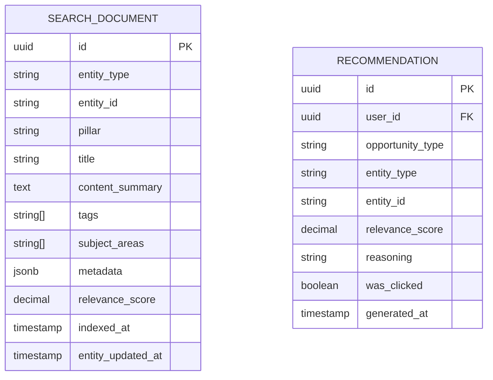

# Search & Recommendation — Subdomain Architecture

> **Document Type**: Subdomain Architecture Document (Level 3 - Component)
> **Parent Domain**: [Platform Core](../ARCHITECTURE.md)
> **Root Architecture**: [System Architecture](../../../ARCHITECTURE.md)
> **Last Updated**: 2026-03-12
> **Subdomain Owner**: Syntropy Core Team

## Metadata

| Field | Value |
|-------|-------|
| **Subdomain Type** | Core Domain |
| **Parent Domain** | Platform Core |
| **Boundary Model** | Internal Module (within Platform Core domain) |
| **Implementation Status** | Not Started |

---

## Business Scope

### What This Subdomain Solves

Search & Recommendation makes the ecosystem's content discoverable and turns isolated pillar activity into cross-pillar opportunities. A learner who completes a track on distributed systems should be shown open Hub issues on distributed system projects and Labs articles on consensus algorithms — automatically, without searching. This proactive surfacing is what makes the ecosystem feel connected rather than fragmented.

### Why It Is a Separate Subdomain

Search index maintenance, real-time event-driven indexing, and recommendation engine logic are distinct from audit log management and portfolio state. They have different performance characteristics (eventual consistency acceptable; sub-second query response required) and different infrastructure needs (search index vs relational storage).

### Subdomain Classification Rationale

**Type**: Core Domain

The cross-pillar recommendation engine — especially the part that uses portfolio state (skills, completed tracks, recent contributions) to surface opportunities in *other* pillars — is the unique capability that no existing search or recommendation platform provides in this context. The connection between "what you just built" and "what you could do next across the ecosystem" is the differentiator.

---

## Ubiquitous Language

| Term | Definition | Diverges from Parent? | Notes |
|------|------------|-----------------------|-------|
| **SearchDocument** | An indexed, searchable representation of an ecosystem entity (track, article, project, issue) | No | Denormalized projection of domain entity data |
| **SearchIndex** | The collection of all SearchDocuments, maintained in near-real-time | No | Updated within 30 seconds of entity publication |
| **RecommendationSignal** | An event that triggers recommendation re-computation for a user | No | Examples: fragment completed, contribution accepted, new track published in skill area |
| **RecommendationSet** | The current set of personalized cross-pillar recommendations for a user | No | Cached; refreshed on RecommendationSignal receipt |
| **OpportunityType** | The category of a recommendation | No | Examples: OpenIssue, PublishedTrack, LabsArticle, InstitutionToJoin |

---

## Aggregate Roots

### SearchIndex

**Responsibility**: Maintain accurate, near-real-time searchable representations of all published ecosystem entities.

**Invariants**:
- Only published/active entities appear in the index (drafts excluded)
- Index is eventually consistent with the AppendOnlyLog (< 30s lag target)

**Entities within this aggregate**:
- `SearchDocument` — indexed entity

**Domain Events emitted**:
- None — search index is a read model; it does not emit domain events

### RecommendationSet

**Responsibility**: Compute and cache personalized cross-pillar opportunity recommendations for each user.

**Invariants**:
- Recommendations are computed from a combination of UserContextModel (from AI Agents) and SearchIndex
- RecommendationSet is refreshed on any relevant RecommendationSignal for the user

**Entities within this aggregate**:
- `Recommendation` — a single surfaced opportunity

**Domain Events emitted**:
- `platform_core.recommendation.generated` — when a new RecommendationSet is computed for a user

---

## Domain Services

| Service | Responsibility | Operates On |
|---------|---------------|-------------|
| `EventIndexingService` | Consumes AppendOnlyLog events; extracts and upserts SearchDocuments | SearchIndex aggregate, event payload |
| `FullTextSearchService` | Executes keyword search queries against the SearchIndex | SearchIndex (read-only) |
| `SemanticSearchService` | Executes semantic (embedding-based) search queries | SearchIndex + vector store |
| `RecommendationEngine` | Computes personalized RecommendationSets from portfolio state + SearchIndex | RecommendationSet aggregate, Portfolio data |
| `OpportunitySurfacingService` | Identifies cross-pillar opportunities matching a user's skill/interest profile | RecommendationSet, SearchIndex |

---

## Integration with Sibling Subdomains

| Sibling Subdomain | Integration Direction | Mechanism | Data / Events Exchanged |
|-------------------|-----------------------|-----------|------------------------|
| Event Bus & Audit | Sibling → This | Kafka consumer group | LogEntries trigger SearchDocument upserts |
| Portfolio Aggregation | Sibling → This | Portfolio updated event | New portfolio state feeds recommendation signals |

---

## Integration with Other Domains

| External Domain | Context Map Pattern | Direction | Purpose |
|-----------------|---------------------|-----------|---------|
| Learn, Hub, Labs | Open Host Service (outbound) | This provides | Search query API and recommendation API consumed by pillar UIs |
| AI Agents | Customer-Supplier | This provides data | RecommendationEngine uses UserContextModel data from AI Agents |

---

## Data Architecture

### Owned Data

| Entity | Description | Sensitivity | Storage |
|--------|-------------|-------------|---------|
| SearchDocument | Indexed entity representation | Internal (derived from Public data) | Search index (full-text + vector) |
| Recommendation | Personalized cross-pillar opportunity | Internal | `platform_core.recommendations` |

---

## Implementation Notes

### Technology Choices

| Decision | Choice | Rationale |
|----------|--------|-----------|
| Full-text search | PostgreSQL full-text search (initial) → dedicated search engine (if needed) | Start simple; Supabase native; migrate when scale requires |
| Semantic/vector search | pgvector (PostgreSQL extension) | Stays within Supabase stack; enables embedding-based similarity search |
| Embeddings | OpenAI text-embedding-3-small or Anthropic equivalent | Via AI Agents ACL adapter; same LLM integration path |
| Recommendation storage | PostgreSQL | ACID; queryable; sufficient for initial scale |

---

## Traceability

| Vision Element | Section | How This Subdomain Implements It |
|----------------|---------|----------------------------------|
| Cross-pillar recommendation engine (cap. 3) | §2, §3 | RecommendationEngine turns portfolio records into cross-pillar opportunities |
| Unified search across all pillars | §6 platform capabilities | SearchIndex aggregates all published entities regardless of pillar |
| Proactive opportunity surfacing | §2 Ideal Future | OpportunitySurfacingService surfaces opportunities without the user having to search |
