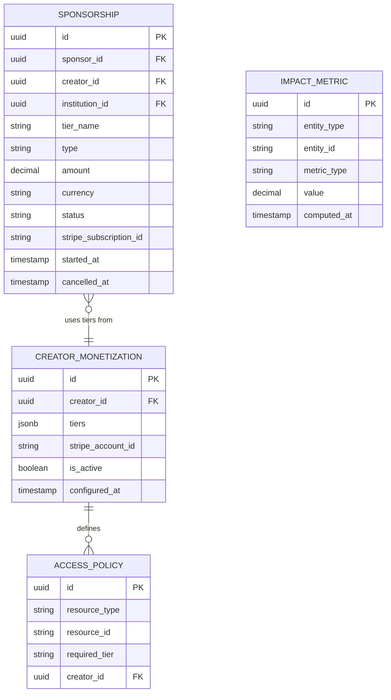

# Sponsorship Domain Architecture

> **Document Type**: Domain Architecture Document (Level 2 - Container)
> **Parent**: [System Architecture](../../ARCHITECTURE.md)
> **Last Updated**: 2026-03-12
> **Domain Owner**: Syntropy Core Team
> **Subdomain Type**: Supporting Subdomain
> **Rationale**: Voluntary creator monetization and impact discovery are important platform capabilities but not competitive differentiators. The core logic (sponsorship agreements, payment processing, access policy enforcement) is well-understood. Stripe handles the financial infrastructure. The domain's value is integration — connecting sponsors to measurable artifact impact via Platform Core data.

---

## Vision Traceability

| Vision Element | Section | How This Domain Implements It |
|----------------|---------|-------------------------------|
| Voluntary sponsorship and creator monetization (cap. 4) | §4 | Sponsorship agreements, recurring and one-time payments, creator monetization configuration |
| Impact discovery for sponsors (cap. 4) | §4 | ImpactMetric computed from Platform Core event log (artifact usage, downloads, citations) |
| Access policy for premium content | §4 | AccessPolicy entity controls content availability based on sponsorship tier |

---

## Document Scope

This document describes the **Sponsorship** bounded context.

### What This Document Covers

- Sponsorship agreements between sponsors and creators/institutions
- CreatorMonetization configuration per creator
- ImpactMetric computation from Platform Core data
- AccessPolicy for controlling content availability
- Stripe ACL adapter for payment processing

---

## Domain Overview

### Business Capability

Sponsorship enables creators and institutions to receive voluntary financial support from sponsors who value their work. It connects financial support to measurable impact — sponsors can see artifact download counts, citation records, and usage events derived from Platform Core data. It is strictly voluntary; no content is paywalled by default.

### Ubiquitous Language

| Term | Definition | Notes |
|------|------------|-------|
| **Sponsorship** | A voluntary financial support agreement between a Sponsor and a Creator or Institution | Can be recurring (monthly) or one-time |
| **CreatorMonetization** | The configuration a creator or institution sets for receiving sponsorship | Includes tier definitions, access policies, payment method configuration |
| **ImpactMetric** | A computed metric reflecting the real-world impact of a creator's artifacts | Derived from Platform Core event log (usage events, citations via DIP) |
| **AccessPolicy** | A rule defining which content is available to which sponsorship tier | Optional; most content remains fully open |
| **SponsorshipTier** | A defined level of sponsorship with associated benefits and access policies | Defined by creator in CreatorMonetization |

---

## Subdomain Classification & Context Map Position

**Type**: Supporting Subdomain

Sponsorship implements important but well-understood logic. Stripe handles payment processing. The primary custom work is connecting sponsorship state to Platform Core impact data and enforcing access policies at content render time.

| Other Context | Pattern | Direction | Description |
|---------------|---------|-----------|-------------|
| Identity | Customer-Supplier | Sponsorship is downstream | Identity supplies User actor attribution for sponsor and creator identification |
| Platform Core | Customer-Supplier | Sponsorship is downstream | Sponsorship reads ImpactMetric data (artifact usage, citations) from Platform Core event log |
| Stripe (external) | ACL | Sponsorship wraps Stripe | StripePaymentAdapter translates Sponsorship domain terms to Stripe API; Stripe vocabulary never leaks |

---

## Data Architecture

### Entity Relationship Diagram

---

## Event Contracts

### Events Published

| Event Type | When Published |
|------------|----------------|
| `sponsorship.sponsorship.started` | When a new sponsorship becomes active |
| `sponsorship.sponsorship.cancelled` | When a sponsorship is cancelled |

### Events Consumed

| Event Type | Source | Behavior |
|------------|--------|---------|
| `dip.usage.registered` | DIP | Update ImpactMetric for the artifact's creator |
| `labs.article.published` | Labs | Update ImpactMetric for article citations (if applicable) |

---

## Integration Points

### Upstream Dependencies

| Dependency | Type | Criticality | Fallback |
|------------|------|-------------|----------|
| Identity | Sync API | Critical | Block sponsorship without verified identity |
| Platform Core (impact data) | Sync API | Non-critical | Show "impact data unavailable" |
| Stripe | Sync API via ACL | Critical (payment) | Defer payment; show retry UI |

### External Integrations

| Provider | Purpose | Criticality |
|----------|---------|-------------|
| Stripe | Payment processing, subscription management | Critical |

---

## Security Considerations

### Data Classification

Payment information is **Restricted** (never stored; handled by Stripe). Sponsorship amounts are **Confidential**. ImpactMetrics are **Public**.

### Access Control

| Role | Permissions |
|------|-------------|
| Sponsor | Create, manage own sponsorships |
| Creator | Configure CreatorMonetization, view sponsorship dashboard |
| Platform Admin | Audit payment flows |

### Compliance Requirements

Financial data subject to PCI-DSS compliance (handled by Stripe). GDPR/LGPD applies to sponsor PII. See [Security Architecture](../../cross-cutting/security/ARCHITECTURE.md).
