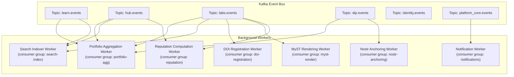

# Background Services — Platform Architecture

> **Document Type**: Platform Service Architecture Document
> **Parent**: [System Architecture](../../ARCHITECTURE.md)
> **Last Updated**: 2026-03-12
> **Owner**: Syntropy Core Team

---

## Service Overview

Background Services encompasses the event bus topology, Kafka consumer workers, event schema enforcement pipelines, and all asynchronous processing that occurs outside the synchronous request-response cycle. It is the "engine room" of the ecosystem — where portfolio updates, search index maintenance, DOI registration, and experiment execution pipelines run.

---

## Architecture

### High-Level Diagram

---

## Event Bus Topology

### Topic Architecture

| Topic | Partitions | Producers | Key Consumers | Retention |
|-------|-----------|-----------|---------------|-----------|
| `learn.events` | 8 | Learn domain | Portfolio, Search | Indefinite |
| `hub.events` | 8 | Hub domain | Portfolio, Search | Indefinite |
| `labs.events` | 8 | Labs domain | Portfolio, Search, DOI, MyST, Reputation | Indefinite |
| `dip.events` | 12 | DIP domain | Portfolio, Search, Nostr Anchoring | Indefinite |
| `identity.events` | 4 | Identity domain | Portfolio, Notifications | Indefinite |
| `platform_core.events` | 8 | Platform Core | Notifications | Indefinite |
| `ai_agents.events` | 4 | AI Agents | Audit log | Indefinite |
| `*.dlq` | 2 per topic | Workers (on failure) | Operations team | 30 days |

**Partitioning key**: `user_id` for user-scoped events; `entity_id` for entity-scoped events. Ensures ordering per user/entity.

### Schema Enforcement

**All producers must validate events against EventSchema Registry before publishing.**

Enforcement implementation:
- Producer-side: SDK wraps Kafka producer; validates against registered schema before sending
- Consumer-side: Worker validates schema on receipt; sends to DLQ if validation fails

---

## Worker Catalog

### Portfolio Aggregation Worker

**Consumer Group**: `portfolio-agg`

**Subscribed Topics**: `learn.events`, `hub.events`, `labs.events`, `dip.events`

**Key Events Handled**:
- `learn.fragment.artifact_published` → award XP, check achievements, update skills
- `hub.contribution.integrated` → award XP, update contributor skills
- `labs.review.submitted` → update reviewer reputation
- `labs.article.published` → award publication achievement
- `dip.artifact.anchored` → update portfolio verified artifacts count

**Processing requirements**:
- Idempotent: duplicate event delivery must not cause double XP or double achievements
- Processing time: < 5 seconds per event (p99)

### Search Indexer Worker

**Consumer Group**: `search-index`

**Subscribed Topics**: `learn.events`, `hub.events`, `labs.events`

**Key Events Handled**:
- `learn.track.published` → upsert Track SearchDocument
- `hub.institution.created` → upsert Institution SearchDocument  
- `labs.article.published` → upsert Article SearchDocument

**Processing requirements**:
- Index lag target: < 30 seconds from event publication to searchable
- Idempotent: duplicate processing produces same index state

### Nostr Anchoring Worker

**Consumer Group**: `nostr-anchoring`

**Subscribed Topics**: `dip.events`

**Key Events Handled**:
- `dip.artifact.created` → submit Nostr anchoring request
- `dip.governance.proposal_executed` → submit Nostr anchoring for LegitimacyChain entry

**Processing requirements**:
- Non-blocking: anchoring does not block the originating DIP operation
- Retry: indefinite retry with exponential backoff (Nostr relays may be temporarily unavailable)
- Status update: write `anchoring_confirmed` back to DIP when Nostr event_id is confirmed

### Notification Worker

**Consumer Group**: `notifications`

**Subscribed Topics**: `platform_core.events`

**Key Events Handled**:
- `platform_core.achievement.unlocked` → create Notification in Communication domain
- `platform_core.collectible.awarded` → create Notification
- `hub.contribution.integrated` → create Notification for contributor and reviewers

### DOI Registration Worker

**Consumer Group**: `doi-registration`

**Subscribed Topics**: `labs.events`

**Key Events Handled**:
- `labs.article.published` → submit DOI registration to DataCite/CrossRef

**Processing requirements**:
- Async: article publication is not blocked by DOI registration
- Status tracking: DOIRecord updated on confirmation or failure
- Retry: max 5 retries; on failure, alert and move to DLQ

### MyST Rendering Worker

**Consumer Group**: `myst-render`

**Subscribed Topics**: `labs.events`

**Key Events Handled**:
- `labs.article.version_created` → render MyST+LaTeX to HTML; cache rendered output

### Reputation Computation Worker

**Consumer Group**: `reputation`

**Subscribed Topics**: `labs.events`, `hub.events`

**Key Events Handled**:
- `labs.review.submitted` → update reviewer reputation signals
- `hub.contribution.integrated` → update contributor reputation signals
- Aggregated periodically (every 15 minutes) into Platform Core Reputation scores

---

## Dead Letter Queue Handling

All workers emit failed messages to `{topic}.dlq` after max retries. DLQ entries trigger:
1. Alert to on-call engineer
2. Review via admin dashboard
3. Manual replay or discard after root cause analysis

---

## Key Decisions

| ADR | Summary |
|-----|---------|
| ADR-002 *(Prompt 01-C)* | Kafka for event bus; durability configuration; consumer group architecture |
