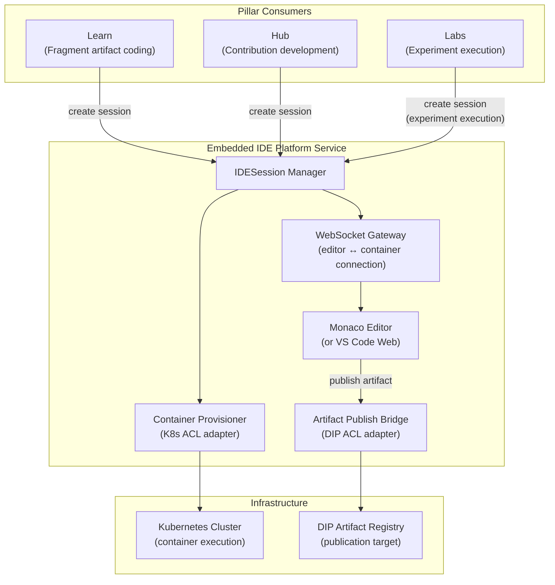
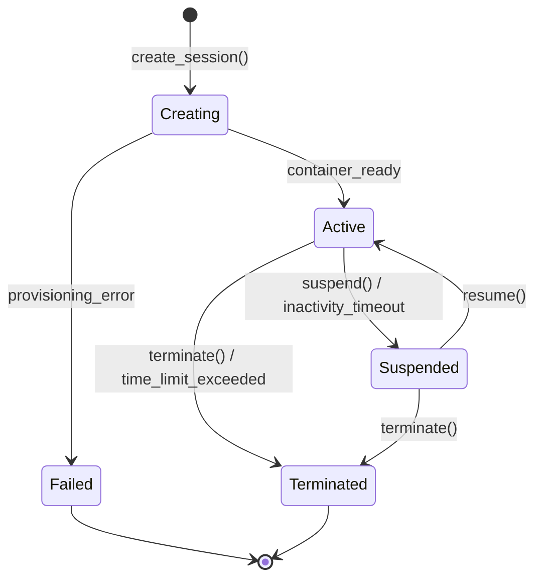

# Embedded IDE — Platform Architecture

> **Document Type**: Platform Service Architecture Document
> **Parent**: [System Architecture](../../ARCHITECTURE.md)
> **Last Updated**: 2026-03-12
> **Owner**: Syntropy Core Team

---

## Service Overview

The Embedded IDE is the shared code execution environment for all pillars of the ecosystem. It embeds Monaco Editor / VS Code Web, manages containerized execution environments per session, and provides the artifact publication bridge from code-in-IDE to DIP-registered artifact. It is implemented as the IDE domain (see [IDE Domain Architecture](../../domains/ide/ARCHITECTURE.md)) and documented here as a platform delivery specification.

---

## Architecture

### High-Level Diagram

---

## Container Lifecycle

**Inactivity timeout**: 30 minutes of no user interaction → auto-suspend

**Time limit**: Configurable per session type:
- Fragment coding: 4 hours maximum
- Contribution development: 8 hours maximum
- Experiment execution: 2 hours maximum (configurable by researcher)

---

## Components

### Monaco Editor Integration

- Monaco Editor (core IDE) embedded in the web application as a React component
- VS Code extension API subset supported for syntax highlighting and language servers
- Language servers loaded per session context (TypeScript, Python, R, Julia for scientific use)
- File explorer, terminal pane, output pane

### Resource Quotas

| Resource | Free Tier | Creator Tier | Researcher Tier |
|----------|-----------|--------------|-----------------|
| CPU | 0.5 vCPU | 1 vCPU | 2 vCPU |
| Memory | 512 MB | 1 GB | 2 GB |
| Disk | 2 GB | 5 GB | 10 GB |
| Max sessions | 1 concurrent | 3 concurrent | 3 concurrent |
| Session max time | 4 hours | 8 hours | 8 hours |

### Artifact Publish Bridge

When a user publishes from the IDE:
1. User triggers "Publish Artifact" from IDE toolbar
2. Monaco sends current workspace artifact to the Publish Bridge
3. Publish Bridge calls DIP ACL adapter with the artifact content and metadata
4. DIP Artifact Registry processes the publication and triggers Nostr anchoring
5. Published artifact ID returned to IDE; shown in editor status bar

---

## Interfaces

| Interface | Protocol | Auth | Notes |
|-----------|----------|------|-------|
| Session creation API | REST | IdentityToken | Creates new IDESession |
| Session WebSocket | WebSocket | IdentityToken | Live editor ↔ container connection |
| Session status API | REST | IdentityToken | Queries session state |
| Artifact publish API | REST | IdentityToken | Triggers DIP publication |

---

## Security Considerations

- Container isolation: each session runs in its own Kubernetes Pod with network isolation
- No cross-user file access: workspace volumes are per-session
- Resource limits enforced at Kubernetes level (CPU and memory limits)
- Container image scanning: base images scanned weekly for vulnerabilities
- No outbound internet access from containers (unless explicitly configured for Labs experiments)

---

## Key Decisions

| ADR | Summary |
|-----|---------|
| ADR-007 *(Prompt 01-C)* | Monaco Editor / VS Code Web; container orchestration on Kubernetes; resource quota model; artifact publish bridge |
