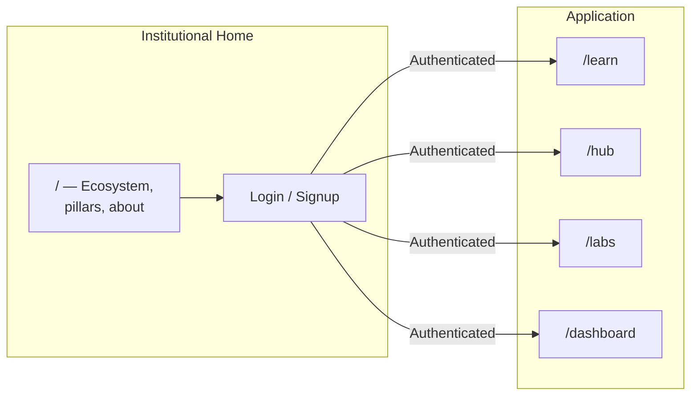
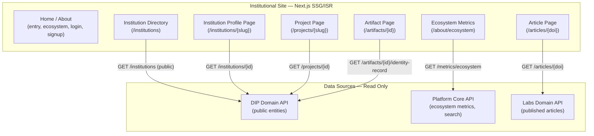

# Institutional Site — Platform Architecture

> **Document Type**: Platform Service Architecture Document
> **Parent**: [System Architecture](../../ARCHITECTURE.md)
> **Last Updated**: 2026-03-16
> **Owner**: Syntropy Core Team

---

## Service Overview

The Institutional Site is the **main entry point** of the Syntropy Ecosystem (GitHub-style). It is the public face of the single web application. When a user visits the system unauthenticated, they see the institutional home, which:

- **Presents the ecosystem** — what Syntropy is and why it exists
- **Explains the three pillars** — Learn, Hub, Labs (not "Platform"; the Platform is the technical foundation, not a user-facing pillar — ADR-012)
- **Provides institutional content** — e.g. contribution, portfolio, community, about
- **Offers login and signup** — and access to the application

After authentication, the user reaches the application areas: Learn, Hub, Labs (and the shared user area for portfolio, search, settings). There is no separate "Platform" page. The institutional site also serves public read-only pages (institution directory, project pages, artifact pages, Labs articles, ecosystem metrics) powered by reads from Platform Core and DIP.

**This is NOT a domain.** It has no owned business data or domain logic. It is part of (or the public face of) the single web application — a server-rendered static/ISR layer for public and entry routes.

---

## Architecture

### Entry Flow

### High-Level Diagram (Data Flow)

---

## Components

### Rendering Strategy

| Route | Strategy | Revalidation | Cache TTL |
|-------|----------|-------------|-----------|
| `/` (home) | SSG | On deploy | 1 day |
| `/institutions` (directory) | ISR | 60 seconds | 60 seconds |
| `/institutions/{slug}` | ISR | 300 seconds | 5 minutes |
| `/projects/{slug}` | ISR | 300 seconds | 5 minutes |
| `/artifacts/{id}` | SSG + on-demand revalidation | On `dip.artifact.anchored` event | Indefinite (immutable) |
| `/articles/{doi}` | ISR | 600 seconds | 10 minutes |
| `/about/ecosystem` | ISR | 3600 seconds | 1 hour |

### Data Read Map

| Page Section | Source Domain | API Endpoint | Data Displayed |
|-------------|---------------|--------------|----------------|
| Institution name, description, type | DIP | `/api/v1/institutions/{id}` | Public institution metadata |
| Governance contract summary | DIP | `/api/v1/institutions/{id}/governance-contract` | Contract type, parameters |
| Legitimacy chain entry count | DIP | `/api/v1/institutions/{id}/legitimacy-chain/count` | Number of governance decisions |
| Artifact identity record | DIP | `/api/v1/artifacts/{id}/identity-record` | Nostr event_id, author, timestamp |
| Project contributors | Platform Core | `/api/v1/portfolio/{user_id}/skills` | Aggregated contributor profiles |
| Ecosystem metrics | Platform Core | `/api/v1/metrics/ecosystem` | Total artifacts anchored, institutions, articles |
| Published article | Labs | `/api/v1/articles/{id}` | Title, abstract, authors, DOI |

---

## Interfaces

The Institutional Site exposes no APIs. It is a pure read-and-render application.

**Data access**: Only public, unauthenticated GET endpoints from domain APIs are used. No authenticated domain data is displayed.

---

## Operational Model

| Environment | Infrastructure |
|-------------|---------------|
| Production | Vercel / CDN (same as web app) |
| Custom domain | `institutions.syntropy.cc` or per-institution subdomain (future) |

---

## Security Considerations

- No user authentication required — all displayed data is public
- No write operations — read-only API calls only
- CSP headers to prevent XSS
- No sensitive data (portfolio, messages, draft content) ever displayed
- Artifact identity records displayed are cryptographically verifiable (Nostr event_id shown for independent verification)
