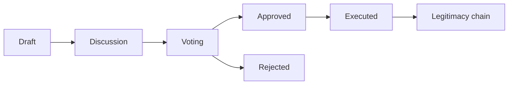

# Institutions and Governance

## What is a digital institution?

A **digital institution** is an organization on the platform (Hub or Labs) that has:

- **Identity** — Name, type (e.g. `institution`, `laboratory`), and visibility.
- **Governance contract** — Rules for who can do what: roles, **chambers** (e.g. electorate, quorum, approval threshold), voting weights, delegation, and a **tier set** so that different kinds of changes require different levels of approval.
- **Legitimacy chain** — Every change to the institution (e.g. adding a member, changing the contract) goes through a **proposal**. Proposals move through draft → discussion → voting → approved/rejected → (optionally) contested → executed. Each execution is a signed, anchored event. The **legitimacy chain** is the ordered list of these events; it is public and auditable.
- **Right of exit** — The contract must define how a member can leave; the platform does not allow contracts without it.

Institutions own **projects** (in the Hub) or **research lines** (in Labs). Value (e.g. sponsorship or project revenue) can flow into a **treasury** and be distributed according to the institution’s **monetization protocol** (AVU-based; conversion to real currency only at liquidation via an oracle).

## How governance works

1. **Creation** — A founder creates an institution by choosing a **contract template** (e.g. Technical Cooperative, Research Laboratory) and setting parameters. The system generates the governance contract and records the founding state in the legitimacy chain.
2. **Proposals** — Any change (new member, contract amendment, project creation) is proposed. The proposal has a type and content; the **change classification function** assigns it to a **tier** (e.g. low risk vs high risk).
3. **Deliberation** — The responsible **chamber** discusses and votes. Quorum and approval thresholds from the contract apply. The result is approved or rejected.
4. **Execution** — An approved proposal is executed: the state of the institution is updated and a new entry is added to the legitimacy chain. No change can happen without going through this path.

## Key principles

- **Transparency** — Governance contracts and the legitimacy chain are public so potential contributors can see how decisions are made.
- **No bypass** — The system does not allow ad-hoc changes; every state change is the result of an executed proposal.
- **Configurable, not prescribed** — The protocol provides primitives (chambers, tiers, weights); each institution chooses its own rules within that.

## Institutions in practice

In the Hub you create an institution from a template, then create projects and issues. In Labs you create a **laboratory** (institution type `laboratory`) and then research lines and articles. When you vote on a proposal or execute one, you are participating in governance; the legitimacy chain records it.

## Related concepts

- **[Artifacts and the DIP](artifacts-and-dip.md)** — Projects hold artifact manifests; value distribution is tied to artifact usage.
- **[Labs: Research and Review](labs-research-and-review.md)** — A laboratory is an institution; research lines are projects.

## See Also

- [Institutions and Governance API](../reference/api/institutions-governance.md)
- [Contracts API](../reference/api/contracts.md)
- [Tutorial: Create Institution and Project](../tutorials/03-create-institution-and-project.md)
- [How to create an institution](../how-to/create-institution.md)
